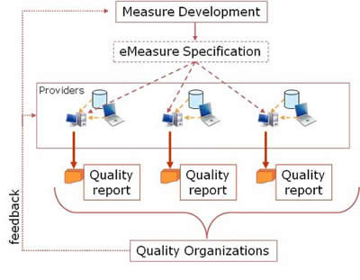

# 1 HQMF Overview

## 1.1 What is the HQMF, and what is an eMeasure?

The Health Quality Measures Format (HQMF) is a standard for representing a health quality measure as an electronic document. A quality measure is a quantitative tool to assess the performance of an individual or organization's performance in relation to a specified process or outcome via the measurement of an action, process, or outcome of clinical care. Quality measures are often derived from clinical guidelines and are designed to determine whether the appropriate care has been provided given a set of clinical criteria and an evidence base. Quality measures are also often referred to as performance measures or quality indicators. Public health programs engage in quality measurement in the context of monitoring and improving the health of the jurisdiction population. Specific measures and other analytics are performed within surveillance programs and are subject to correlation with dynamic environmental factors, social conditions, and other epidemiologic criteria that are not suited to static measure definition. In support of these quality measurement activities, cohort measures specify a population of interest to a given surveillance program. Such cohort measures are intended to assess and report records of interest to the surveillance program.

Through standardization of a measure's structure, metadata, definitions, and logic, the HQMF provides measure consistency and unambiguous interpretation. A health measure encoded in the HQMF is referred to as an "eMeasure".

Standardization of document structure (e.g., sections), metadata (e.g., author, verifier), and definitions (e.g., numerator, initial population) enables a wide range of measures, currently existing in a variety of formats, to achieve at least a minimal level of consistency and readability, even if not fully machine processable.

Formal representation of the clinical, financial, and administrative concepts and logic within an eMeasure supports unambiguous interpretation and consistent reporting. Examples of statements that can be formally represented by the HQMF are:

    To be included in a measure's Denominator, a patient will have had at least two face-to-face visits; AND will have a confirmed diagnosis of coronary artery disease (based on diagnostic or procedure criteria).

    To be included in a measure's Initial Population, a patient will have had a principal inpatient discharge diagnosis of stroke; AND a hospital length of stay less than or equal to 120 days.

    To be included in a public health reportable population, a patient will have a confirmed diagnosis of Tuberculosis within a given reporting period; AND residence within a jurisdiction that requires reporting of Tuberculosis.

HQMF, like the HL7 Clinical Document Architecture (CDA) standard, is derived from an overarching structured document architecture. HQMF is not a CDA standard, but rather, has a peer-to-peer relationship with CDA. In order to report the results of an HQMF computation, systems typically will use the HL7 CDA R2 Quality Reporting Document Architecture (QRDA) standard.

## 1.2 Guidance for Measure Developers

Creating eMeasures in HQMF requires measure developers to adopt a programmer's mind-set. Constructing or creating eMeasures in HQMF is similar to constructing an SQL query. HQMF is a declarative programming language. As with any such language, it is possible to create code that is syntactically correct but logically incorrect. The result is unanticipated bugs or side effects. Therefore, while creating eMeasures, measure developers must consider that each eMeasure will be processed by an HQMF Release 2 (R2) processing engine. A processing engine is a program that parses an HQMF file, executes the logic against a data store, and computes results (i.e., 7 patients in the Denominator, 3 in the Numerator). As HQMF processing engines become more available, measure developers will need to adopt many of the practices common to software development such as integrating testing with the development process. Measure developers can refer to HQMF processing engines that currently exist (e.g., US ONC Query Health Initiative, MITRE Cypress project) to better understand HQMF processing complexities. 

## 1.3 HQMF for Quality and Public Health

### 1.3.1 HQMF and Quality Improvement

Figure 1: Quality measure framework

Measure developers, drawing on available evidence, devise measureable parameters to gauge the quality of care in a subject area. These parameters are assembled into quality measures, which are then expressed as eMeasures in HQMF. A set of eMeasures may be used to guide care decisions as well as data collection for Electronic Health Record (EHR) and other systems. The data are then assembled into quality reports (e.g., QRDA documents) and submitted to quality reporting or other organizations. 

### 1.3.2 HQMF and Public Health Cohort Measure Definitions for Reporting

HQMF is part of a larger public health reporting framework, as shown in the following figure. 

Figure 2: Public health eMeasure framework

Public health epidemiologists, often drawing upon available evidence, devise requirements for reporting from providers and laboratories to monitor community health. These reporting requirements are mapped to standard vocabularies and structures available to EHR systems, laboratory systems, and information exchanges, which are then expressible as a Cohort measure definition in HQMF (called an eMeasure). This eMeasure may be understood by providers to guide reportable actions for care, and to guide collection of Electronic Health Record (EHR), laboratory, and other source reporting data. These data are assembled into public health reports (e.g., Healthcare Associated Infection (HAI) CDA Report, HL7 CDA for public health reports) and submitted to public health authorities.

Unambiguous expression of concepts and logic within an eMeasure is a necessary step towards the larger objective of enabling a direct query against an EHR or other operational data store. While HQMF is not an EHR query language, through the provision of unambiguous and formal definitions, it is an EHR query enabler. Additionally, an unambiguous representation of the clinical concepts in an eMeasure allows EHR vendors and healthcare providers to be proactive in capturing such information at the point of care. If, for example, a quality measure reports on the provision of educational material to stroke patients, the corresponding eMeasure will make it clear exactly what type of educational material would be considered appropriate care. If the eMeasure calls for the collection of a certain data element not normally captured by the EHR, the EHR might now prompt the user to collect this information, thereby enhancing both the quality of data reporting and the quality of care. These data might similarly be captured through invoking a public health reporting form that is pre-populated from the EHR data allowing for the user to enter the remaining data attributes. 

