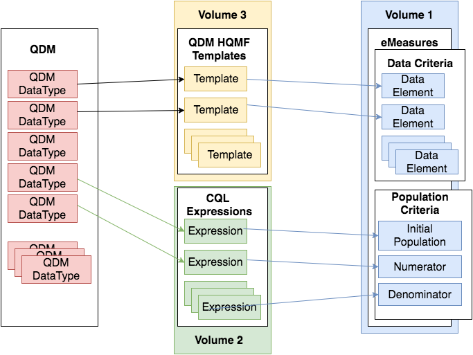
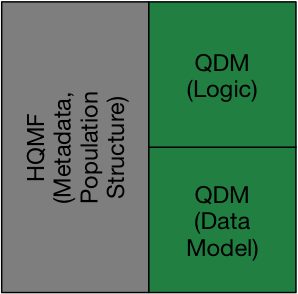
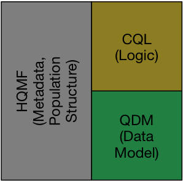
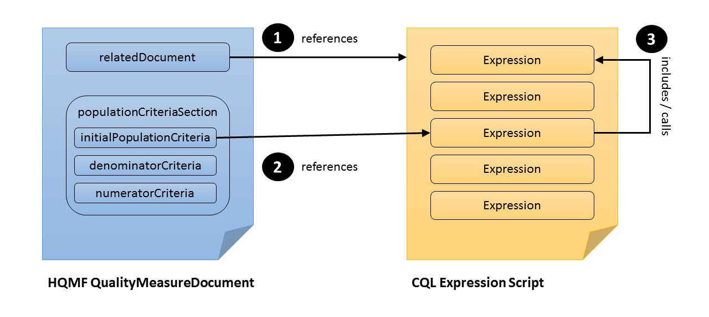

## 1 Introduction

### 1.1 Purpose

For care quality to be evaluated, it must be standardized and communicated to the appropriate organizations. To that end, this Implementation Guide has been written to provide guidance for authoring electronic Clinical Quality Measures (eCQMs) utilizing the following standards:

* Quality Data Model (QDM) v5.4 [^1]
* Clinical Quality Language (CQL) R1.3 [^2]
* Health Quality Measures Format Release 1 Normative (HQMF R1 Normative) [^3]

Although the specification is based on the 1.3 version of CQL, backwards-compatible future versions of CQL can be used as well. In addition, if necessary, the 1.2 version of CQL can be used without loss of functionality for this Implementation Guide.

Note that HQMF releases have typically been referred to by their STU version, so HQMF R2.1 was referring to the STU version (2.1), not the full release version, which is still 1. Now that HQMF has been released as a normative specification, the STU version is dropped. Except where noted specifically, references to HQMF in this guide are to the normative release 1 version.

Except where noted, material from the above specifications is not reproduced here.

### 1.2 Structure of this Guide

Three volumes comprise this HL7 Version 3 Implementation Guide: Clinical Quality Language (CQL)- based Health Quality Measure Format (HQMF), Release 1 STU3 (US Realm), Standard for Trial Use:



Figure 1: Relationship between QDM, CQL, eCQM, and the volumes of this IG.

Volume 1: Provides narrative introduction, background material, and conformance requirements for representing CQL-based eCQMs in HQMF.

Volume 2: Describes how to incorporate version 5.4 of the Quality Data Model into a CQL-based eCQM in accordance with accepted formatting and usage conventions.

Volume 3: Contains the HQMF templates for QDM data elements,  necessary for constructing QDM+CQL-based HQMF measures.

### 1.3 Structure of this Volume

In this section, we present an outline of this volume of this HL7 Version 3 Implementation Guide: Clinical Quality Language (CQL)-based Health Quality Measure Format (HQMF), Release 1 STU3 (US Realm), Standard for Trial Use.

This volume is divided into 6 chapters. Chapters 2 - 6 describe how to construct a CQL based HQMF document and follow the structure of an HQMF document (metadata, data criteria, population criteria, stratification criteria).

Chapter 1 provides an introduction to this IG, gives a brief history of the IG, describes some of the standards upon which this IG was built, and briefly references other standards and tools present in the ecosystem of which this IG is part.

Chapter 2 provides an overview of HQMF structure, how to reference CQL documents in the HQMF document, and how to specify control variables (measure period).

Chapter 3 describes how to reference codes and valuesets in CQL and the accompanying HQMF. Chapter 4 describes how to construct the dataCriteriaSection of the HQMF document.

Chapter 5 discusses measure scoring types, how to specify population criteria in the HQMF document using CQL, and how to specify measure populations in CQL. There are also sections discussing stratification, inclusion of supplemental data, and defining risk adjustment variables.

Chapter 6 contains a discussion of composite measures and HQMF examples of composite measures.

### 1.4 Audience

The audience for this IG includes software developers of the Measure Authoring Tool (MAT); measure developers who will specify clinical quality measures in HQMF; software developers and implementers who will implement the quality measures specified in HQMF in their institutions or in their vendor products; and local, regional, and national quality reporting agencies who wish to receive and process quality report documents that are based on measures specified in HQMF.

### 1.5 Approach

The approach taken here is consistent with balloted IGs for Clinical Document Architecture (CDA). These publications view the ultimate implementation specification as a series of layered constraints. HQMF itself is a set of constraints on the Health Level Seven (HL7) Reference Information Model (RIM). IGs such as this add constraints to HQMF through conformance statements that further define and restrict the sequence and cardinality of HQMF objects and the vocabulary sets for coded elements.

This IG is STU3 of the CQL-based HQMF Standard for Trial Use (STU). Section 1.8 describes the development of this STU.

### 1.6 Scope

This IG is a conformance profile, as described in the “Refinement and Localization” [^8] section of the HL7 Version 3 Interoperability Standards. The base standard for this IG is the HL7 Health Quality Measures Format. This IG (Volumes 1, 2, and 3) does not describe every aspect of HQMF Release 1 Normative. Rather, it defines constraints on the base HQMF used in a CQL-based HQMF document in the US Realm. Additional optional HQMF elements, not included here, can be included and the result will be compliant with the specifications in this guide.

### 1.7 Conventions

The keywords SHALL, SHALL NOT, SHOULD, SHOULD NOT, MAY and NEED NOT in this document are to be interpreted as described in the HL7 Version 3 Publishing Facilitator’s Guide.

* SHALL: an absolute requirement for the particular element. Where a SHALL constraint is applied to an XML element, that element must be present in an instance but may have an exceptional value (i.e., may have a nullFlavor), unless explicitly precluded. Where a SHALL constraint is applied to an XML attribute, that attribute must be present and must contain a conformant value.

* SHALL NOT: an absolute prohibition against inclusion

* SHOULD/SHOULD NOT: best practice or recommendation. There may be valid reasons to ignore an item, but the full implications must be understood and carefully weighed before choosing a different course

* MAY/NEED NOT: truly optional; can be included or omitted as the author decides with no implications

### 1.8 Background

This Implementation Guide (IG) defines an approach to using CQL with Health Quality Measures Format Release 1 Normative (HQMF) [^3] for defining eCQMs.   This IG is split into three volumes, volume    1 (this volume) contains the instruction on how to use HQMF with CQL, volume 2 describes how to use QDM with CQL, and volume 3 contains all the necessary QDM based HQMF templates for defining a QDM based eCQM.

This Implementation Guide is the successor of the QDM-based HQMF IG R1.4 (Figure 2a) and the CQL- Based HQMF IG R1 STU1 (Figure 2b).



(a) QDM based HQMF IG [^4]



(b) CQL based HQMF IG (this IG)

Figure 2: Relationship between QDM based and CQL based HQMF IG’s.

#### 1.8.1 Clinical Quality Language R1.3

Clinical Quality Language R1.3 (CQL) is an HL7 standard for trial use (STU) [^2]. It is part of the effort to harmonize standards between electronic clinical quality measures (eCQMs) and clinical decision support (CDS). CQL provides the ability to express logic that is human readable yet structured enough for processing a query electronically.

#### 1.8.2 QDM based HQMF IG R1.4

The QDM based HQMF IG R1.4 [^4] published October 2016 described how to construct an HQMF measure using QDM data elements and QDM logic (Figure 2a). That IG was built using QDM version 4.3.

#### 1.8.3 CQL based HQMF IG R1 STU1

The first version of the CQL based HQMF IG was released in September 2015 and was intended to be used in conjunction with the QDM based HQMF R1 IG. Since 2015, the community and the standards have evolved and QDM v5.02 no longer contains expression logic, ceding this functionality to CQL. As such, no stand-alone QDM based HQMF IG will be built upon future versions of QDM starting with QDM v5.02. Rather, this IG is intended to be the sole guide describing how to use QDM, CQL, and HQMF in combination (Figure 2b).

A result of replacing QDM-based logic with CQL is that all QDM logic elements previously encoded in HQMF are replaced with CQL. This means that QDM data criteria specify only the data of interest (e.g. value sets, effective time, properties) for the eCQM, and the previous use of QDM expressions that captured interrelationships between data criteria (such as “starts after end of”) or identified subsets of data (such as min, max, last, and first) are now represented with CQL expressions. This IG documents the full approach in detail starting in Chapter 2.

A separate HL7 initiative will produce an IG that covers the use of Fast Healthcare Interoperability Resources (FHIR), CQL, FHIR Quality Profiles, and other emerging approaches to define eCQMs.

#### 1.8.4 HQMF

HQMF is a structured document markup standard* “…for representing a health quality measure as an electronic document. A quality measure is a quantitative tool to assess the performance of an individual or organization’s performance in relation to a specified process or outcome via the measurement of an action, process, or outcome of clinical care. Quality measures are often derived from clinical guidelines and are designed to determine whether the appropriate care has been provided given a set of clinical criteria and an evidence base.” [^3] [^a]

HQMF defines a header for classification and management of the quality measure as well as important metadata. HQMF also defines a document body that carries the content of the quality measure.

Through standardization of a measure’s structure, metadata, definitions, and logic, the HQMF ensures measure consistency and unambiguous interpretation. A health quality measure encoded in the HQMF format is referred to as an electronic clinical quality measure (eCQM). Standardization of document structure (e.g., sections), metadata (e.g., author, verifier), and definitions (e.g., numerator, initial population) enable a wide range of measures currently existing in a variety of formats to achieve consistency. This formal representation of the clinical, financial, and administrative concepts and logic within an eCQM produce unambiguous interpretation and consistent reporting.

During the past few years, National Quality Forum (NQF), through the Health Information Technology Expert Panel (HITEP), developed the Quality Data Model (QDM) for data representation in quality measures; and HL7 developed the HQMF Release 1 (R1) Draft Standard For Trial Use (DSTU). NQF, working with CMS, applied the QDM to HQMF R1, and implemented this solution in the Measure Authoring Tool (MAT) [^6]. The team did this by creating patterns for each QDM data type and QDM attribute, mapping them to the HL7 Reference Information Model (RIM), and using standard vocabularies. The QDM-based HQMF R1 was further refined (and the HQMF R1 DSTU was extended) in collaboration with measure developers through the eCQM Issues Group (eMIG), a consensus body of eCQM developers and stewards convened by CMS. The resulting QDM-based (extended) HQMF R1 was implemented in the MAT, and served as the basis for the creation of Promoting Interoperability Program (PIP) eCQMs.

This approach was subsequently standardized in the QDM-based HQMF IG [^4] for the trial version of HQMF R1 STU2 along with the full list of templates for the QDM data types and QDM attributes in Volume 2 of the QDM- based HQMF IG, so that they could meet the needs of Promoting Interoperability Program (PIP) eCQMs, and so that the QDM- based HQMF strategy would be governed by an open HL7 consensus process (as opposed to being driven by the MAT tooling implementation).

#### 1.8.5 HQMF Release 1 Normative vs STU1 vs STU2

HQMF R1 STU1 was balloted in the September 2009 ballot cycle as a DSTU; it was supported by volunteer efforts and through the NQF contract with the US Department of Health and Human Services (HHS) to promote the effective use of EHR systems. The DSTU period for HQMF R1 STU1 was two years.

HQMF R1 STU2 was sponsored by the Center for Clinical Standards and Quality of CMS in partnership with HL7 and the Office of the National Coordinator (ONC). A driver for developing HQMF R1 STU2 was the need to make HQMF more amenable to automated machine processing. ONC’s Standards and Interoperability (S&I) Framework Query Health Technical Workgroup co-hosted project meetings. This IG is developed based on the normative release of HQMF R1 that was published in June of 2017 [^3].

[^a]: HQMF is not an HL7 V3 Clinical Document Architecture (CDA) standard,but is similar to CDA in being a structured document markup standard.

### 1.9 Other Related Tools and Standards

This section describes other tools, standards, and resources related to electronic Clinical Quality Measures.

#### 1.9.1 Quality Data Model

Volume 1 of this IG is intended to be as model agnostic as possible. However, the examples used have incorporated QDM [^1]. Further discussion of incorporating QDM into CQL based HQMF measures is discussed in Volume 2 of this IG.

#### 1.9.2 Relationship to Quality Reporting Document Architecture

Volumes 2 and 3 discuss how to incorporate QDM into CQL based HQMF measures. A standard reporting mechanism for QDM based is the Quality Reporting Document Architecture [^5]. Further discussion of QRDA is available in Volume 2 of this IG.

#### 1.9.3 Measure Authoring Tool

The MAT is a web-based software-authoring tool that measure developers use to create eCQMs [^6]. The authoring tool allows measure developers to create eCQMs in a highly structured format using the QDM and healthcare industry standard vocabularies. The MAT was developed by NQF under a contract with HHS, and has been publicly available through NQF since September 2011. All Promoting Interoperability Program (PIP) measures are authored in MAT to ensure consistency in creating header metadata, population criteria, data criteria, etc. Effective January 2013, CMS assumed ownership of the MAT and has contracted with Health Care Innovation Services, a joint venture between Telligen and Net-Integrated Consulting for the ongoing development, maintenance, and support.

The QDM-based building-block approach to eCQMs, which is described in this IG, was implemented in the MAT. It will be updated in accordance with this guide.

#### 1.9.4 NLM Value Set Authority Center

The Value Set Authority Center (VSAC) [^9] is provided by the National Library of Medicine (NLM), in collaboration with the ONC and CMS. The VSAC currently serves as the authority and central repository for the official versions of value sets that support Promoting Interoperability Program (PIP) eCQMs. Through the VSAC, NLM draws upon the UMLS Metathesaurus and its responsibility as the central coordinating body for clinical terminology standards within the HHS to assure the ongoing validity and accuracy of the value sets. NLM launched the VSAC Authoring Tool on October 31, 2013. Value sets for eCQMs can now be authored directly in VSAC. In addition, direct reference codes can be retrieved from the VSAC for use in eCQMs.

#### 1.9.5 CMS Measures Management System Blueprint

CMS has developed a standardized approach for the development and maintenance of the quality measures it uses in its various quality initiatives and programs. The Measures Management System is composed ofa set of business processes and decision criteria that CMS-funded measure developers follow in the creation, implementation, and maintenance of quality measures. Measures developed following the Measures Management System meet the high standards required by the NQF for consensus endorsement. The full Measures Management System set of business processes and decision criteria are documented and described in A Blueprint for the CMS Measures Management System (the Blueprint). Updates to the Blueprint have been made every year since its first release in 2003.

To support the need of eCQM development, the “Measures Specifications” section was added to Version

8.0 of the Blueprint (August 2011) to guide CMS- contracted measure developers on how to develop and document an eCQM for either a retooled measure or a de novo measure. The “Measure Specifications” section has since gone through several updates and has been evolved to become the “Measure Lifecycle” section with the latest being published on CMS’ website [^7].

#### 1.9.6 HITSC Recommended Vocabularies

In 2012, the Health IT Standards Committee (HITSC) Clinical Quality Technology Workgroup and Vocabulary Task Force of the ONC published their recommendations for the use of vocabulary standards by measure developers. The list of QDM categories and their applicable HITSC recommended vocabulary standards are included in the Blueprint’s “Measure Lifecycle” section.

## 2 HQMF Basics

In HQMF, an eCQM is formatted in XML as a QualityMeasureDocument containing metadata (the rest of this section) and terminology (Section 3), a data criteria section (Section 4), and a population criteria section (Section 5). The population criteria section typically contains initial population criteria, denominator criteria, and numerator criteria sub-components, among others. Snippet 1 shows the structure of HQMF.

```xml
<QualityMeasureDocument>
    <!-- metadata for the measure - snipped for brevity -->
    <component>
        <dataCriteriaSection>
            <entry>...</entry>
        </dataCriteriaSection>
    </component>
    <component>
        <populationCriteriaSection>
            <component>
                <initialPopulationCriteria>...</initialPopulationCriteria>
            </component>
            <component>
                <denominatorCriteria>...</denominatorCriteria>
            </component>
            <component>
                <numeratorCriteria>...</numeratorCriteria>
            </component>
        </populationCriteriaSection>
    </component>
</QualityMeasureDocument>
```

Snippet 1: HQMF document structure - abridged for clarity (from sample eCQM.xml)

### 2.1 Metadata

The header of an eCQM document identifies and classifies the document and provides important metadata about the measure. The Blueprint includes a list of header data elements that are specified by CMS for use by all CMS measure contractors. The Blueprint header requirements have been implemented in the Promoting Interoperability Program (PIP) eCQMs and all subsequent annual updates. This IG further constrains the header in the base HQMF standard by including the Blueprint header requirements. Details are as shown in Volume 3 of this IG package.

The rest of this section describes some of the more important components to the header, such as “Related Documents” (Section 2.2), “Control Variables” (Section 2.3), and “Data Criteria” (Section 4).

### 2.2 Related Documents

The Clinical Quality Language R1.3 [^2] can be used in conjunction with HQMF to construct CQL-based HQMF measures. CQL is a domain specific language used in the Clinical Quality and Clinical Decision Support domains. Measures written in CQL leverage the expressibility and computability of CQL to define the populationCriteria used in the HQMF.

Any included CQL library must contain a library declaration line as its first line as in Snippet 2.

```cql
library EXM146 version '4.0.0'
```

Snippet 2: Library declaration line from (EXM146v4 CQL.cql)

When using multiple CQL libraries to define a measure, refer to the “Nested Libraries” section of Volume 2 of this guide.

Inclusion of CQL into an HQMF document is accomplished through the use of relatedDocument elements. relatedDocument elements such as Snippet 3 are incorporated into the HQMF in the metadata section (line: 2 of Snippet 1). CQL expression documents are included by reference using the HQMF expressionDocument element as described in S4.4 of HQMF [^3] – note that S4.4.1.5 of HQMF prohibits embedding of expression documents. Snippet 3 shows an example of this.

Lines 21–32 in Snippet 3 identify a CQL expression document (EXM146v4 CQL.cql) and assign an internal root identifier to it (22688A59-B73C-4276-9E83-778214E1CA3C). This identifier is later used when referencing CQL expressions from HQMF population criteria. In addition, a global, version-independent identifier for the library is specified using the setId element. The root attribute of this element defines a globally unique namespace for the library, and the extension attribute specifies a stable, version-independent identifier for the library. If this identifier is not the same as the name of the library, then the identifierName attribute can be used to provide a human readable identifier. If the library has a version specified, the versionNumber element is used as well.

    Conformance Requirement 1 (Referencing CQL Documents):
    Measures utilizing CQL libraries SHALL include exactly 1 expressionDocument element per CQL library refenced in the HQMF.
    Libraries implicitly referenced through nesting of libraries MAY be included.
    The expressionDocument element SHALL contain a child text element that SHALL have a mediaType attribute value of text/cql and SHALL include a child reference element whose value contains an absolute URI that identifies the CQL expression document. This URI SHALL be constructed using the setID for the library.
    Any referenced CQL library SHALL contain a library declaration line.
    The library declaration line SHALL be the first line in the library.
    The expressionDocument element SHALL contain a setID element with a root element that provides a globally unique namespace identifier for libraries, and an extension attribute specifying a stable, version-independent identifier for the library.
    If the setID element is not the same as the name of the CQL library, the identifierName element SHOULD be used to provide a human-readable identifier.
    If the library is versioned, the expressionDocument element SHALL contain a versionNumber element with a value attribute specifying the version of the library as defined in the CQL library declaration

```xml
<relatedDocument typeCode="COMP">
    <expressionDocument>
        <id root="22688A59-B73C-4276-9E83-778214E1CA3C" />
        <text mediaType="text/cql">
            <reference value="http://example.org/ecqms/libraries/AD01B04B-4534-40E5-B3B4-CCC210450441/EXM146v4 CQL.cql" />
            <translation mediaType="application/elm+xml">
                <reference value="http://example.org/ecqms/libraries/AD01B04B-4534-40E5-B3B4-CCC210450441/EXM146v4 ELM.xml" />
            </translation>
            <translation mediaType="application/elm+json">
                <reference value="http://example.org/ecqms/libraries/AD01B04B-4534-40E5-B3B4-CCC210450441/EXM146v4 ELM.json" />
            </translation>
        </text>
        <setId root="http://example.org/ecqms/libraries/" extension="AD01B04B-4534-40E5-B3B4-CCC210450441" identifierName="EXM146" />
        <versionNumber value="4.0.0" />
    </expressionDocument>
</relatedDocument><relatedDocument>
    <expressionDocument>
        <id root="22688A59-B73C-4276-9E83-778214E1CA3D" />
        <text mediaType="text/cql">
            <reference value="http://example.org/ecqms/libraries/24B11242-A658-44B6-93F7-83DDE04F9677/Common-2.0.0 CQL.cql" />
            <translation mediaType="application/elm+xml">
                <reference value="http://example.org/ecqms/libraries/24B11242-A658-44B6-93F7-83DDE04F9677/Common-2.0.0 ELM.xml" />
            </translation>
            <translation mediaType="application/elm+json">
                <reference value="http://example.org/ecqms/libraries/24B11242-A658-44B6-93F7-83DDE04F9677/Common-2.0.0 ELM.json" />
            </translation>
        </text>
        <setId root="http://example.org/ecqms/libraries/" extension="24B11242-A658-44B6-93F7-83DDE04F9677" identifierName="Common" />
        <versionNumber value="2.0.0" />
    </expressionDocument>
</relatedDocument>
```

Snippet 3: Referencing a CQL file in HQMF (from EXM146v4 eCQM.xml)

Inclusion of CQL libraries within the HQMF framework must conform to Conformance Requirement 1.

#### 2.2.1 Including ELM

CQL defines both a human-readable text representation and a machine-oriented XML representation called the Expression Logical Model (ELM). The human-readable text representation is optimized for authoring while the ELM XML representation offers a canonical, simplified representation that is easier to implement in software. Any CQL expression can be directly translated to its ELM equivalent. Measure authors do not work with ELM directly; rather authoring tools convert CQL to the ELM representation for distribution.

Both CQL and ELM representations should be referenced from the HQMF to follow the HL7 V3 approach of supporting human readability at a minimum (in this case, the high-level CQL syntax) and a canonical representation for machine processing (in this case, CQL’s Expression Logical Model (ELM)). This approach supports easy human review of measure logic via CQL and easy implementation of that logic in tools via ELM.

    Conformance Requirement 2 (Referencing ELM Documents):
    Any expressionDocument/text elements that reference a CQL document SHOULD include a translation element that includes a child reference element whose value contains an absolute URI that identifies an Expression Logical Model (ELM) expression document, constructed using the setId for the library.
    If an ELM translation is provided, both an XML and JSON representation of the ELM SHOULD
    be included.
    The XML representation of the ELM SHALL have a mediaType attribute value of
    application/elm+xml
    The JSON representation of the ELM SHALL have a mediaType attribute value of
    application/elm+json
    Any translation-referenced ELM documents SHALL be semantically equivalent to the corresponding parent CQL expression document.

Lines 25–30 of Snippet 3 shows an example of how an HQMF document would reference both the CQL and the ELM. More on ELM can be found in Chapter 4.1. For examples of ELM using the XML and JSON representations please see the included examples, EXM146v4 ELM.xml and
EXM146v4 ELM.json.

### 2.3 Control Variables

HQMF introduces the concept of control variables as metadata that influences the computation of measures. Currently HQMF defines only one control variable: the measurement period, see §4.1.3.12 of HQMF [^3]. Snippet 4 demonstrates how to indicate a controlVariable in the HQMF (line: 2 of Snippet 1).

The values of HQMF control variables are accessible to CQL libraries as CQL parameters. The HQMF measurement period control variable is accessible to CQL libraries as the value of a parameter called "Measurement Period". Snippet 5 shows an example of a CQL library declaring this parameter.

```xml
<controlVariable>
    <measurePeriod>
        <code code="MSRTP" codeSystem="2.16.840.1.113883.3.560">
            <displayName value="Measurement Period" />
        </code>
        <value xsi:type="PIVL_TS">
            <phase lowClosed="true" highClosed="true">55
                <low value="201201010000" />
                <high value="201212312359" />
                <width xsi:type="PQ" value="1" unit="a" />
            </phase>
        </value>
    </measurePeriod>
</controlVariable>
```

Snippet 4: HQMF representation of control variables from (EXM146v4 eCQM.xml)

```cql
parameter "Measurement Period" Interval<DateTime>
```

Snippet 5: CQL declaration of the measurement period parameter (from EXM146v4 CQL.cql)

    Conformance Requirement 3 (HQMF Measurement Period):
    The value of the HQMF measurement period control variable SHALL be made available to CQL libraries as the value of the measurePeriod element.
    CQL libraries that require access to the HQMF measurement period control variable SHALL either declare the type of the "Measurement Period" parameter as an interval of DateTime or provide a default value as an interval of DateTime.

## 3 Terminology

This chapter describes how to use codes and valuesets from codesystems like LOINC, SNOMED-CT, and others within the CQL and HQMF files of a measure package.

Valuesets and direct reference codes are declared in the header section of the CQL using the CQL valueset and code constructs. In the case of direct reference codes a codesystem declaration must precede the code declaration (per CQL v1.2 specification). Examples of valueset and code declarations can be seen in the accompanying "examples/TerminologyExample.cql".

```cql
codesystem "SNOMED-CT": 'urn:oid:2.16.840.1.113883.6.96' version 'urn:hl7:version:201609'
valueset "Encounter Inpatient SNOMEDCT Value Set": 'urn:oid:2.16.840.1.113883.3.666.7.307' version 'urn:hl7:version:20160929'
code "Venous foot pump, device (physical object)": '442023007' from "SNOMED-CT"
```

Snippet 6: CQL declaration of codesystem, valueset, and code (from Terminology CQL.cql)

Further discussion of codesystem, valueset, and code can be found in Volume 2 of this IG, sections 2.3, 2.4, and 2.5.

All declared valuesets and codes can be found in the definition elements in the HQMF (line: 2 of Snippet 1). Examples of valueSet and cql-ext:code definitions can be found in the accompanying "examples/TerminologyExample.xml".

```xml
<defintion typeCode="DRIV">
    <valueSet classCode="OBS" moodCode="DEF">
        <!-- id of the value set from the CQL library with the URI prefixes removed -->
        <id root="2.16.840.1.113883.3.666.5.307" />
        <null>
            <title value="Encounter Inpatient SNOMEDCT Value Set" />
            <!-- Version attribute from the CQL valueset definition, without URI prefixes -->
            <cql-ext:version value="20160929" />
    </valueSet>
    </definition>
    <definition>
        <cql-ext:code code="442023007" codeSystem="2.16.840.1.113883.6.96" codeSystemName="SNOMED-CT" codeSystemVersion="201609">
            <null>
                <displayName value="Venous foot pump, device (physical object)" />
        </cql-ext:code>
    </definition>
```

Snippet 7: Example HQMF terminology definitions (from Terminology eCQM.xml) Measures using valueset and/or direct reference codes must conform to Conformance Requirement 4.

    Conformance Requirement 4 (Terminology Inclusion):
    All valuesets and codes referenced in the CQL SHALL be included in the HQMF using definition elements.
    valueset.id@root SHALL be the OID of the valueset
    valueset.title@value SHALL be the CQL identifier for the valueset
    cql-ext:code@codeSystemName SHALL be the CQL identifier for the codesystem
    cql-ext:code.displayName@value SHALL be the CQL identifier for the code

Note that because this conformance requirement references the extension schema defined in this IG, it is not included in Vol III due to tooling constraints.

## 4 Data Criteria

The data criteria section (lines 4–6 of Snippet 1) defines the patient data of interest in the measure as a set of entries. Each entry identifies specific types of data along with constraints that the data must meet. Snippet 8 shows an example of a data criteria entry indicating a ”Laboratory Test, Performed”.

Volume 3 of this implementation guide contains templates for the entry elements in the data criteria section (as in Snippet 8) and the mappings from the HQMF templates to their respective QRDA templates. For an example of how to include direct reference codes in the data criteria section please see line 110 of the accompanying "examples/Terminology eCQM.xml".

```xml
<entry typeCode="DRIV">
    <observationCriteria classCode="OBS" moodCode="EVN">
        <templateId>
            <item root="2.16.840.1.113883.10.20.28.3.42" extension="2016-12-01" />
        </templateId>
        <id root="05f0a7c8-371e-4e77-aad4-22ff9fdf7fa3" />
        <code valueset="2.16.840.1.113883.3.464.1003.198.12.1012" valueSetVersion="20160929" />
        <title value="Laboratory Test, Performed" />
        <statusCode code="completed" />
    </observationCriteria>
</entry>
```

Snippet 8: Example HQMF data criteria (from EXM146v4 eCQM.xml)

    Conformance Requirement 5 (Data Criteria Inclusion):
    Data criteria entries SHALL be included in the HQMF for each QDM element referenced by the measure logic.
    Data criteria entries SHALL conform to the templates defined in Volume 3 of this IG.
    Data criteria entries SHALL NOT include excerpt or temporallyRelatedInformation elements.

Note that CQL defines its own method for referencing data and that there is no direct link between the data criteria included in the HQMF and the data used by the CQL expressions. The HQMF data criteria are retained by this implementation guide to promote limited backwards compatibility with existing implementations of the QDM-based HQMF IG for the following use cases:

* Determining the set of data used by a particular eCQM.
* Limited “scoop-and-filter” for creation of QRDA category 1 reports. The elimination of temporal relationships from HQMF data criteria may result in the inclusion of more data than actually required. Implementations desiring or required to comply with privacy policies that mandate or recommend fine-grained filtering should examine the CQL or ELM to determine additional data constraints necessary for adherence to those policies.

Section 4.1 describes a means for deriving HQMF data criteria from CQL data references.

### 4.1 Use of ELM

The canonical representation of ELM makes it straightforward to derive HQMF data criteria for CQL data references to comply with Conformance Requirement 6:

(a) ELM elements with an xsi:type of Retrieve are equivalent to the simplified HQMF data criteria defined in Chapter 2

(b) The value of those ELM element’s dataType attributes can be mapped to the corresponding QDM data type for that data reference

(c) The value of those ELM element’s codes child elements identify the value set for the concept for that data reference

(d) The corresponding HQMF data criteria template can be looked up in Volume 3 of this IG using the QDM data type identified in item (b) above

(e) For each ELM element identified in item (a) above, an HQMF data criteria should be included using the template identified in item (d) that references the value set identified in item (c)

To illustrate the mapping, Snippet 9 shows an ELM data reference and Snippet 10 shows the corresponding HQMF data criteria.

```xml
<def name="Acute Pharyngitis" id="2.16.840.1.113883.3.464.1003.102.12.1011" accessLevel="Public" />
```

```xml
<operand xmlns:ns2="urn:healthit-gov:qdm:v5_0_2" dataType="ns2:Diagnosis" xsi:type="Retrieve">
    <codes name="Acute Pharyngitis" xsi:type="ValueSetRef" />
</operand>
```

Snippet 9: ELM data reference for Diagnosis: Acute Pharyngitis (from EXM146v4 ELM.xml)

```xml
<entry typeCode="DRIV">
    <observationCriteria classCode="OBS" moodCode="EVN">
        <templateId>
            <item root="2.16.840.1.113883.10.20.28.3.1" extension="2016-12-01" />
        </templateId>
        <id root="9e4e810d-3c3e-461e-86f8-6fe7a0b1ca2b" />
        <code code="282291009" codeSystem="2.16.840.1.113883.6.96" codeSystemName="SNOMED CT">
            <displayName value="Diagnosis" />
        </code>
        <title value="Diagnosis" />
        <statusCode code="completed" />
        <value xsi:type="CD" valueSet="2.16.840.1.113883.3.464.1003.102.12.1011" valueSetVersion="20160929" />
    </observationCriteria>
</entry>
```

Snippet 10: HQMF data criteria for Diagnosis: Acute Pharyngitis (from EXM146v4 eCQM.xml)

Note: while the QDM datatypes templates in volume 3 contain specifications of QDM attributes, they are included for the purpose of formal semantic representations of the QDM datatypes. The dataCriteriaSection entry (and by extension the HQMF) shall not contain any references to the attributes within the measure’s HQMF.

    Conformance Requirement 6 (Data Criteria Inclusion):
    dataCriteriaSection entry’s SHALL only contain information related to data types
    dataCriteriaSection entry’s SHALL NOT contain information related to data type attributes

## 5 Population Criteria

The populationCriteriaSection (lines 9 - 19 of Snippet 1) includes definitions of criteria used to specify populations. The criteria specifying these populations are described using CQL and those CQL expressions are given context in the HQMF. In this section, we describe how to use CQL and HQMF to define population criteria.

CQL provides the logical expression language that is used to define population criteria. CQL-based constraints are used instead of the RIM-based data criteria constraints and population expressions defined in §4.14.3 and §2.3.2 of the HQMF R1 STU 2 specification [^3] respectively.

    Conformance Requirement 7 (Population Criteria Restrictions):
    Population criteria SHALL NOT include allTrue, allFalse, atLeastOneTrue, atLeastOneFalse, onlyOneTrue or onlyOneFalse elements.

Once included in the HQMF file, expressions defined in the CQL can be used to further refine the data criteria and to define population criteria.  Figure 3 illustrates the general concept.  Figure 3 illustrates the relationship between the HQMF and CQL documents: The HQMF QualityMeasureDocument references a CQL expression script (#1), the population criteria sections reference a particular expression from the referenced CQL file (#2), the referenced expression in-turn may include or call another expression (#3) in the same (or a different) CQL expression script. Snippet 11 and Snippet 12 demonstrate the use of HQMF and CQL in the definition of the "Initial Population". Note that the root identifier of the criteria reference (line 424) matches the internal identifier assigned to the CQL expression document (line 22 of Snippet 3). Also, note the use of the EXM146v4 namespace and escaped quotation marks (“&quot;”) in line 425.



Figure 3: HQMF with linked expression document

Snippet 12 shows several examples of a CQL expression calling another, e.g. the "Initial Population" expression references another CQL expression: "Pharyngitis Encounters With Antibiotics". In this example the referenced expressions are all contained within the same CQL file (EXM146v4 CQL.cql)

```xml
<initialPopulationCriteria classCode="OBS" moodCode="EVN" isCriterionInd="true">
    <code codeSystem="2.16.840.1.113883.5.4" codeSystemName="HL7 Act Code" code="IPOP">
        <displayName value="Initial Population" />
    </code>
    <precondition typeCode="PRCN">
        <criteriaReference moodCode="EVN" classCode="OBS"> 424		<id root="22688A59-B73C-4276-9E83-778214E1CA3C" extension="EXM146v4.&quot;Initial Population&quot;" />
        </criteriaReference>
    </precondition>
</initialPopulationCriteria>
 ```

Snippet 11: Defining a population via reference to a CQL expression (from EXM146v4 eCQM.xml)

```cql
library EXM146 version '4.0.0'

using QDM version '5.02'

include Common version '2.0.0' called Common

define "In Demographic":
    AgeInYearsAt(start of Measurement Period) >= 2
    and AgeInYearsAt(start of Measurement Period) < 18

define "Measurement Period Encounters":
    ["Encounter, Performed": "Ambulatory/ED Visit"] Encounter
    where Encounter.relevantPeriod during Measurement Period
    and "In Demographic"

define "Pharyngitis Encounters With Antibiotics":
    "Measurement Period Encounters" Encounters
    with "Pharyngitis" Pharyngitis such that
    Common."Includes Or Starts During"(Pharyngitis, Encounters)
    with "Antibiotics" Antibiotics such that Antibiotics.authorDatetime
    3 days or less after start of Encounters.relevantPeriod

define "Initial Population":
    "Pharyngitis Encounters With Antibiotics"
```

Snippet 12: CQL definition of the "Initial Population" criteria (from EXM146v4 CQL.cql)

and some are included above. The "In Demographic" expression uses the built-in CQL function Age- InYearsAt(). The definition of "Pharyngitis Encounters With Antibiotics" includes the function "Includes Or Starts During", defined in another CQL library (Common as described in "examples/EXM146v4/Common-2.0.0 CQL.cql"), further explanation of nested libraries is given in the “Nested Libraries” section of Volume 2 of this IG.

    Conformance Requirement 8 (Referential Integrity):
    All HQMF populationCriteriaSection component’s

    SHALL reference exactly one CQL expression.
    SHALL reference the same CQL library.

### 5.1 Criteria Names

To encourage consistency among measures, the following guidelines for specifying population criteria within a measure are proposed. The measure population criteria names and calculation methods used here are based on the Health Quality Measures Format (HQMF) HL7 standard [^3].

    Conformance Requirement 9 (Criteria Names):
    The name of an expression specifying a population criteria within a measure SHOULD always be the name of the criteria type†† :
    * "Initial Population"
    * "Denominator"
    * "Denominator Exclusion"
    * "Denominator Exception"
    * "Numerator"
    * "Numerator Exclusion"
    * "Measure Population"
    * "Measure Population Exclusion"
    * "Measure Observation"
    * "Stratification"

For each type of measure, the set of applicable criteria are defined by the Health Quality Measure Format (HQMF) specification. In addition, the formula for calculating the measure score is implied by the type of the measure. The following sections describe the expected result type for population criteria for each type of measure, as well as explicitly defining the measure score calculation formula.

In addition to the measure type, measures generally fall into two categories, patient-based, and non-patient- based, such as episode-of-care-based.  In general, patient-based measures count the number of patients in each population, while non-patient-based measures count the number of items (such as encounters) in each population. Although the calculation formulas are conceptually the same for both categories, for ease of expression, population criteria for patient-based measures return true or false, while non-patient-based measures return the item to be counted such as an encounter or procedure.

### 5.2 HQMF Population Semantics

HQMF defines a set of measure population components that are used to construct measures. HQMF populations have implicit relationships to each other as defined in the HQMF specification. For example, for proportion measures, denominatorCriteria have an implicit dependency on initialPopulation- Criteria, i.e. the criteria for inclusion in the denominator of a measure implicitly include the criteria  for inclusion in the initial population.  Similarly, numeratorCriteria have an implicit dependency on

† This is the name of a function. See the Continuous Variable Measure section for more.
†† When using multiple populations and/or multiple population groups, see Section 5.7
‡‡ Some ratio measures will require multiple Initial Populations, one for the numerator and one for the denominator.

Table 2: Measure populations based on types of measure scoring.

| Initial Population | Denominator Exclusion| Denominator Exception | Numerator | Numerator Exclusion | Measure Population | Measure Population Exclusion |
|:--|:-:|:-:|:-:|:-:|:-:|:-:|
| Proportion | R | R | O | O | R | O | NP | NP |
| Ratio | R‡‡ | R | O | NP | R | O | NP | NP |
| Continuous Variable | R | NP | NP | NP | NP | NP | R | O |
| Cohort | R | NP | NP | NP | NP | NP | NP | NP |

R=Required. O=Optional. NP=Not Permitted.

denominatorCriteria, i.e. the criteria for inclusion in the numerator of a measure implicitly include the criteria for inclusion in the denominator.
CQL expressions referenced by HQMF population criteria are executed within the context of these implicit dependencies.

    Conformance Requirement 10 (HQMF Population Semantics):
    CQL expressions referenced by an HQMF population component SHALL
    be executed within the context of the implicit HQMF population component dependencies.
    CQL expressions MAY include explicit dependencies that duplicate the implicit HQMF population dependencies.

For example, Snippet 13 defines the "Initial Population" and "Denominator" for a measure.

```cql
define "Initial Population":
"In Demographic" and "Has Target Encounter"

define "Denominator": "Initial Population"
```

Snippet 13: Explicit definition of the initial population and denominator.

In this snippet, the relationship between the "Denominator" and the "Initial Population" is made explicit even though the HQMF defines the "Denominator" to be a subset of the "Initial Population". With respect to the HQMF population definitions, the following CQL code has identical meaning:

```cql
define "Denominator": true
```

 This last bit of code defines the "Denominator" utilizing the HQMF dependencies but this dependency is not obvious from the CQL; this is called an implicit dependency.

### 5.3 Proportion Measures

An HQMF document representing a proportion measure will include one or more population criteria sections as described in Table 2.

The semantics of these components are unchanged from the HQMF specification; the only difference is that each component references a single criterion encoded as a CQL expression.

The referenced CQL expressions return either an indication that a patient meets the population criteria (patient-based measures) or the events that a particular patient contributes to the population (episode-of- care-based measures). For example, consider two measures:

| Measure # | Denominator | Numerator |
|:--|:-:|:-:|
| 1 | All patients with condition A that had one or more encounters during the measurement period. | All patients with condition A that underwent procedure B during the measurement period. |
| 2 | All encounters for patients with condition A during the measurement period. | All encounters for patients with condition A during the measurement period where procedure B was performed during the encounter. |

Table 3: Patient-based and Episode-of-Care Measure Examples

In Table 3, the first measure is an example of a patient-based measure. Each patient may contribute at most one count to the denominator and numerator, regardless of how many encounters they had. The second measure is an episode-of-care measure where each patient may contribute zero or more encounters to the denominator and numerator counts.
For measures conforming to this implementation guide, the HQMF ITMCNT measure attribute is not used to identify the items to count. Instead, CQL expressions should be written to return an appropriate value for each population depending on the measure type. Note that the CQL context indicates whether a given expression is executed in the context of a single patient or a population of patients. Therefore the Patient context is used for both patient and episode-of-care measures and it is the responsibility of the referenced expression to return an appropriate value.

    Conformance Requirement 11 (Proportion Measures):
    Population criteria SHALL each reference a single CQL expression.
    The CQL expression SHALL use the Patient context and be executed within the context of a single patient record at a time.
    The CQL expression for patient-based measures SHALL return a Boolean to indicate whether a patient matches the population criteria (true) or not (false).
    The CQL expression for episode-of-care measures SHALL return a List of events that match the population criteria.

#### 5.3.1 Proportion measure scoring

Additional information on how proportion measures are scored (and the semantics behind the criteria names) can be found in the HQMF specification [^3].

### 5.4 Ratio Measures

An HQMF document representing a ratio measure will include one or more population criteria sections as described in Table 2.

In addition, it may also include one measure observation section with one or more measureObservation- Definition elements. The semantics of these components are unchanged from the HQMF specification; the only difference is that each measure population component and each measure observation definition references a single criterion encoded as a CQL expression.

    Conformance Requirement 12 (Ratio Measures):
    Population criteria components SHALL each reference a single CQL expression as defined by 
    measureObservationDefinition elements SHALL reference CQL expressions as defined by ., with the exception that instead of a measurePopulationCriteria, the component element SHALL reference a numeratorCriteria or denominatorCriteria by id (i.e. using root and extension attributes).

For patient-based ratio measures, all population criteria must return true or false (or null). For non-patient- based ratio measures, each population criteria must return the same type, such as an Encounter, or Procedure.

For ratio measures that include a Measure Observation, the measure observation is specified in the same way as it is for continuous variable measures. In particular, the Measure Observation is defined as a function that takes a single argument of the same type as the elements returned by all the population criteria, and the aggregation method is specified in the HQMF.

#### 5.4.1 Ratio measure scoring

Additional information on how ratio measures are scored (and the semantics behind the criteria names) can be found in the HQMF specification [^3].

### 5.5 Continuous Variable Measure

An HQMF document representing a continuous variable measure will include one or more population criteria sections as described in Table 2.

In addition, it will also include at least one measureObservationSection (seperate from the populationCriteriaSection, often placed between lines 20 and 21 of Snippet 1) with one or more measureObservationDefinition elements. The semantics of these components are unchanged from the HQMF specification; with the exception that each measure population component references a single criterion encoded as a CQL expression, and and each measure observation definition references a single criterion by its id in the HQMF document. Note that the implicit population semantics described in Section 5.2 apply equally to continuous variable measures: measure observations are only computed for patients matching the appropriate set of population criteria (i.e. accounting for exclusions).

An example measureObservationDefinition element is shown in Snippet 14.

The criteria referenced from the measureObservationDefinition component refers to a CQL expression that returns a list of events for each patient that contributes to the measure population as shown in Snippet 15.

```xml
<measureObservationSection>
    <templateId>
        <item root="2.16.840.1.113883.10.20.28.2.4" extension="2018-05-01" />
    </templateId>
    <id extension="MeasureObservations" root="B525A408-F6C1-4755-97CF-E08346F3751E" /> 486	<code code="57027-5" codeSystem="2.16.840.1.113883.6.1" codeSystemName="LOINC" />
    <title value="Measure Observation Section" />
    <text />
    <!--Definition for Measure Observation 1-->
    <definition>
        <measureObservationDefinition classCode="OBS" moodCode="DEF">
            <id extension="Measure Observation" root="8A9A47CF-45A4-4385-923C-5A045D8EA9F8" />
            <code code="AGGREGATE" codeSystem="2.16.840.1.113883.5.4" />
            <value nullFlavor="DER" xsi:type="INT">
                <expression value="TestCMS55v5.&quot;Measure Observation&quot;" />
            </value>
            <methodCode>
                <item code="MEDIAN" codeSystem="2.16.840.1.113883.5.84" />
            </methodCode>
            <component code="COMP">
                <criteriaReference classCode="OBS" moodCode="EVN">
                    <id extension="measurePopulation" root=" 0276D90F-87A1-44CA-86CC-4A35DD1D708A" />
                </criteriaReference>
            </component>
        </measureObservationDefinition>
    </definition>
</measureObservationSection>
 ```

Snippet 14: Sample measure observation section from TestCMS55v5 eCQM.xml

```cql
define "Measure Population":
    "Initial Population"

// Measure Observation
define function "Related ED Visit"(Encounter "Encounter, Performed" ):
    Last(["Encounter, Performed": "Emergency Department Visit"] ED
    where ED.relevantPeriod ends 1 hour or less before start of Encounter.relevantPeriod
    sort by start of ED.relevantPeriod )

define function "Measure Observation" (Encounter "Encounter, Performed" ):
    duration in minutes of "Related ED Visit"(Encounter).locationPeriod
```

Snippet 15: Sample CQL (from TestCMS55v5 CQL.cql) for a continuous-variable measure

In the example shown in Snippet 14 and Snippet 15: the measure reports the AGGREGATE (line 494 in the HQMF) of the result of executing the "Measure Observation" function (line 496 in the HQMF, line 66 in the CQL) on each of the events in the measure population, as determined by the "Measure Population" expression (line 501 in the HQMF, line 34 in the CQL).

    Conformance Requirement 13 (Continuous Variable Measures):
    initialPopulationCriteria, measurePopulationCriteria and measurePopulationExclusionCriteria SHALL each reference a single CQL expression as defined by .
    methodCode SHALL be populated to indicate the aggregation method for the measure
    CQL expressions referenced from measureObservationDefinition elements SHALL use
    Patient context and be executed within the context of a single patient.
    The component of the measureObservationDefinition
    SHALL contain a criteriaReference that refers to the measurePopulationCriteria (root and extension attributes) which is within the populationCriteriaSection that is the target population group fro the measureObservationDefinition.
    CQL functions referenced from the value of the measureObservationDefinition SHALL:
    be in the same CQL file as the CQL expression in the measurePopulationCriteria referenced from the component of the measureObservationDefinition since the value element does not allow specification of the document ID
    accept a single argument whose type matches the elements of the list returned by the CQL expression referenced from the component of the measureObservationDefinition
    return either an Integer, a Decimal, or a Quantity

For continuous variable measures, the measure observation is defined as a function that takes a single parameter of the type of elements returned by the population criteria. The Initial Population, Measure Population, and Measure Population Exclusion criteria expressions must all return a list of elements of the same type.

Note that the component reference in the measure observation definition is present to resolve which measure population should be used in the case of multiple populations, but the actual input to the measure observation definition needs to account for population membership (i.e. account for exclusions). In the case of a continuous variable measure with multiple populations, the id of the criterion in HQMF is used to ensure that the measure observation definition refers to a unique criterion.

#### 5.5.1 Continuous variable measure scoring

Additional information on how continuous variable measures are scored (and the semantics behind the criteria names) can be found in the HQMF specification [^3].

### 5.6 Cohort Definitions

For cohort definitions, only the Initial Population criteria type is used. For patient-based cohort definitions, the criteria should return a true or false (or null). For other types of cohort definitions, the criteria may return any type.

### 5.7 Measures with Multiple Populations

When a measure has multiple population groups (multiple populationCriteriaSection’s), the criteria names will follow the convention above, adding the number of the population group to each criterion, e.g. "Initial Population 1", "Denominator 1", etc. Note that when multiple population groups are present, the number of the group is added to all population groups, not just the groups other than the first

For multiple population ratio measures that specify 2 initial populations, the populations would be named with an additional " X" to distinguish the initial populations, e.g. "Initial Population 1 1", "Initial Population 1 2", "Initial Population 2 1", "Initial Population 2 2".

    Conformance Requirement 14 (Multiple Population Indexing):
    When specifying multiple populations and/or multiple population groups the following naming scheme
    SHOULD be used

    (Criteria Name) (population group number)( population number)

Note when a measure has a single population group but multiple populations (such as a ratio measure), the “ ” is dropped. For example, "Initial Population 1", "Initial Population 2" refers to the populations NOT population groups.

Note also that when a measure has multiple population groups, the expectation is that the measure would have multiple scores, one for each population group. The formulas for calculation of the groups do not change; they are the same as for single group measures, just calculated using the criteria for each group.

### 5.8 Stratification

    Conformance Requirement 15 (Stratification Criteria):
    Stratifier criteria SHALL NOT include HQMF logical operators.
    Each stratifier criteria child precondition SHALL include one criteriaReference element referencing a single CQL expression.
    For patient-based measures, the CQL expression SHALL return a Boolean.
    For event-based measures (e.g. episode-of-care), the CQL expression SHALL return a list of events of the same type as the population criteria.

Stratification is represented using a stratifierCriteria component. The semantics of this component is unchanged from the HQMF specification; the only difference is that each child criteriaReference references a CQL expression that returns a boolean to determine whether a given patient meets the criteria for that stratification. Snippet 16 shows an example stratifier that stratifies results for two sub-populations. Snippet 17 shows the CQL representation of the stratifier.

```xml
<stratifierCriteria>
    <id extension="Stratifiers" root="F8EB3BCE-C313-49F0-B441-83F9B060FBEC" />
    <code code="STRAT" codeSystem="2.16.840.1.113883.5.4" codeSystemName="Act Code" />
    <precondition typeCode="PRCN">
        <criteriaReference classCode="OBS" moodCode="EVN">
            <id extension="TestCMS55v5.&quot;Stratification 1&quot;" root="DFAAF6C1-0609-49C7-BCEA-8EEDFB65DCFF" />
        </criteriaReference>
    </precondition>
</stratifierCriteria>
 ```

Snippet 16: Example Stratifier from TestCMS55v5 eCQM.xml

```cql
 define "Stratification 1" :
    "Inpatient Encounter" Encounter
    where not (Encounter.principalDiagnosis in "Psychiatric/Mental Health Patient")
 ```

Snippet 17: Example Stratifier from TestCMS55v5 CQL.cql

### 5.9 Supplemental Data Elements

    Conformance Requirement 16 (Supplemental Data Elements):
    Each supplemental data element referenced in the CQL SHOULD:

    return a single value when evaluated in the context of a member of the population
    have a name beginning with "SDE"

Part of the definition of a quality measure involves the ability to specify additional information to be returned for each member of a population. Within QDM and HQMF, these supplemental data elements are specified as QDM Data Elements for patient characteristics (such as Race, Ethnicity, Payer, and Administrative Sex) and marking them with an SDE code within the underlying HQMF XML. Snippet 18 demonstrates an example supplemental data definition using the cql-ext:supplementalDataElement.

```xml
<cql-ext:supplementalDataElement>
    <id extension="Supplemental Data Elements" root=" 478294D1-2825-441E-A6B8-B0E6ADBBDF37" />
    <code code="SDC" codeSystem="2.16.840.1.113883.5.4" codeSystemName="Act Code" />
    <precondition typeCode="PRCN">
        <criteriaReference classCode="OBS" moodCode="EVN">
            <id extension=" TestRiskAdj.&quot;SDE Ethnicity&quot;" root="FAB9DAAA-36D9-4674-8C63-6A3CB38D6BCC" />
        </criteriaReference>
    </precondition>
</cql-ext:supplementalDataElement>
 ```

Snippet 18: Sample Supplemental Data Elements from TestRiskAdj eCQM.xml

```cql
 define "SDE Ethnicity":
 ["Patient Characteristic Ethnicity": "Ethnicity"]
 ```

Snippet 19: Example Supplemental Data Element from TestRiskAdj CQL.cql

With CQL, supplemental data elements are specified using the same mechanism as any other population criteria, by defining an expression that returns the appropriate data element, and then identifying that expression within the CQL-Based HQMF. Examples of the HQMF and CQL are given in Snippet 18 and Snippet 19, respectively.
By convention, the name of each supplemental data element expression would start with "SDE". The supplemental data element expressions would be required to return a single value when evaluated in the context of a member of the population. For example, patient-based measures would return the value of a supplemental data element for a given patient.

### 5.10 Risk Adjustment

    Conformance Requirement 17 (Risk Adjustment Criteria):
    Risk Adjustment Variables SHALL be included using cql-ext:supplementalDataElement  elements as defined in hhs-cql-hqmfn1-ext-v1.xsd
    Risk Adjustment Variables SHALL reference a single CQL expression.

Some measure may define variables used to adjust scores based on a measure of “risk” observed in the population. Such variables are referred to as risk adjustment variables. Risk adjustment variables are included in the populationCriteriaSection (lines 9 - 19 of Snippet 1) and defined using CQL; such inclusions must adhere to Conformance Requirement 17.

```xml
<cql-ext:supplementalDataElement>
    <id extension="Risk Adjustment Variables" root="E738B53D-3537-41C3-A24F-507853D0C905" />
    <code code="MSRADJ" codeSystem="2.16.840.1.113883.5.4" codeSystemName="Act Code" />
    <precondition typeCode="PRCN">
        <criteriaReference classCode="OBS" moodCode="EVN">
            <id extension="TestRiskAdj.&quot;Hepatic Failure&quot;" root="FAB9DAAA-36D9-4674-8C63-6A3CB38D6BCC" />
        </criteriaReference>
    </precondition>
</cql-ext:supplementalDataElement>
 ```

Snippet 20: Sample Risk Adjustment Variable from TestRiskAdj eCQM.xml

```cql
define "Hepatic Failure":
    exists ("Cirrhosis Dx")
    and exists ("Bilirubin Test")
    and exists ("Serum Albumin Test")
```

Snippet 21: Sample Risk Adjustment Variable from TestRiskAdj CQL.cql

An example of risk adjustment can be found in the included directory "examples/TestRiskAdj v5 1/"; the relevant sections of the HQMF (Snippet 20) and CQL (Snippet 21) have been included.

## 6 Composite Measure Development

Composite measures make use of multiple component measures to produce a combined score. In the most general case, a composite measure is akin to a continuous variable measure, where the measure observation for each population member is some combination of his or her component measure scores. However, the calculation logic involved is detailed, and a higher-level representation of the most common composite measure calculation approaches enables a much simpler representation to work with and understand. Note that composite measures must be constructed from existing component measures. Composites do not introduce any new measure logic beyond the composite score calculation. If a composite needs to introduce new logic, a new component measure must be developed that can then be included in the composite.

    Conformance Requirement 18 (Composite Measures):
    Composite Measures SHALL include a subjectOf/measureAttribute element for measure type (code = MSRTYPE) with a value of COMPOSITE from the appropriate code system as specified by HQMF
    Composite Measures SHALL include a subjectOf/measureAttribute element for the composite measure scoring method (code = CMPMSRMTH) with a value from the appropriate code system as specified by HQMF.

The example illustrates the use of these measure attributes to indicate a composite measure:

```xml
<subjectOf>
    <code code="MSRTYPE" codeSystem="2.16.840.1.113883.5.4">
        <displayName value="Measure Type" />
    </code>
    <value code="COMPOSITE" codeSystem="2.16.840.1.113883.5.4">
        <displayName value="Composite" />
    </value>
</subjectOf><subjectOf>
    <code code="CMPMSRMTH" codeSystem="2.16.840.1.113883.5.4">
        <displayName value="Measure Type" />
    </code>
    <value code="ALLORNONESCR" codeSystem="2.16.840.1.113883.5.1063">
        <displayName value="All-or-nothing Scoring" />
    </value>
</subjectOf>
 ```

Snippet 22: Sample Risk Adjustment Variable from TestRiskAdj eCQM.xml

Broadly speaking, composite measure scoring methods fall into two categories:

1. Individual-Based: Scoring methods that operate at the individual level by combining members of component populations and then calculating the measure score using standard measure scoring techniques on the combined populations.
2. Component-Based: Scoring methods that operate at the population level by combining the summary scores of component measures.

Architecturally, environments that are already capable of calculating measures using the measure scoring methods already described in this implementation guide can readily consume composite measure specifications that use the first approach (individual-based) but would require additional support in order to calculate component-based measures. Specifically, generic support for component-based calculation methods would require that an environment be able to evaluate CQL logic in the Population context. As such, although this implementation guide describes four composite scoring methods, only the first three individual-based composite methods are supported at this time. Future versions of this implementation guide will consider population context expressions in general, and component-based composite scoring methods in particular.

To illustrate the different composite scoring methods, an example Annual Wellness assessment measure for Eligible Clinicians (EC) is used. Note that although the scoring methods are described in terms applicable to ECs, the concepts apply in general to composites that could be built for any setting.

### 6.1 All-or-nothing Scoring

    Conformance Requirement 19 (All-or-nothing Scoring):
    All-or-nothing scoring SHALL be indicated using a subjectOf element to define with a CMPMSRMTH measure attribute with a code of ALLORNONESCR as defined by the base HQMF specification.
    Calculation logic for all-or-nothing composite measures SHALL be functionally equivalent to the calculation formulas defined in this section.
    Calculation logic for all-or-nothing composite measures SHOULD be written in the same way as the calculation formulas defined in this section.
    Narrative descriptions of population criteria for all-or-nothing composite measures SHOULD include the narrative descriptions of the corresponding population criteria for each component measure.

All-or-nothing scoring includes an individual in the numerator of the composite measure if they are in the numerators of all of the component measures in which they are in the denominator.

Figure 5. All-or-none method

Interpretation: For each Eligible Clinician (EC), the percentage of patients who received all preventive services for which they were eligible within the specified time interval. Gives EC numerator credit only if a patient meets the criteria for all of the components of the measure for which the patient is eligible.
Example: X% of an EC’s patients received all preventive services for which they were eligible.

Individual measure | A | B | C | D | E
|----|----|----|----|----|----|
Screening for breast cancer |  | N/A | | | |
Screening for colorectal cancer |  |  |  | |  |
Pneumococcal vaccination |  | |  |  | |

An example of an “All-or-nothing” scored composite measure has been in included in "examples/TestComposite/". This directory contains the composite measure, Composite eCQM.xml, and the component measures in directories Test122v5 Artifacts/ and Test131v5 Artifacts/. From Composite eCQM.xml, note the component measures are referenced in using relatedDocument elements.  Within the metadata of the measure, a subjectOf element contains the details of the "Composite Measure Scoring" as shown in Snippet 22.

```xml
<subjectOf>
    <measureAttribute>
        <code code="CMPMSRMTH" codeSystem="2.16.840.1.113883.5.4">
            <displayName value="Composite Measure Scoring" />
        </code>
        <value xsi:type="CD" code="ALLORNONESCR" codeSystem="2.16.840.1.113883.5.1063">
            <displayName value="All-or-nothing Scoring" />
        </value>
    </measureAttribute>
</subjectOf>
 ```

Snippet 23: Example All-or-nothing scored composite measure from Composite eCQM.xml

Computationally, this method amounts to expressing each population criteria for the composite measure as the union (logical ‘or’ for patient-based measures) of the respective population criteria for each component measure, except for the numerator, which is expressed as the intersection (logical ‘and’ for patient-based measures) of the numerators of the component measures.

Formally, this means the population criteria for the composite measure are expressed in terms of the population criteria for each component measure, as in:

```cql
define "Initial Population":
  ComponentMeasure1."Initial Population"
    or ComponentMeasure2."Initial Population"
    or ComponentMeasure3"."Initial Population"

define "Denominator":
  ComponentMeasure1."Denominator"
    or ComponentMeasure2."Denominator"
    or ComponentMeasure3."Denominator"

define "Denominator Exclusion":
  ComponentMeasure1."Denominator Exclusion"
    or ComponentMeasure2."Denominator Exclusion"
    or ComponentMeasure3."Denominator Exclusion"

define "Denominator Exception":
  ComponentMeasure1."Denominator Exception"
    or ComponentMeasure2."Denominator Exception"
    or ComponentMeasure3."Denominator Exception"

define "ComponentMeasure1 Numerator Membership": // Repeat for each component
  ComponentMeasure1."Initial Population"
    and ComponentMeasure1."Denominator"
    and not ComponentMeasure1."Denominator Exclusion"
    and ComponentMeasure1."Numerator"
    and not ComponentMeasure1."Numerator Exclusion"

define "Numerator":
  "ComponentMeasure1 Numerator Membership"
    and "ComponentMeasure2 Numerator Membership"
    and "ComponentMeasure3 Numerator Membership"

define "Numerator Exclusion":
  ComponentMeasure1."Numerator Exclusion"
    or ComponentMeasure2."Numerator Exclusion"
    or ComponentMeasure3."Numerator Exclusion"
```

Snippet 24: Formal criteria for a patient-based All-or-nothing composite measure

### 6.2 Opportunity Scoring

    Conformance Requirement 20 (Opportunity Scoring):
    Opportunity scoring SHALL be indicated using a subjectOf element to define with a CMPMSRMTH measure attribute with a code of OPPORSCR as defined by the base HQMF specification.
    Calculation logic for opportunity composite measures SHALL be functionally equivalent to the calculation formulas defined in this section.
    Calculation logic for opportunity composite measures SHOULD be written in the same way as the calculation formulas defined in this section.
    Narrative descriptions of population criteria for opportunity composite measures SHOULD include the narrative descriptions of the corresponding population criteria for each component measure.

Opportunity scoring considers the appearance of a patient in a denominator of a component measure as an opportunity to provide a service, and the appearance of that patient in the numerator of each component as the fulfillment of that opportunity. This means that each component measure is considered a “case” in the composite population. The denominator is then the set of cases in which patients appeared in the denominator for the component measures, and so on for each population criteria. This allows the composite to then be calculated as a standard proportion measure where the basis for the population criteria is membership in the population for each component.

Figure 4. Opportunity scoring method

Interpretation: For each Eligible Clinician (EC), the percentage of opportunities to provide preventive services that were completed.
Example: X% of preventive service opportunities for the EC were completed.

| Individual measure | A | B | C | D | E |
|----|----|----|----|----|----|
|Screening for breast cancer |  | N/A | | | |
| Screening for colorectal cancer |  |  |  | |  |
| Pneumococcal vaccination |  |  | | 

Formally, this is done by describing a “case” for each component measure as illustrated in the following general case logic:

```cql
define "Initial Population":
    ("Patient Record" P
        where ComponentMeasure1."Initial Population"
            return { service: 'Service 1' }
    )
        union ("Patient Record" P
            where ComponentMeasure2."Initial Population"
                return { service: 'Service 2' }
        )
        union ("Patient Record" P
            where ComponentMeasure3."Initial Population"
                return { service: 'Service 3' }

define "Denominator":
    ("Patient Record" P
        where ComponentMeasure1."Denominator"
            return { service: 'Service 1' }
    )
        union ("Patient Record" P
            where ComponentMeasure2."Denominator"
                return { service: 'Service 2' }
        )
        union ("Patient Record" P
            where ComponentMeasure3."Denominator"
                return { service: 'Service 3' }
        )

define "Numerator":
    ("Patient Record" P
        where ComponentMeasure1."Numerator"
            return { service: 'Service 1' }
    )
        union ("Patient Record" P
            where ComponentMeasure2."Numerator"
                return { service: 'Service 2' }
        )
        union ("Patient Record" P
            where ComponentMeasure3."Numerator"
            return { service: 'Service 3' }
        )
```

Snippet 25: Formal criteria for a service-based opportunity composite measure

The populations in an opportunity composite are then lists of “services” the patient was eligible for (in the initial population and denominator) and received (in the numerator). The approach for populations not depicted here (denominator exclusion, denominator exception, and numerator exclusion) is analogous.

Note that this approach is using component measures where the improvement notation for the component is that an increase in the score represents an improvement. If the improvement notation is decreasing for a component, its population criteria would be negated (i.e. the absence of a patient in the component numerator would represent fulfillment).

### 6.3 Patient-level Linear Combination Scoring

    Conformance Requirement 21 (Patient-level Linear Combination Scoring):
    Patient-level linear combination scoring SHALL be indicated using a subjectOf element to define with a CMPMSRMTH measure attribute with a code of LINEARSCR as defined by the base HQMF specification.
    Calculation logic for patient-level linear combination composite measures SHALL be functionally equivalent to the calculation formulas defined in this section.
    Calculation logic for patient-level linear combination composite measures SHOULD be written in the same way as the calculation formulas defined in this section.
    Narrative descriptions of population criteria for patient-level linear combination composite measures SHOULD include the narrative descriptions of the corresponding population criteria for each component measure.

Patient-level linear combination scoring is modeled as a continuous variable measure that gives numerator credit for the proportion of patients in the numerators of composite measures.

Figure 6. Patient-level linear combination method
Interpretation: For each Eligible Clinician (EC), the percentage of completed preventive services, which gives EC partial numerator credit for meeting the criteria for some but not all components of the measure.
Example: On average, each patient was provided X% of services for which the patient was eligible.

| Individual measure | A | B | C | D | E |
|----|----|----|----|----|----|
| Screening for breast cancer |  | N/A | | | |
| Screening for colorectal cancer |  |  |  |  |  |
| Pneumococcal vaccination |  |  |  |  |

Computationally, this method is a continuous variable measure using average, where the measure observation for an individual is the number of numerators of component measures in which that member appears, over the number of denominators of component measures in which that member appears. To express this in a continuous variable measure, use the average aggregate method in HQMF.

Formally, this is done by considering the membership test for each component measure as a 0 (if the patient is not in the population) or a 1 (if the patient is in the population) and adding the values for each component:

```cql
define "Is In Component 1 Denominator":
    ComponentMeasure1."Initial Population"
        and ComponentMeasure1."Denominator"
        and not ComponentMeasure1."Denominator Exclusion"
        and not (ComponentMeasure1."Denominator Exception"
          and not ComponentMeasure1."Numerator")

define "Is In Component 1 Numerator":
    ComponentMeasure1."Initial Population"
        and ComponentMeasure1."Denominator"
        and not ComponentMeasure1."Denomniator Exclusion"
        and not ComponentMeasure1."Numerator Exclusion"

define "Is In Component 2 Denominator":
    ComponentMeasure2."Initial Population"
        and ComponentMeasure2."Denominator"
        and not ComponentMeasure2."Denominator Exclusion"
        and not (ComponentMeasure2."Denominator Exception"
          and not ComponentMeasure2."Numerator")

define "Is In Component 2 Numerator":
    ComponentMeasure2."Initial Population"
        and ComponentMeasure2."Denominator"
        and not ComponentMeasure2."Denominator Exclusion"
        and not ComponentMeasure2."Numerator Exclusion"
```

Snippet 26: Formal criteria for a service-based opportunity composite measure

With these definitions, we can then express the measure observation for each patient as a calculation of the proportion of measures in which they were in the numerator:

```cql
define "Denominator Score":
    ToScore("Is In Component 1 Denominator")
    + ToScore("Is In Component 2 Denominator")

define "Numerator Score":
    ToScore("Is In Component 1 Numerator")
    + ToScore("Is In Component 2 Numerator")

define function "Measure Observation"(patient "Patient Characteristic Birthdate"):
    "Numerator Score" / "Denominator Score"

define function "ToScore"(value Boolean):
    if value then 1 else 0
```

Snippet 27: Formal criteria for a service-based opportunity composite measure

And finally, the population criteria for the initial population is defined to return the patient record if the patient is in the initial population of any component measure; the measure population if the patient is in any component denominator; and the measure population exclusion if the patient is in all the denominator exclusions of the component measures:

```cql
define "Initial Population":
    "Patient Record" P
        where ComponentMeasure1."Initial Population"
            or ComponentMeasure2."Initial Population"

define "Measure Population":
    ComponentMeasure1."Denominator"
        or ComponentMeasure2."Denominator"

define "Measure Population Exclusion":
    ComponentMeasure1."Denominator Exclusion"
        and ComponentMeasure2."Denominator Exclusion"
```

Snippet 28: Formal criteria for a patient-based linear combination composite measure

Note that these definitions are based on component measures whose improvement notation is an increase in the measure score. If any component measure has an improvement notation of decrease in score, the denominator and numerator for that component would be reversed in the above calculations.

### 6.4 Weighted Scoring

Weighted scoring combines component measure scores using a weighting factor for each component. In the special case that the weighting factor for each component measure is 1, this is also called component-level linear combination scoring.

Note that as discussed in the section on composite scoring methods, this method is a component-based composite measure scoring method. The description of this method is included here for completeness, but component-based composite measure scoring methods are not supported at this time.

Figure 7. Component-level linear combination method

Interpretation: For each Eligible Clinician (EC), percentage of patients who received preventive services, which gives EC partial numerator credit for meeting the criteria for some but not all components of the measure.

Example: On average, each preventive service was provided to X% of patients.

| Individual measure | A | B | C | D | E |
|----|----|----|----|----|----|
| Screening for breast cancer |  | N/A |  | | |
Screening for colorectal cancer |  |  |  |  |  |
Pneumococcal vaccination |  |  |  |  | |

Computationally, this method is simply the weighted average of the component measure scores. In the simplest case where the weights are all 1, this method is simply the average score of the component measures.

A “Weighted” score composite measure would contain a subjectOf declaration indicating the measure scoring (see Snippet 22). Additionally, a composite measure using a weighted scoring scheme would need to include the weight of each measure within the relatedDocument elements, as in line 8 of Snippet 23:

```xml
<relatedDocument typeCode="XCRPT">
    <componentQualityMeasureDocument>
        <id root="40280381-537c-f767-0153-c378bd7207a5" />
        <setId root="9a031e24-3d9b-11e1-8634-00237d5bf174" />
        <versionNumber value="1.1" />
        <subjectOf>
            <measureAttribute>
                <code code="CMPMSRSCRWGHT" codeSystem="2.16.840.1.113883.5.4" />
                <value xsi:type="PQ" value="0.2" />
                </measureattibute>
        </subjectOf>
    </componentQualityMeasureDocument>
</relatedDocument><relatedDocument typeCode="XCRPT">
    <componentQualityMeasureDocument>
        <id root="40280381-51f0-825b-0152-22bd8ee41875" />
        <setId root="500e4792-7f94-4e34-8546-ee71c56fe463" />
        <versionNumber value="1.1" />
        <subjectOf>
            <measureAttribute>
                <code code="CMPMSRSCRWGHT" codeSystem="2.16.840.1.113883.5.4" />
                <value xsi:type="PQ" value="0.8" />
                </measureattibute>
        </subjectOf>
    </componentQualityMeasureDocument>
</relatedDocument>
 ```

Snippet 29: Weighted composite measure relatedDocuments

### 6.5 Measure Types

    Conformance Requirement 22 (Composite Measure Types):

    For composite measures using Opportunity scoring
    The measure scoring method SHALL be Proportion or Ratio
    All component measures SHALL use Proportion or Ratio scoring
    For composite measures using All-or-nothing scoring
    The measure scoring method SHALL be Proportion or Ratio
    All component measures SHALL use Proportion or Ratio scoring
    For composite measures using Patient-level linear scoring
    The measure scoring method SHALL be Continuous Variable
    All component measures SHALL use Proportion, Ratio, or Continuous Variable Scoring

    a composite eCQM SHALL have at least two componentQualityMeasureDocument elements
    the typeCode attribute of the relatedDocument element SHALL be XCRPT
    the id element of the componentQualityMeasureDocument element SHALL be present and
    SHALL have a root attribute that specifies the id of the component eCQM
    SHOULD have an identifierName attribute that specifies the title of the component eCQM

For composite measures, the composite score calculation method effectively determines the measure type. The component measures in a composite can also be proportion, ratio, or continuous variable measures. However, all the component measures of a composite must be of the same type.

The following table summarizes the allowable measure types for each of the composite scoring methods:

| Scoring Method | Composite Measure Type | Component Measure Types |
|:----:|:----:|:----:|
| Opportunity | Proportion/Ratio | Proportion/Ratio |
| All-or-nothing | Proportion/Ratio | Proportion/Ratio |
| Patient-level Linear | Continuous Variable | Proportion/Ratio/Continuous Variable |

Note that these requirements are about ensuring that the population criteria expressions among the components use similar sets of population criteria. This means that all the components of a given composite measure don’t necessarily have to use the same scoring type, just that they have to have similar population criteria. For example, a Proportion composite may use a Proportion component and a Ratio component. 

### 6.6 Measure Basis

    Conformance Requirement 23 (Composite Measure Basis):

    All component measures used within a composite measure SHALL use the same measure basis

As with single measures, composite measures may be patient-based, or use some other element as the measure basis such as encounters or procedures. However, each component measure of a composite must use the same basis. For example, a composite measure may not include both patient-based and episode-of-care measures as component measures.

### 6.7 Stratification

    Conformance Requirement 24 (Composite Measure Stratification):

    Stratifiers of components in a composite measure SHALL NOT be used to stratify the composite measure 

Because composite measure scoring for individual-based composites effectively ignores component scores, stratifiers defined on component measures are not applicable to the composite measure score. As such, stratifiers are supported in composite measures, just as they are with non-composites, but stratifiers of the component measures are ignored.

### 6.8 Multiple Populations

    Conformance Requirement 25 (Composite Measure Populations):

    Composite measure SHALL contain only one population group
    Component measures included in composite measure SHALL contain only one population group

To simplify expression and implementation of composite measures, all component measures used within a composite must have a single population group. In addition, the composite measure itself can only contain a single population group. Note that for ratio measures with two initial populations, the initial population would have to be constructed using the appropriate initial population from the component measures.

### 6.9 Supplemental Data Elements and Risk Adjustment Variables

    Conformance Requirement 26 (Composite Measure Supplement Data Elements and Risk Adjustment):

    Composite measures SHALL include supplemental data elements and risk adjustment variables from all component measures, as well as those defined in the composite directly.
    Supplemental data elements and risk adjustment variables that appear in the multiple components or a component and the composite by name SHALL be of the same type

For individual-based composite scoring methods, additional data elements are collected from all component measures, but could also be defined at the composite level. The name of the supplemental data element or risk adjustment element is used to determine uniqueness across components and the composite. If a supplemental data element or risk adjustment element appears in more than one component, it must be of the same type.

### 6.10 Component Quality Measures

    Conformance Requirement 27 (Component Quality Measures):
    Component quality measures SHALL be referenced using a relatedDocument element containing a componentQualityMeasureDocument element where:
    a composite eCQM SHALL have at least two componentQualityMeasureDocument elements
    the typeCode attribute of the relatedDocument element SHALL be XCRPT
    the id element of the componentQualityMeasureDocument element SHALL be present and
    SHALL have a root attribute that specifies the id of the component eCQM
    SHOULD have an identifierName attribute that specifies the title of the component eCQM
    the setId element of the componentQualityMeasureDocument SHOULD be present and
    if present, it SHALL have a root attribute that is the setId of the component eCQM
    the versionNumber element of the componentQualityMeasureDocument SHOULD be present and
    SHALL be present if the setId element is present and
    if present, it SHALL have a value attribute that is the versionNumber of the component eCQM

Regardless of the scoring method, a composite eCQM will include any number of component measures to be included in the composite calculations. Each component results in the appearance of a relatedDocument element containing a componentQualityMeasureDocument element that references at least the id, but also the title, setId, and version of the component eCQM, as illustrated in the following example:

```xml
<relatedDocument typeCode="XCRPT">
    <componentQualityMeasureDocument>
        <id root="40280582-5b4d-ee92-015b-97f1b0670264" identifierName="TestCMS122v5" />
        <setId root="449eb961-74e6-4e78-9723-9aa0ca4dd115" />
        <versionNumber value="0.0.001" />
    </componentQualityMeasureDocument>
</relatedDocument><relatedDocument typeCode="XCRPT">
    <componentQualityMeasureDocument>
        <id root=" 40280582-5b4d-ee92-015b-97f745990272" identifierName="Test131v5" />
        <setId root=" 447f098e-81ba-45e4-b296-5bb119d87762" />
        <versionNumber value="0.0.001" />
    </componentQualityMeasureDocument>
</relatedDocument>
 ```

Snippet 30: Composite measure relatedDocuments

## References

[^1]: Quality Data Model, Version 5.4. Centers of Medicare & Medicaid Services; Office of the National Coordinator for Health Information Technology, 2017. <https://ecqi.healthit.gov/qdm>

[^2]: Clinical Quality Language (CQL), STU R1.3. HL7, July 2018. <http://www.hl7.org/implement/standards/product_brief.cfm?product_id=400>

[^3]: HL7, Representation of the Health Quality Measures Format (HQMF) Release 1. HL7, June 2017. <http://www.hl7.org/implement/standards/product_brief.cfm?product_id=97>

[^4]: HL7 Version 3 Implementation Guide: Quality Data Model (QDM)-based Health Quality Measure Format (HQMF), R1.4 – US Realm, Volume 2 (Draft Standard for Trial Use). HL7, October 2016. <http://www.hl7.org/implement/standards/product_brief.cfm?product_id=346>

[^5]: HL7 Implementation Guide for CDA Release 2: Quality Reporting Document Architecture – Category I STU Release 5 (US Realm). HL7, ballot cycle September 2017. <http://www.hl7.org/implement/standards/product_brief.cfm?product_id=35>

[^6]: Measure Authoring Tool. CMS. <https://www.emeasuretool.cms.gov/>

[^7]: Measures Management System Blueprint v13.0. CMS, May 2017. <https://www.cms.gov/Medicare/Quality-Initiatives-Patient-Assessment-Instruments/MMS/MMS-Blueprint.html>

[^8]: Refinement, Constraint and Localization, Release 2. HL7, September 2015. <http://www.hl7.org/v3ballotarchive_temp_52E32C7C-1C23-BA17-0CA99EC07A928F9D/v3ballot/html/infrastructure/conformance/conformance.html>

[^9]: Value Set Authority Center. U.S. National Library of Medicine. <https://vsac.nlm.nih.gov/>
