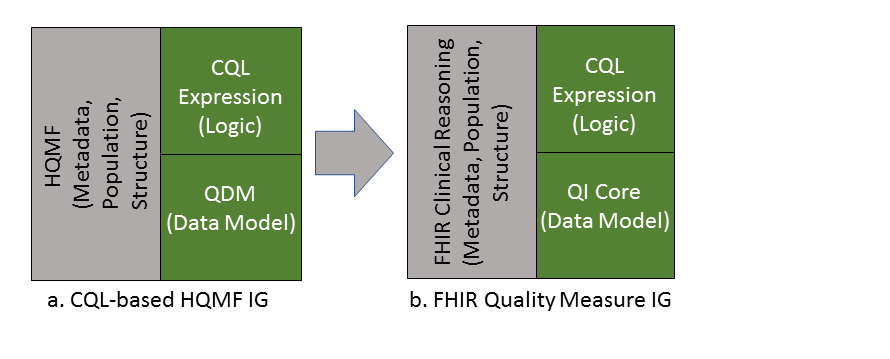

---

<!-- TOC  the css styling for this is \pages\assets\css\project.css under 'markdown-toc'-->

* Do not remove this line (it will not be displayed)
{:toc}

## 2 Introduction
{: #introduction}

### 2.1 Purpose
{: #purpose}

[The National Academy of Medicine, formerly called the Institute of Medicine (IOM),](http://www.nationalacademies.org/hmd/Reports/2001/Crossing-the-Quality-Chasm-A-New-Health-System-for-the-21st-Century.aspx) defines quality as: “The degree to which health services for individuals and populations increase the likelihood of desired health outcomes and are consistent with current professional knowledge.” For care quality to be evaluated, it must be standardized and communicated to the appropriate organizations. To that end, the FHIR Quality Measure Implementation Guide (this IG) has been written to provide guidance for authoring electronic clinical quality measures ([eCQMs](https://ecqi.healthit.gov/glossary/ecqms)), clinical quality measures specified in a standard electronic format and designed to use structured, encoded data present in the electronic health record. This implementation guide references the following standards for creating eCQMs:

* [Fast Healthcare Interoperability Resources (FHIR) R4](https://www.hl7.org/fhir/r4/)
* [Clinical Quality Language (CQL) R1.4](http://www.hl7.org/implement/standards/product_brief.cfm?product_id=400)
* [QI-Core Implementation Guide (QI-Core) R3.2](http://build.fhir.org/ig/cqframework/qi-core/)

To avoid variation in the use of FHIR Resources and metadata consistently across eCQMs and clinical decision support (CDS), a quality-related implementation guide based on a logical data model is essential. In the US Realm, eCQMs SHALL use [FHIR Quality Improvement Core (QICore)](http://build.fhir.org/ig/cqframework/qi-core) profiles as the data model to maintain consistency.

Although the specification is based on the 1.4 version of CQL, backwards-compatible future versions of CQL can be used as well. In addition, if necessary, the 1.2 and 1.3 versions of CQL can be used without loss of functionality for this Implementation Guide.

Except where noted, material from the base FHIR specification, and in particular the Clinical Reasoning module, is not repeated here.

As features and functionality are identified by this implementation guide that apply more broadly, those features may be promoted to the base FHIR specification.

### 2.2 Audience
{: #audience}

The audience for this IG includes software developers of measure authoring tools such as the US Centers for Medicare and Medicaid Services (CMS) [Measure Authoring Tool (MAT)](<https://www.emeasuretool.cms.gov/>); measure developers who will specify clinical quality measures using FHIR and CQL; software developers and implementers who will implement the quality measures specified in FHIR and CQL in their institutions or in their vendor products; institutions and organizations who wish to use FHIR and CQL to express and implement quality measures within their health systems; and local, regional, and national quality reporting agencies who wish to receive and process quality reporting documents that are based on measures specified in FHIR and CQL.

### 2.3 Approach
{: #approach}

The approach taken here is consistent with balloted IGs for FHIR. These publications view the ultimate implementation specification as a set of formal artifacts, including profiles, extensions, and terminologies. The base FHIR specification provides for the representation of quality measures using the Measure resource, as well as guidance on quality reporting within the Clinical Reasoning module. IGs such as this add constraints to the base resources and guidance through profiles and conformance requirements that further define and restrict the sequence and cardinality of elements in the FHIR resources and the vocabulary sets for coded elements.

This IG is STU2 of the FHIR Quality Measure IG.

### 2.4 Scope
{: #scope}

This IG is a conformance profile, as described in the [“Conformance” section of the HL7 FHIR specification](http://hl7.org/fhir/R4/conformance-module.html). The base resource for this IG is the HL7 FHIR Measure and Library resources and associated guidance within the Clinical Reasoning module. This IG does not describe every aspect of quality reporting in FHIR. Rather, it defines profiles and constraints on the base Measure and Library resources used in a FHIR Quality Measure. Additional optional Measure and Library elements, not included here, can be included and the result will be compliant with the specifications in this guide. The FHIR Clinical Reasoning module provides resources and universally applicable guidance for reporting quality measurement results, and the [Data Exchange for Quality Measures Implementation Guide](http://build.fhir.org/ig/HL7/davinci-deqm/) provides additional guidance and use cases related to quality reporting.

### 2.5 Conventions
{: #conventions}

The keywords SHALL, SHALL NOT, SHOULD, SHOULD NOT, MAY, and NEED NOT in this document are to be interpreted as defined in [RFC 2119](https://www.ietf.org/rfc/rfc2119.txt). Unlike RFC 2119, however, this specification allows that different applications may not be able to interoperate because of how they use optional features. In particular

* SHALL: an absolute requirement for all implementations
* SHALL NOT: an absolute prohibition against inclusion for all implementations
* SHOULD/SHOULD NOT: a best practice or recommendation to be considered by implementers within the context of their particular implementation; there may be valid reasons to ignore an item, but the full implications must be understood and carefully weighed before choosing a different course
* MAY/NEED NOT: truly optional; can be included or omitted as the implementer decides with no implications

### 2.6 Background
{: #background}

This Implementation Guide (IG) defines an approach to using CQL with the FHIR Measure and Library resources for specifying quality measures. The guidance here is drawn from the [FHIR Clinical Reasoning Module](http://www.hl7.org/implement/standards/product_brief.cfm?product_id=97), as well as the [CQL-Based HQMF IG R1 STU4](http://www.hl7.org/implement/standards/product_brief.cfm?product_id=405).

This Implementation Guide (Figure 2-1(b)) is the successor of the CQL-based HQMF IG R1 STU4 (Figure 2-1(a)).

<b>Figure 2-1: Relationship between CQL based HQMF and FHIR Quality Measure IG’s Diagram.</b>

Note that the QI Core implementation guide includes an author-focused view of QI Core called QUICK. This view provides a conceptual model for the development of quality improvement artifacts such as decision support rules and quality measures. However, although the authoring view is available, implementation tooling and guidance is still being developed to fully support the use of QUICK. Until this tooling is available, this implementation guide uses the QI Core profiles directly.

#### 2.6.1 Clinical Quality Language R1.4
{: #clinical-quality-language-r1.4}

[Clinical Quality Language R1.4 (CQL)](http://www.hl7.org/implement/standards/product_brief.cfm?product_id=400) is an HL7 standard for trial use (STU). It is part of the effort to harmonize standards between electronic clinical quality measures (eCQMs) and clinical decision support (CDS). CQL provides the ability to express logic that is human readable yet structured enough for processing a query electronically.

#### 2.6.2 CQL based HQMF IG R1 STU4
{: #cql-based-hqmf-ig-r1-stu4}

The first version of the CQL-based HQMF IG was released in September 2015 and was intended to be used in conjunction with the pre-existing QDM based HQMF R1 IG. Since 2015, the community and the standards evolved and the current version of QDM (v5.4) no longer contains expression logic, ceding this functionality to CQL. The CQL-based HQMF IG is the sole guide describing how to use QDM, CQL, and HQMF in combination (Figure 4-a).

A result of replacing QDM-based logic with CQL is that all QDM logic elements previously encoded in HQMF were replaced with CQL. This means that QDM data criteria specify only the data of interest (e.g. value sets, effective time, properties) for the eCQM, and the previous use of QDM expressions that captured interrelationships between data criteria (such as “starts after end of”) or identified subsets of data (such as min, max, last, and first) are now represented with CQL expressions. This IG documents the full approach in detail starting in Chapter 2.

This implementation guide, the FHIR Quality Measure IG, covers the use of FHIR, CQL, FHIR QI-Core and QUICK, and other emerging approaches to define eCQMs.

#### 2.6.3 HQMF
{: #hqmf}

HQMF is a structured document markup standard “…for representing a health quality measure as an electronic document. A quality measure is a quantitative tool to assess the performance of an individual or organization’s performance in relation to a specified process or outcome via the measurement of an action, process, or outcome of clinical care. Quality measures are often derived from clinical guidelines and are designed to determine whether the appropriate care has been provided given a set of clinical criteria and an evidence base.” See [HL7, Representation of the Health Quality Measures Format (HQMF)](http://www.hl7.org/implement/standards/product_brief.cfm?product_id=97) for more information.

Note that HQMF is not an HL7 V3 Clinical Document Architecture (CDA) standard, but is similar to CDA in being a structured document markup standard.

HQMF is now a normative HL7 V3 based standard that defines a header for classification and management of the quality measure as well as important metadata. HQMF also defines a document body that carries the content of the quality measure. It standardizes a measure’s structure, metadata, definitions, and logic, the HQMF ensures measure consistency and unambiguous interpretation.

The FHIR Clinical Reasoning module replaces HQMF by defining the Measure resource.

#### 2.6.4 Quality Reporting Document Architecture (QRDA)
{: #quality-reporting-document-architecture-(qrda)}

[Quality Reporting Document Architecture (QRDA) Category I](http://www.hl7.org/implement/standards/product_brief.cfm?product_id=35) is an HL7 standard that supports quality reporting at the individual patient level (referred to as QRDA Category I) and [Quality Reporting Document Architecture (QRDA) Category III](https://www.hl7.org/implement/standards/product_brief.cfm?product_id=286) is an HL7 standard that supports quality reporting at the summary level (referred to as QRDA Category III). The aspects of QRDA related to reporting results are captured in the MeasureReport resource, while the aspects of QRDA representing patient information are captured by QI-Core. The FHIR Clinical Reasoning module replaces QRDA by defining the MeasureReport structure, and the [Data Exchange for Quality Measures Implementation Guide](http://build.fhir.org/ig/HL7/davinci-deqm/) provides implementation guidance for measure reporting.
