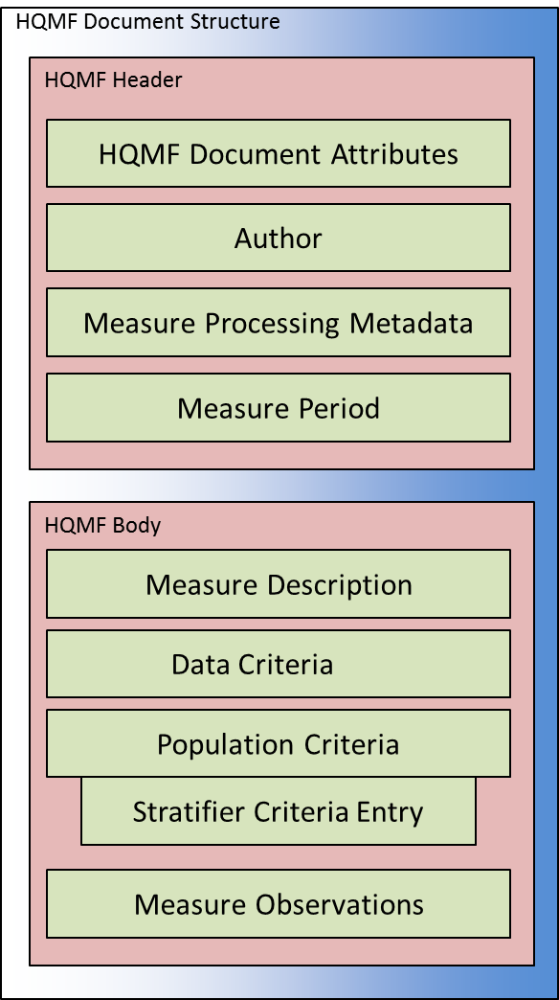
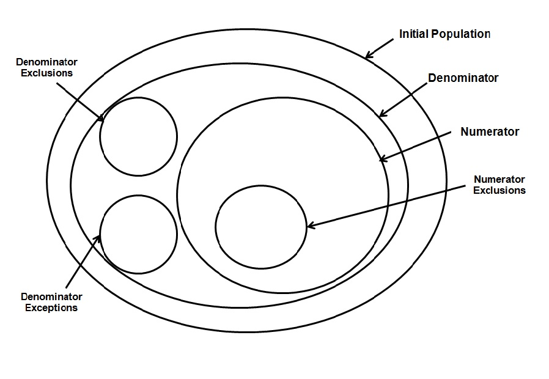
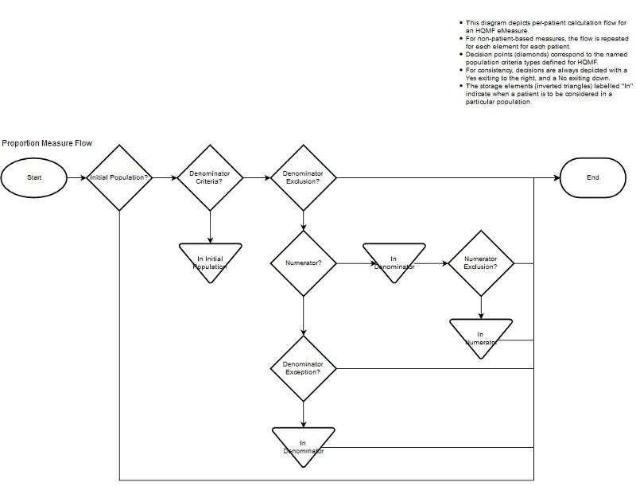
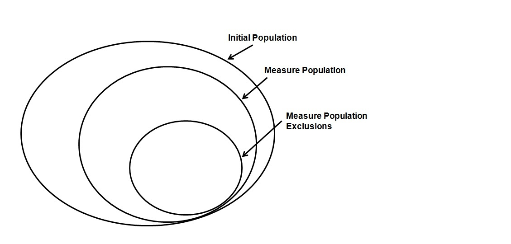
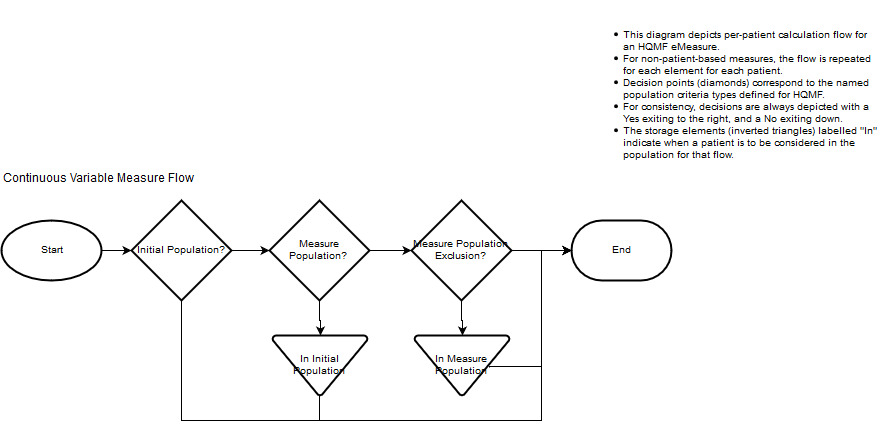
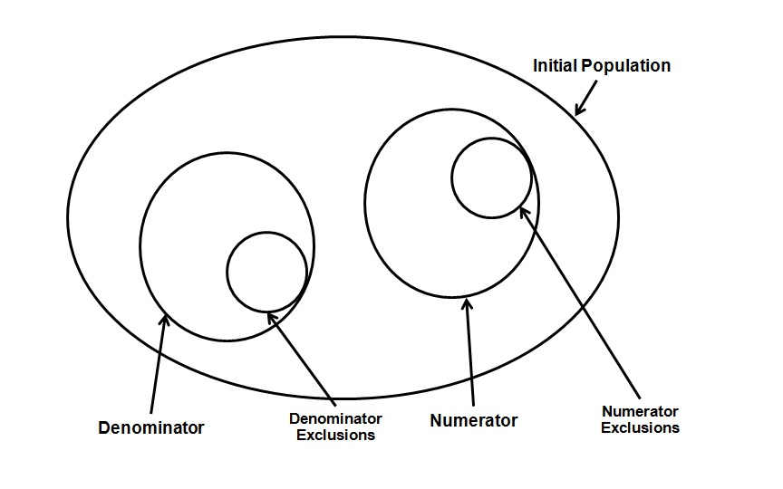
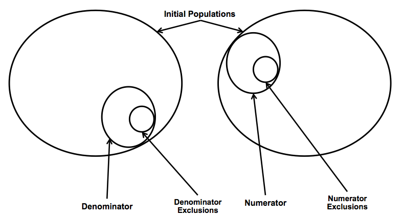
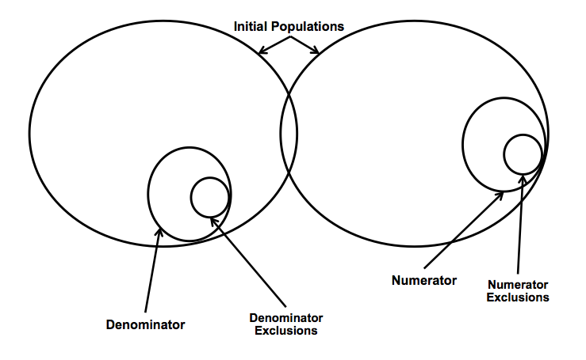
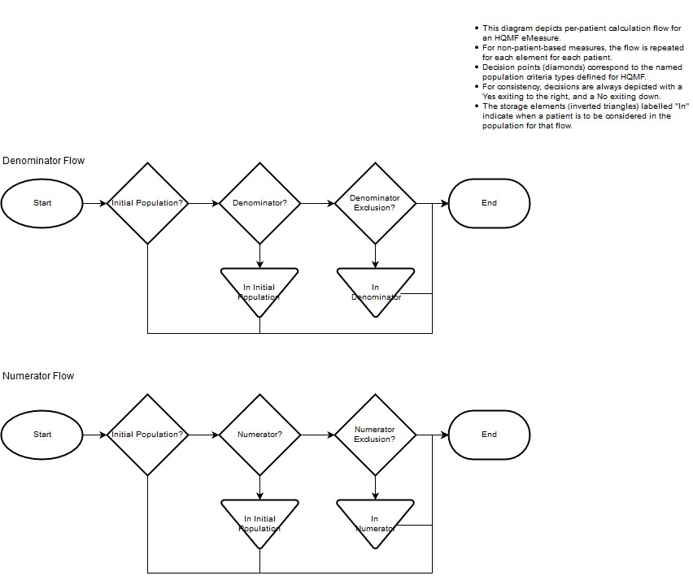
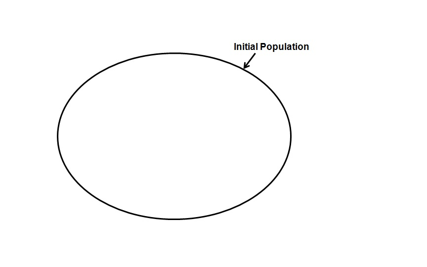

## 2 General HQMF Concepts

This chapter serves as a high-level introduction to the concepts used within an eMeasure document, all of which are described in greater detail in later chapters. For the purposes of public health reporting, the case reporting requirements will be expressed as Cohort measures.

HQMF concepts of measurement period, Data and Population Criteria, stratifiers, and other measure attributes are bundled together in a structure shown in the diagram below.

Figure 3: Typical HQMF document structure



An eMeasure document is wrapped by the <QualityMeasureDocument> element, and contains a header and a body (see QualityMeasureDocument). The header identifies and classifies the document and provides important metadata about the measure.

The body contains sections (<populationCriteriaSection> <dataCriteriaSection>, etc.), each wrapped by the <component> element. Each section can contain a single HQMF narrative block (see the Section Narrative Block), and any number of HQMF entries. An eMeasure conformant to the specification may contain pre-defined components, such as the Population Criteria Section (see Document constraints). Each pre-defined component may suggest or require various entries (see Section Constraints), and HQMF entries within these components are constrained to better ensure consistency across eMeasures (see Entry Constraints). Additional components and entries, above and beyond those required for HQMF conformance, can be included as needed.

The HQMF narrative block must contain the human readable content to be rendered. Within a component, the narrative block represents content to be rendered whereas HQMF entries represent structured content provided for further computer processing.

A minimally conformant eMeasure will contain elements from the document header, but need not include computable Data Criteria. In this case, the full narrative of the eMeasure, in any electronic format, is placed into or referenced by QualityMeasureDocument.text. From there, one can represent the full narrative of a quality measure within the narrative blocks of HQMF defined components. Full encoding further enhances the narrative of the quality measure with the addition of entries.

The following truncated XML snippet shows the high level XML structure of an HQMF Document.

```xml
<!-- Start of an HQMF R2 eMeasure. An eMeasure is surrounded by the QualityMeasureDocument element. -->
<QualityMeasureDocument>
   <!-- Header attributes including Title, Narrative, Author, Custodian etc.  -->
   <templateId />
   <title />
   <text />
   <author />
   <custodian />
   <verifier />

   <!-- defining the time period that this eMeasure applies to -->
   <controlVariable>
      <measurePeriod />
   </controlVariable>

   <!-- Miscellaneous metadata for an eMeasure -->
   <subjectOf>
      <measureAttribute />
   </subjectOf>

   <!-- Sections -->
   <!-- Measure Description Section -->
   <component>
      <measureDescriptionSection />      
   </component>

   <!-- Data Criteria Section, containing actCriteria, etc. -->
   <component>
      <dataCriteriaSection />
   </component>

   <!-- Population Criteria Section containing an Initial Population,
   numeratorCriteria, denominatorCriteria exclusions, exceptions,
   stratifier Criteria etc. -->
   <component>
      <populationCriteriaSection />
   </component>

   <!-- Measure Observation Section containing expression language expressions
      for evaluation using Data Criteria-->
   <component>
      <measureObservationsSection />
   </component>

</QualityMeasureDocument>
<!-- end of eMeasure -->
```

### 2.1 Measurement Period

Every quality measure has a Measurement Period. The Measurement Period designates the reference time frame for which data are identified, filtered and analyzed. Measurement Period can be expressed as both fixed times (start and end date) and relative times (start date and a period of reporting frequency). The exact usage of Measurement Period depends on the measure and its purpose. Data that are collected before or after the Measurement Period can also be identified with a time relationship, explained in the next part of this document.

### 2.2 Data Criteria

A "criterion" is something that can be evaluated to be TRUE or FALSE for a given item. It lays out a pattern to be matched by an object in an EHR.

The Data Criteria of a measure identify the various conditions that determine if a data item is included in the measure population or not (based upon clinical or public health interests).

For example:

    "Patient is between the ages of 20 - 30 years"
    "Patient had a hbA1C test as part of last visit"
    "Patient's last LDL cholesterol is < 100"
    "Patient has Diabetes type II"

Data Criteria can be defined against the following types of clinical data elements (this list is not exhaustive):

    Patient Demographics
    Encounters
    Medications
    Laboratory Results
    Vital Signs
    Problems
    Procedures
    Allergies
    Immunizations

Note that the actual contents of a Data Criteria element are determined by the type of data being referenced in the criteria. For example, an Encounter data criteria is represented with a Act of type Encounter, so the elements available will be determined by the structure of that type.

#### 2.2.1 Filters and Data Criteria


HQMF assumes that Data Criteria are evaluated in stages. For example a Data Criterion element (encounter) might include a constraint that a patient had an encounter within the measurement period. When this Data Criterion element is evaluated, first a list of all encounters is retrieved. Then, those encounters not within the measurement period are removed. If the resulting list of encounters is empty, then the criterion is not satisfied. If the list contains at least one encounter, then the criterion is satisfied. This document refers to that refinement process as "filtering" and the refinements applied to a data criterion during evaluation as "filters". The filters that can be applied to a Data Criterion element include temporally related information, outbound relationship, and excerpt.

For example:

    Patient has an HbA1C value > 9% in the "LAST" laboratory test.
    The patient was diagnosed with Diabetes Type II, and the "FIRST" encounter where the patient was diagnosed was within the measurement period.
    Patient's "LAST" vaccination was within 3 months of the "FIRST" vaccination.

In the above examples, "LAST" and "FIRST" are examples of filters (using excerpt) that can be applied to initial Data Criteria to refine and extract the population of interest.

Data Criteria can be related to other Data Criteria or Measurement Period via time relationships. The following examples show how an encounter can have a temporal relationship with other Data Criteria or a Measurement Period.

    Patient had a laboratory test that occurred one year before the most recent encounter.
    Patient has encounters during the Measurement Period where a particular medication was requested.
    Patient had a diagnosis of disease X within N years of immunization for disease X.

#### 2.2.2 Value Sets and Data Criteria


Quality measures often need to select patients based on enumerated features of demographics, encounters, medications or other criteria that span a range of coded values. These ranges of coded values are represented as value sets and are used to filter populations.

A value set represents a uniquely identifiable set of valid concept identifiers, where any concept identifier in a coded element can be tested to determine whether it is a member of the value set at a specific point in time. A concept identifier in a value set may be a single concept code or a post-coordinated expression of a combination of codes. A value set has a unique identifier that is assigned by the owner of the value set. These identifiers are referenced within the Data Criteria and included within the eMeasure. The exact representation will be described later in this document.

An example of a value set is a list of codes for Diabetes Type II. The list could have a name that conveys what is in the list of codes (e.g., Diabetes Type II). The value set is identified by an OID (e.g., 2.16.840.1.113883.3.464.1.37) and belong to a particular entity which maintains oversight of the value set and makes any updates to it as needed.

A value set from public health, for example, is Immunization Service Funding Eligibility, identified by 2.16.840.1.114222.4.5.301. It includes national classifications Immunization Service Funding Eligibility assigned to the patient for the purpose of identifying sources of reimbursement. As with many public health domain value sets, this is maintained by the PHIN-VADS Value Set Repository (https://phinvads.cdc.gov/). This value set may be further constrained or extended by state or regional jurisdictions (assigned a separate identifier) where additional classifications may also be supported.

Note that according to Quality Data Model (QDM), a value set is constrained to a single code system. The exception to this rule is grouping value sets. Through grouping value sets, multiple value sets of the same or different code systems can be combined into one value set.

#### 2.2.3 Processing Order and Data Criteria

Data Criteria can include a set of filters on the events identified. The order in which those filters are processed determines the end result for any specific criterion. All Data Criteria processing is performed in document order, meaning the order in which the criteria elements appear in the document, and the processing is not complete until all of the Data Criteria children are processed. The concepts are explained below using a few examples.

Consider the XML example below which specifies an ObservationCritiera which, when processed, will extract the last hbA1C greater than 9% among all the observations where hbA1C was measured.

The processing of Data Criteria when executed in document order is as follows:

    Identify and extract the result observations where hbA1C are measured. This is performed using the value set of the code element. Let us call this the set of "hbA1C observations".
    Identify and extract from the set of "hbA1C observations" the ones where the value is greater than 9%. This is done when the value element is processed. Let us call this the set of "hbA1C observations greater than 9%".
    Identify and extract the last observation from the set of "hbA1C observations greater than 9%". This is done when the excerpt element is processed which identifies the observation to be extracted.

```xml
<entry typeCode="DRIV">
   <localVariableName value="LastHbA1Cgt9"/>
   <observationCriteria classCode="OBS" moodCode="EVN">
      <id root="2.16.840.1.113883.19" extension="LastHbA1Cgt9"/>
      <code valueSet="2.16.840.1.113883.3.464.1.72"/>
      <value xsi:type="IVL_PQ" lowClosed="false">
         <low value="9" unit="%"/>
         <high nullFlavor="PINF"/>
      </value>
      <excerpt>
         <subsetCode code="LAST"/>
            <observationCriteria classCode="OBS" moodCode="EVN">
                <id root="2.16.840.1.113883.19" extension="LastHbA1Cgt9"/>
            <observationCriteria/>
      </excerpt>
   </observationCriteria>
</entry>
```

The next example shows how to check if the "last hbA1c measured was greater than 9%". This is different than the previous example, which extracted the last one from the set of "hbA1c results greater than 9%".

There are 3 different criteria elements required to perform this operation.

    The first criterion identifies and extracts the last hbA1c observation regardless of the value of the observation.
    The second criterion checks if an observation value is greater than 9%, regardless of whether the observation is the first one or last one or one in between.
    The third criterion is a grouper criterion which is used to intersect the first and the second criteria, the intersect operation will only extract the observation if it is the last one and it is greater than 9%.

```xml
<!-- Get last A1C (Criteria A) -->
<entry typeCode="DRIV">
   <localVariableName value="LastHbA1C"/>
   <observationCriteria classCode="OBS" moodCode="EVN">
      <id root="2.16.840.1.113883.19" extension="LastHbA1C"/>
      <code valueSet="2.16.840.1.113883.3.464.1.72"/>
      <definition>
         <criteriaReference classCode="OBS" moodCode="EVN">
            <id root="2.16.840.1.113883.19" extension="Results"/>
         </criteriaReference>
      </definition>
      <excerpt>
         <subsetCode code="LAST"/>
            <observationCriteria classCode="OBS" moodCode="EVN">
                <id root="2.16.840.1.113883.19" extension="LastHbA1C"/>
            <observationCriteria/>
      </excerpt>
   </observationCriteria>
</entry>

<!-- Criteria to check for a1c greater than 9% (Criteria B) -->
<entry typeCode="DRIV">
   <localVariableName value="HbA1Cgt9"/>
   <observationCriteria moodCode="EVN">
      <id root="2.16.840.1.113883.19" extension="HbA1Cgt9"/>
      <value xsi:type="IVL_PQ">
         <low value="9" unit="%"/>
      </value>
      <definition>
         <criteriaReference classCode="OBS" moodCode="EVN">
            <id root="2.16.840.1.113883.19" extension="Results"/>
         </criteriaReference>
      </definition>
   </observationCriteria>
</entry>

<!-- Create another Grouper criteria which is an intersect of A and B, meaning that we are intersecting  -->
<entry typeCode="DRIV">
   <grouperCriteria classCode="GROUPER" moodCode="EVN">
      <id root="2.16.840.1.113883.19" extension="IsLastA1Cgt9"/>
      <outboundRelationship typeCode="COMP">
        <conjunctionCode code="AND"/>
        <criteriaReference classCode="OBS" moodCode="EVN">
            <id root="2.16.840.1.113883.19" extension="LastHbA1C"/>
        </criteriaReference>
      </outboundRelationship>
      <outboundRelationship typeCode="COMP">
        <conjunctionCode code="AND"/>
        <criteriaReference classCode="OBS" moodCode="EVN">
            <id root="2.16.840.1.113883.19" extension="HbA1Cgt9"/>
        </criteriaReference>
      </outboundRelationship>
   </grouperCriteria>
</entry>
```

#### 2.2.4 Result Evaluation and Caching

The HQMF standard allows Data Criteria to be referenced using the Data Criteria ID. This allows measure developers to create a Data Criteria definition once and reuse it multiple times throughout the measure document using the ID. Results compiled from evaluation of the original Data Criteria can be cached. The cached results can be reused, without reevaluation, whenever the Data Criteria ID is referenced. However, HQMF R2 does not mandate result caching (i.e., Data Criteria referenced via an ID can be reevaluated each time) and leaves this detail up to specific implementations of the standard.

#### 2.2.5 Risk Adjustment Variables

In developing outcome measures, one challenge that measure developers often have is accounting for factors outside of provider or hospital control. These are features such as patient characteristics (age, health, etc.) or other risk factors. Because of variations in these risk factors, patients may experience variations in outcomes of care. Such variations in outcomes might not reflect the actual quality of care provided by the health care organization. Adjusting an outcome measure for these factors, a process called Risk Adjustment which produces a risk adjusted outcome measure, allows accurate comparison of outcomes across organizations.

Risk adjusted outcome measures identify risk factors as risk variables. Risk variables are plugged into a risk model to calculate the risk adjustment. In HQMF, risk variables are expressed in data criteria that extract the information needed for the risk model.

For example, a measure that calculates the risk-standardized mortality rate will identify risk variables such as patient age, first measurement of systolic blood pressure, first troponin level, and first creatinine level. Data criteria for the troponin and patient age risk variables are shown below:

```xml
<entry typeCode="DRIV">
  <localVariableName value="Troponin"/>
  <observationCriteria moodCode="EVN" classCode="OBS">
    <id root="2.16.840.1.113883.3.100.1" extension="LaboratoryTestResultFirstTroponinLevelGroup"/>
    <code xsi:type="CD" valueSet="2.16.840.1.113883.3.666.5.2361">
      <displayName value="First Troponin Level Group"/>
    </code>
    <text value="Laboratory Test, Result: First Troponin Level Group"/>
    <excerpt typeCode="XCRPT">
      <subsetCode code="FIRST"/>
      <observationCriteria classCode="OBS" moodCode="EVN">
        <id root="2.16.840.1.113883.3.100.1" extension="LaboratoryTestResultFirstTroponinLevelGroup"/>
      </observationCriteria>
    </excerpt>
  </observationCriteria>
</entry>
<entry typeCode="DRIV">
  <localVariableName value="PatientAge"/>
  <observationCriteria moodCode="EVN" classCode="OBS">
    <id root="2.16.840.1.113883.3.100.1" extension="PatientCharacteristicPatientAge"/>
    <code xsi:type="CD" valueSet="2.16.840.1.113883.3.190.5.47">
      <displayName value="Patient Age"/>
    </code>
    <text value="Patient Characteristic: Patient Age"/>
  </observationCriteria>
</entry>
```

### 2.3 Population Criteria Section

The Population Criteria Section identifies a population using one or more Data Criteria elements. Populations can be of multiple types and are used in different ways by a variety of measure types. Each measure has a measure score that determines what population types may be used. Each population type has a normative definition stated within this HQMF standard (see Definitions).

Table 1: Allowed Population Criteria for Measure Scores

| Measure Score | Initial Population | Denominator | Denominator Exclusion | Denominator Exception | Numerator | Numerator Exclusion | Measure Population | Measure Population Exclusion |
|:----|:----:|:----:|:----:|:----:|:----:|:----:|:----:|:----:|
| Proportion | R |R | O | O | R | O | NP | NP |
| Ratio | R | R | O | NP | R | O | NP | NP |
| Continuous Variable | R | NP | NP | NP | NP | NP | R | O |
| Cohort | R | NP | NP | NP | NP | NP | NP | NP |

#### 2.3.1 Population Criteria and Measure Scores

The following sections describe the expected result type for population criteria for each type of measure, as well as explicitly defining the measure score calculation formula.

In addition to the measure type, measures generally fall into two categories, patient-based, and non-patient-based, such as episode-of-care-based. In general, patient-based measures count the number of patients in each population, while non-patient-based measures count the number of items (such as encounters) in each population. Although the calculation formulas are conceptually the same for both categories, for ease of expression, population criteria for patient-based measures return true or false, while non-patient-based measures return the item to be counted such as an encounter or procedure.

The measure calculation examples use Clinical Quality Language (CQL) to express the formulas, however this is only done to make the syntax and calculations clear. HQMF does not require the use of CQL.

##### 2.3.1.1 Proportion Measure Score

The population types for a Proportion measure are "Initial Population", "Denominator", "Denominator Exclusion", "Numerator", "Numerator Exclusion" and "Denominator Exception". The following diagram shows the relationships between the populations for proportion measures and the table below provides their definitions.

Figure 4: Population criteria for Proportion measures illustration



Table 2: Population Criteria Definitions for Proportion Measures

| Population | Definition |
|:----|:----:|
| Initial Population (IPOP) | All entities to be evaluated by an eMeasure which may but are not required to share a common set of specified characteristics within a named measurement set to which the eMeasure belongs. |
| Denominator (DENOM) | The same as the Initial Population or a subset of the Initial Population to further constrain the population for the purpose of the eMeasure. |
| Denominator Exclusion (DENEX) | Entities to be removed from the Initial Population and Denominator before determining if Numerator criteria are met. Denominator Exclusions are used in Proportion and Ratio measures to help narrow the Denominator. |
| Numerator (NUMER) | The processes or outcomes for each entity defined in the Denominator of a Proportion or Ratio measure. |
| Numerator Exclusion (NUMEX) | Entities that should be removed from the eMeasure's Numerator. Numerator exclusions are used in Proportion and Ratio measures to help narrow the Numerator (for inverted measures). |
| Denominator Exception (DENEXCEP) | Those conditions that should remove a patient, procedure, or unit of measurement from the Denominator only if the Numerator criteria are not met. Denominator exceptions allow for adjustment of the calculated score for those providers with higher risk populations. |

Here is an example of using population types to select data on diabetes patients for a Proportion measure:

* Initial Population (IPOP): Patient is between the age of 16 and 74
* Denominator (DENOM): Patient has Diabetes Type II
* Numerator (NUMER): Patient is between the age of 16 and 74, has Diabetes Type II, and the most recent laboratory result has hbA1C value > 9%
* Denominator Exception (DENEXCEP): Patient meets the DENOM criteria and does NOT meet the NUMER criteria, and is designated as having "Steroid Induced Diabetes" or "Gestational Diabetes"

Figure 5: Calcuation Flow for Proportion Measures



* Initial population (IPOP): Identify those cases that meet the IPOP criteria.
* Denominator (DENOM): Identify that subset of the IPOP that meet the DENOM criteria.
* Denominator exclusion (DENEX): Identify that subset of the DENOM that meet the DENEX criteria. There are cases that should be removed from the denominator as exclusion. Once these cases are removed, the subset remaining would reflect the denominator per criteria.
* Numerator (NUMER): Identify those cases in the DENOM and NOT in the DENEX that meet the NUMER criteria. In proportion measures, the numerator criteria are the processes or outcomes expected for each patient, procedure, or other unit of measurement defined in the denominator.
* Numerator exclusion (NUMEX): Identify that subset of the NUMER that meet the NUMEX criteria. Numerator Exclusion is used only in ratio eMeasures to define instances that should not be included in the numerator data.
* Denominator exception (DENEXCEP): Identify those in the DENOM and NOT in the DENEX and NOT in the NUMER that meet the DENEXCEP criteria.

The “performance rate” is a ratio of patients meeting NUMER criteria, divided by patients in the DENOM (accounting for exclusion and exception). Performance rate can be calculated using this formula:

Performance rate = (NUMER - NUMEX) / (DENOM – DENEX – DENEXCEP)

###### 2.3.1.1.1 Patient-based Calculation

The following snippet provides precise semantics for the measure score calculation for a patient-based proportion measure:

```cql
context Patient

define "Denominator Membership":
  "Initial Population"
    and "Denominator"
    and not "Denominator Exclusion"
    and not ("Denominator Exception" and not "Numerator")

define "Numerator Membership":
  "Initial Population"
    and "Denominator"
    and not "Denominator Exclusion"
    and "Numerator"
    and not "Numerator Exclusion"

context Population

define "Measure Score":
  Count("Numerator Membership" IsMember where IsMember is true)
    / Count("Denominator Membership" IsMember where IsMember is true)
```

###### 2.3.1.1.2 Non-patient-based Calculation

The following snippet provides precise semantics for the measure score calculation for a non-patient-based proportion measure:

```cql
define "Numerator Membership":
  "Initial Population"
    intersect "Denominator"
    except "Denominator Exclusion"
    intersect "Numerator"
    except "Numerator Exclusion"

define "Denominator Membership":
  "Initial Population"
    intersect "Denominator"
    except "Denominator Exclusion"
    except ("Denominator Exception" except "Numerator")

context Population

define "Measure Score":
  Count("Numerator Membership") /
    Count("Denominator Membership")
```

##### 2.3.1.2 Continuous Variable Measure Score

The population types for a Continuous Variable measure are "Initial Population", "Measure Population", and "Measure Population Exclusion". In addition to these populations, a Measure Observation is defined which contains one or more Continuous Variable statements that are used to score one or more particular aspects of performance. The following diagram shows the relationships between the populations for Continuous Variable measures and the table below provides their definitions.

Figure 6: Population criteria for Continuous Variable measures illustration



Table 3: Population Criteria Definitions for Continuous Variable Measures

| Population | Definition |
|:----|:----:|
| Initial Population (IPOP) | All entities to be evaluated by an eMeasure which may but are not required to share a common set of specified characteristics within a named measurement set to which the eMeasure belongs. |
| Measure Population (MSRPOPL) | Continuous Variable measures do not have a Denominator, but instead define a Measure Population, as shown in the figure above. Rather than reporting a Numerator and Denominator, a Continuous Variable measure defines variables that are computed across the Measure Population (e.g., average wait time in the emergency department). A Measure Population may be the same as the Initial Population or a subset of the Initial Population to further constrain the population for the purpose of the eMeasure. |
| Measure Population Exclusions (MSRPOPLEX) | Patients who should be removed from the eMeasure's Initial Population and Measure Population before determining the outcome of one or more continuous variables defined within a Measure Observation. Measure Population Exclusions are used in Continuous Variable measures to help narrow the Measure Population. |

Here is an example of using the population types to select data on emergency department patients for a Continuous Variable measure:

* Initial Population (IPOP): Patient had an emergency department (ED) encounter
* Measure Population (MSRPOPL): Same as Initial Population
* Measure Population Exclusion (MSRPOPLEX): Patient had an inpatient encounter that was within 6 hours of the ED encounter or expired in the ED

Figure 7: Calcuation Flow for Continuous Variable Measure Score



* Initial population (IPOP): Identify those cases that meet the IPOP criteria.
* Measure population (MSRPOPL): Identify that subset of the IPOP that meet the MSRPOPL criteria.
* Measure population exclusion (MSRPOPLEX): Identify that subset of the MSRPOPL that meet the MSRPOPLEX criteria.

###### 2.3.1.2.1 Individual Observations

Individual Observations are calculated for each case in the MSRPOPL and not in the MSRPOPLEX.

###### 2.3.1.2.2 Measure Aggregates

Using individual observations for all cases in the MSRPOPL and not in the MSRPOPLEX, calculate the aggregate MSRPOPL.

Score = aggregate MSRPOPL

###### 2.3.1.2.3 Calculation

The following snippet provides precise semantics for the measure score calculation for a continuous variable measure:

```cql
define "Measure Population Membership":
  "Initial Population"
    intersect "Measure Population"
    except "Measure Population Exclusion"

context Population

define "Measure Score":
  Avg("Measure Population Membership" PopulationMember
      return "Median ED Time"(PopulationMember)
  )
```

##### 2.3.1.3 Ratio Measure Score

The population types for a Ratio measure are "Initial Population", "Denominator", "Denominator Exclusion", "Numerator" and "Numerator Exclusion". The following diagrams show the relationships between the populations for Ratio measures and the table below provides their definitions.

Figure 8: Population criteria for Ratio measures illustration



Figure 9: Population criteria for Ratio measures illustration



Figure 10: Population criteria for Ratio measures illustration



Table 4: Population Criteria Definitions for Ratio Measures

| Population | Definition |
|:----|:----:|
| Initial Population (IPOP) | All entities to be evaluated by an eMeasure which may but are not required to share a common set of specified characteristics within a named measurement set to which the eMeasure belongs. Ratio measures are allowed to have two Initial Populations, one for Numerator and one for Denominator. In most cases, there is only 1 Initial Population |
| Denominator (DENOM) | The same as the Initial Population or a subset of the Initial Population to further constrain the population for the purpose of the eMeasure. |
| Denominator Exclusion (DENEX) | Entities that should be removed from the Initial Population and Denominator before determining if Numerator criteria are met. Denominator exclusions are used in Proportion and Ratio measures to help narrow the Denominator. |
| Numerator (NUMER) | The outcomes expected for each entity defined in the Denominator of a Proportion or Ratio measure. |
| Numerator Exclusion (NUMEX) | Entities that should be removed from the eMeasure's Numerator before determining if Numerator criteria are met. Numerator exclusions are used in Proportion and Ratio measures to help narrow the Numerator. |

Here is an example of using the population types to select data on patients with central line catheters for a ratio measure:

* Initial Population (IPOP): Patient is aged 65 years or older and admitted to hospital
* Denominator (DENOM): Patient has a central line
* Denominator Exclusion (DENEX): Patient is immunosuppressed
* Numerator (NUMER): Patient has a central line blood stream infection
* Numerator Exclusion (NUMEX): Patient's central line blood stream infection is deemed to be a contaminant

Figure 11: Calcuation Flow for Ratio Measure Score



* Initial population (IPOP): Identify those cases that meet the IPOP criteria. (Some ratio measures will require multiple initial populations, one for the numerator, and one for the denominator.)
* Denominator (DENOM): Identify that subset of the IPOP that meet the DENOM criteria.
* Denominator exclusion (DENEX): Identify that subset of the DENOM that meet the DENEX criteria.
* Numerator (NUMER): Identify that subset of the IPOP that meet the NUMER criteria.
* Numerator exclusion (NUMEX): Identify that subset of the NUMER that meet the NUMEX criteria.

###### 2.3.1.3.1 Individual Observations

For each case in the DENOM and not in the DENEX, determine the individual DENOM observations.

For each case in the NUMER and not in the NUMEX, determine the individual NUMER observations.

###### 2.3.1.3.2 Measure Aggregates

Using individual observations for all cases in the DENOM and not in the DENEX, calculate the aggregate DENOM.

Using individual observations for all cases in the NUMER and not in the NUMEX, calculate the aggregate NUMER.

Ratio = aggregate NUMER / aggregate DENOM

###### 2.3.1.3.3 Patient-based Calcuation

The following snippet provides precise semantics for the measure score calculation for a patient-based ratio measure:

```cql
context Patient

define "Denominator Membership":
  "Initial Population"
    and "Denominator"
    and not "Denominator Exclusion"

define "Numerator Membership":
  "Initial Population"
    and "Numerator"
    and not "Numerator Exclusion"

context Population

define "Measure Ratio Numerator":
  Count("Numerator Membership" IsMember where IsMember is true)

define "Measure Ratio Denominator":
  Count("Denominator Membership" IsMember where IsMember is true)
```

###### 2.3.1.3.4 Non-patient-based Calculation

The following snippet provides precise semantics for the measure score calculation for a non-patient-based ratio measure:

```cql
define "Numerator Membership":
  "Initial Population"
    intersect "Numerator"
    except "Numerator Exclusion"

define "Denominator Membership":
  "Initial Population"
    intersect "Denominator"
    except "Denominator Exclusion"

context Population

define "Measure Score Numerator":
  Count("Numerator Membership")

define "Measure Score Denominator":
  Count("Denominator Membership")
```

##### 2.3.1.4 Cohort Measure Score

In a cohort measure, a population is identified from the population of all items being counted. For example, one might identify all the patients who have had H1N1 symptoms. The identified population is very similar to the Initial Population but is called a Cohort Population for public health purposes. In the Constrained Information Model (CIM), the population will be expressed using the InitialPopulationCriteria act. The Cohort Population result is used by public health agencies to trigger specific public health activities. The following diagram depicts the population for a Cohort measure and the table below provides its definition.

Figure 12: Population criteria for Cohort measures illustration



Table 5: Population Criteria Definitions for Cohort Measures

| Population | Definition |
|:----|:----:|
| Initial Population (IPOP) | All entities to be evaluated by an eMeasure which may but are not required to share a common set of specified characteristics within a named measurement set to which the eMeasure belongs. (Also known as a Cohort Population) |

Here is an example of using the population types to select data on patients who have received immunizations for a Cohort measure:

* Initial Population (IPOP): All patients who had an immunization

Figure 13: Calcuation Flow for Cohort

Calculation Flow Diagram-Cohort

* Initial population (IPOP): Identify those cases that meet the IPOP criteria.

#### 2.3.2 Population Criteria and Data Criteria

Population Criteria are constructed using Data Criteria to appropriately identify the right population. In order to use multiple Data Criteria to filter out populations, the Data Criteria are combined logically using "AND/OR/XOR" operators. These operators appear in the form of:

* "AllTrue" and "AllFalse", representing AND and NOR operators respectively
* "AtLeastOneTrue" and "AtLeastOneFalse" representing OR and NAND operators respectively
* "OnlyOneTrue" and "OnlyOneFalse" representing XOR operator

For example, to identify an Initial Population consisting of male patients between the ages of 16-74, we would construct two Data Criteria elements and combine them as follows:

* Data Criteria Element 1: "Patient is between the ages of 16-74"
* Data Criteria Element 2: "Patient is male"
* Combine the above two criteria using the "AllTrue" operator (which is a logical AND) to extract the Initial Population desired.

#### 2.3.3 Population Criteria and Items Counted

Most eMeasures need the ability to designate what a population is counting. For example, a single measure may need to look at how many patients met a particular criterion, the number of beds available for those patients, and the number of staff treating those patients. To express this, Items Counted (ITMCNT) is provided as a Measure Attribute so that a population can make explicit what is being counted.

Items Counted can be specified at the document level or at the specific population level using the measureAttribute act class.

### 2.4. Stratifiers

Stratifiers are constructed using Data Criteria and used to specify how the results need to be grouped.

For example:

    Identify all patients between the ages of 16 and 74 and stratify the counts by gender.

In the above example, the stratification criteria refer to gender and age Data Criteria elements to group the counts of patients between 16 and 74.

When a measure definition includes stratification, each population in the measure definition should be reported both without stratification, and stratified by each stratification criteria. Specific programs may require reporting of performance rates. The performance rate is defined as

Performance rate = (NUMER - NUMEX) / (DENOM – DENEX – DENEXCEP)

For measures with multiple numerators and/or strata, each patient/episode must be scored for inclusion/exclusion to every population. For example if a measure has 3 numerators, and the patient is included in the first numerator, the patient should be scored for inclusion/exclusion from the populations related to the other numerators as well.

#### 2.6 Human Readability and Rendering HQMF Documents

HQMF requires that a receiver of an eMeasure be able to deterministically display the document in a standard Web browser such that a human reader would extract the same quality data as would a computer that is basing the extraction on formally encoded eMeasure entries. Material within a section to be rendered is placed into the section.text field. The content model of this field is the same as that used for other Structured Document specifications (e.g., Clinical Document Architecture, Structured Product Labeling).

The following conformance constraints relate to the rendered content of an HQMF document:

* A recipient of an eMeasure SHALL be able to parse and interpret the document sufficiently to render it, using the rendering rules in the Section Narrative Block.
* HQMF header fields, which SHALL be rendered if present, include the following attributes, participants, and relationships:
  * QualityMeasureDocument.title
  * QualityMeasureDocument.text
  * QualityMeasureDocument.statusCode
  * QualityMeasureDocument.effectiveTime
  * QualityMeasureDocument.versionNumber
  * QualityMeasureDocument.author
  * QualityMeasureDocument.custodian
  * QualityMeasureDocument.verifier
    * QualityMeasureDocument.verifier.time
* QualityMeasureDocument.componentOf. QualityMeasureSet. title
* QualityMeasureDocument.subjectOf. MeasureAttribute code value pairs
* HQMF section fields which if present must be rendered include:
  * Section.title
  * Section.text (must be rendered per the rules defined in Section Narrative Block).
A creator of an eMeasure SHALL properly populate section.text and Section Narrative Blocks such that a recipient, adhering to the recipient requirements above, will render the document such that a human reader would extract the same quality data as would a computer that is basing the extraction on formally encoded eMeasure entries.

To avoid confusion among readers, narrative block and rendered content must be differentiated. Rendered Content refers to all the elements that a recipient must be able to render for the document as a whole. This includes QualityMeasureDocument.title and QualityMeasureDocument.text elements where a narrative description of the eMeasure is stored, and to the Section.text and Section.title elements where narrative text to be rendered is stored. "Narrative Block" specifically refers to section.text elements in every section.

The textual elements at the document level and the section level can contain all the required information for a measure in a narrative form, however it cannot be verified or automated to provide consistent processing.

#### 2.7 Encoding eMeasure Quality Statements

##### 2.7.1 General Approach

Quality measures exist in a variety of formats today. The HQMF specification, while providing formalism for query measure statements, also provides an incremental approach where one can:

* Create a minimally conformant eMeasure that simply wraps an existing quality measure in any electronic format within the HQMF header.
* Represent the full narrative of a quality measure within the narrative blocks of HQMF defined sections.
* Enhance the full narrative within the HQMF XML with a formalized representation of quality statements. This formalism is based on the following approach, which serves to modularize the process and make it understandable, reusable, and implementable via an eMeasure authoring tool:
  1. Data criteria are defined: A criterion ("age is greater than 18", "antibiotic was prescribed", "diminished renal capacity", "length of stay less than 120 days") is an assertion that can be found to be true or false, when comparing against raw data (either QRDA documents or EHR data).Formally, Data Criteria return sets of matching data nodes which pass the assertions stated in the Data Criteria. Hence, an empty data set resolves to "false" , while a non-empty set resolves to "true". Filters can then be applied to a returned non-empty data set. Data Criteria in HQMF are used primarily to determine whether or not the item being counted (e.g., patients, encounters, procedures, etc.) is included in a measure's Population, Numerator, Denominator, etc. For instance, a measure might say that "to be included in the Denominator, a patient must have age greater than 18 and antibiotic therapy prescribed". HQMF formalizes Data Criteria by expressing them as RIM patterns coupled with vocabularies. Where a patient or the item being counted has an object in EHR that is subsumed by Data Criteria, those criteria can be deemed true for that patient or item being counted. Most measures focus on counting the number of patients that meet certain Data Criteria. However, this may not always be the case. An example of a non-patient centric measure is NQF #0435, which counts encounters where Ischemic stroke patients were prescribed antithrombotic therapy at hospital discharge (the item being counted here would be encounters and not actual patients).
  2. Population Criteria are defined: Criteria for Numerator, Denominator, and other measurement populations are defined based on the underlying Data Criteria. For instance, the criteria for a patient to be part of a measure's Denominator might be that the patient meets the criteria for "diminished renal capacity" and does not meet the criteria that "antibiotic was prescribed". Population Criteria, like Data Criteria, are assertions that can be found to be true or false, thereby providing a means for HQMF to formalize a measure's population parameters.
  3. Measure observations are defined: While some quality measures only define Data Criteria and Population Criteria, other quality measures also define variables or calculations that are used to score a particular aspect of performance. For instance, a measure intends to assess the use of restraints. Population criteria for the measure include "patient is in a psychiatric inpatient setting" and "patient has been restrained". For this population, the measure defines a measure observation of "restraint time" as the total amount of time the patient has been restrained. Measure observations are not criteria, but rather, are definitions of observations, used to score a measure. Examples in Public Health Reporting Requirements include:
      * Next shot due date and administration of the same vaccine > 1 month
      * Significant increase in BMI- increase of BMI>10% in a 6 month period

These steps are described in greater detail in the chapters that follow. HQMF entries corresponding to these steps are segregated into different sections in an eMeasure.

##### 2.7.2 Patient Criteria vs. Aggregate Scores

Terms like "numerator" and "denominator" can be ambiguous, in that they can refer to [1] the criteria for determining if an individual patient is included in a particular population (e.g., "numerator criteria are inpatient AND diagnosis of pneumonia AND treated with antibiotic"); [2] the total count of patients meeting the criteria (e.g., "27 patients meet the numerator criteria"); [3] the top or bottom of a fraction (e.g., "the numerator is total restraint time, the denominator is total psychiatric inpatient days"). HQMF differentiates these interpretations in a number of ways:

* Data criteria and population criteria are expressed as individual patient criteria. In other words, criteria are constructed such that one can determine whether or not a particular patient meets the criteria.
* HL7 has distinct codes to distinguish between the interpretations. For example, the code "included in denominator" is an assertion (represented in HQMF as an observation value) that a patient has met the denominator criteria; whereas the code "denominator count" is an observation (represented as an observation code) that carries a value.
* Measure Observations are not implicitly tied to any particular population and can explicitly reference the population over which they apply. For example, a measure defines a Measure Observation "average systolic blood pressure" as the sum of systolic blood pressures divided by the number of blood pressure readings. While the "sum of systolic blood pressures" is the numerator of an equation, it bears no relationship to the measure's numerator population. In fact, a quality organization may require that "average systolic blood pressure" be reported on any of the measure populations. Examples in Public Health Reporting Requirements include:
  * Exposure duration
    * Time from screening to consultation
    * Exposure to lead for more than 30 days
    * Exposure to treatment
  * Foreign travel in excess of 1 week

##### 2.7.3 Measure Definition vs. Reporting Requirements

Organizations with a variety of quality reporting goals can collect data based on the same eMeasure, but stipulate different reporting requirements. For example, several organizations might be interested in the use of antibiotics in patients with bronchitis. An eMeasure could then define the nenominator criteria as "encounter with diagnosis of bronchitis", and the numerator criteria as "antibiotic prescription is written". One quality organization wishes to receive a quarterly summary where all qualifying encounters are reported, stratified by age; whereas another quality organization requests semi-annual reports, where, in order to minimize the human burden of chart review, only 20% of encounters with a diagnosis of bronchitis need to be sampled.

A "measure definition" includes those components of a quality measure that are fixed and universally applicable, whereas "reporting requirements" are not part of a measure's definition, and can vary across organizations. While the dividing line is not absolute, common reporting requirements that are not typically defined as part of an eMeasure include reporting frequency, sampling, etc.

#### 2.8 Data Collection, Missing Data and Corrupt or Invalid Data

HQMF eMeasure's Data and Population Criteria specify what measure population group the item being counted belongs to (e.g., Initial Population, Denominator, Denominator Exclusion, Numerator). For each Data or Population Criteria element defined in a HQMF measure, an item's EHR data can have three possible results:

1. The data for the item being counted meet the criterion.
2. The data for the item being counted do not meet the criterion.
3. Unknown item data or missing data.

For result #1 or #2, it is straightforward to evaluate what population group the item should belong to, based upon criterion satisfaction.

For result #3, since HQMF measures normally do not provide guidance on how to deal with the unknown result, there are often questions. Does or does not the item being counted meet the criterion? How can one determine a measure population group based on unknown result? Should a query continue to retrieve other data for the item being counted for the rest of the measure criteria?

To eliminate confusion and inconsistency in interpreting unknown data or missing data, the following constraint will apply: if data are unknown or missing, they SHALL fail the criteria unless otherwise specified in the measure.

To specify criteria around missing data, a measure can include missing data constructs using null flavors as part of the measure definition itself. For more information on this topic, refer to PopulationCriteriaSection.

While developing eMeasures, another aspect measure authors might need to account for is corrupt or invalid data. For example, assuming that one measure has a criterion of systolic blood pressure greater than 130, invalid and obviously misreported values such as systolic BP of 2000 might be reported as part of the criteria results.

For corrupt or invalid data, measure authors may need to take additional steps to construct HQMF eMeasures in a way that either reduces the chance of invalid values contaminating the result pool or reports invalid/corrupt data values separately using stratifiers. Although reporting invalid data is not explicitly defined in HQMF as a separate section, there are several strategies to deal with the situation.

One methodology is to define Data Criteria with caps at values deemed appropriate for the measure, using the appropriate Boolean logic (see the chapter on Logical Groupers) to check for false criteria before including a result into the result set.

A second approach is to use stratifiers (see the chapter on StratifierCriteria) to group the outlier/corrupt data values separately so measure authors have an idea if and when their Data Criteria are returning values that might skew the results. This would require a measure developer to create the Data Criteria needed to pick out only the outlier values and then use the stratifier criteria entry to group these values together. An important point to note is that this approach does not remove these values from the overall result set as in the previous approach. It only makes it easier for developers to identify that such values exist in the data set.
