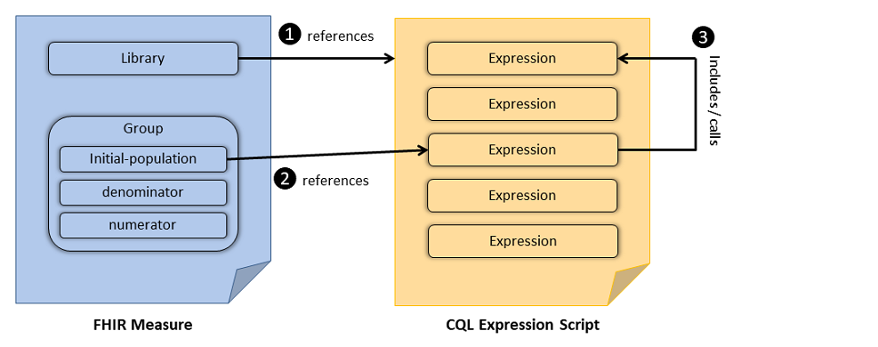
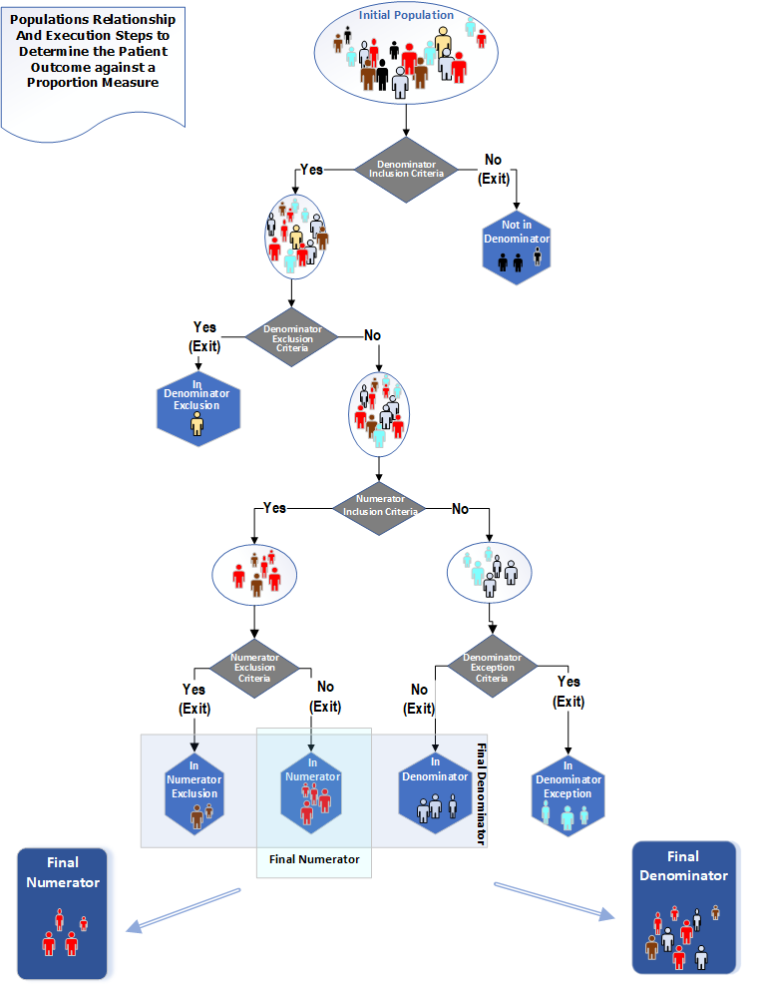
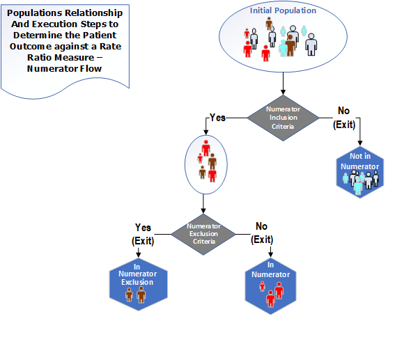
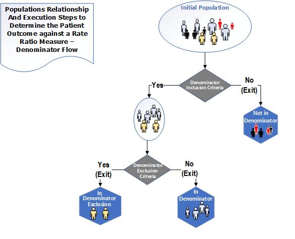
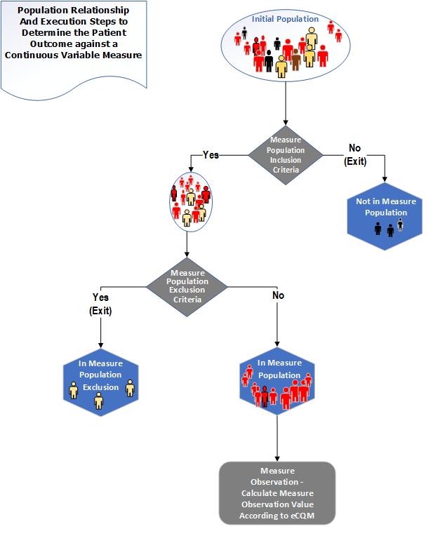
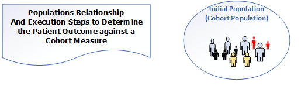

---

<!-- TOC  the css styling for this is \pages\assets\css\project.css under 'markdown-toc'-->

* Do not remove this line (it will not be displayed)
{:toc}


## 3 eCQM Basics
{: #ecqm-basics}

In FHIR, an eCQM is represented as a FHIR Measure resource containing metadata ([Section 3.1](#metadata)) and terminology ([Section 3.2](#terminology)), a population criteria section ([Section 3.4](#population-criteria)), and at least one FHIR Library resource containing a data criteria section ([Section 3.3](#data-criteria)) as well as the logic used to define the population criteria. The population criteria section typically contains initial population criteria, denominator criteria, and numerator criteria sub-components, among others. Snippet 1 shows the structure of a FHIR Measure.

```xml
<Measure>
  <!-- metadata for the measure - snipped for brevity -->
  <effectivePeriod>
    <start value="2018-01-01"/>
    <end value="2018-12-31"/>
  </effectivePeriod>
  <library>
    <reference value="Library/EXMLogic"/>
  </library>
  <group>
    <population>
      <code><coding><code value="initial-population"/></coding></code>
      <criteria value="Initial Population"/>
    </population>
    <population>
      <code><coding><code value="denominator"/></coding></code>
      <criteria value="Denominator"/>
    </population>
    <population>
      <code><coding><code value="numerator"/></coding></code>
      <criteria value="Numerator"/>
    </population>
  </group>
</Measure>
```
{: #content-pre}

Snippet 3-1: FHIR Measure structure - abridged for clarity (from sample [Measure-measure-exm.xml](Measure-measure-exm.html))

### 3.1 Metadata
{: #metadata}

The header of an eCQM document identifies and classifies the document and provides important metadata about the measure. [The CMS Measures Management System Blueprint](https://www.cms.gov/Medicare/Quality-Initiatives-Patient-Assessment-Instruments/MMS/MMS-Blueprint.html) includes a list of header data elements that are specified by CMS for use by all CMS measure contractors. The Blueprint header requirements have been implemented in the Meaningful Use 2014 eCQMs and all subsequent annual updates. This IG further constrains the header in the base [Measure]({{site.data.fhir.path}}measure.html) resource by including the Blueprint header requirements.

The rest of this section describes some of the more important components to the header, such as “Related Documents” ([Section 3.1.1](#related-documents)), “Measurement Period” ([Section 3.1.2](#measurement-period)), and “Data Criteria” ([Section 3.3](#data-criteria)).

#### 3.1.0 Must Support
{: #must-support}

Certain elements in the profiles defined in this implementation guide are marked as _Must Support_. This flag is used to indicate that the element plays a critical role in defining and sharing quality measures, and implementations SHALL understand and process the element.

In addition, because measure specifications typically make use of data implementation guides (e.g. US Core, QI-Core), the implications of the Must Support flag for profiles used from those implementation guides must be considered.

For more information, see the definition of [Must Support]({{site.data.fhir.path}}conformance-rules.html#mustSupport) in the base FHIR specification.

#### 3.1.1 Related Documents
{: #related-documents}

[Clinical Quality Language R1.4](http://www.hl7.org/implement/standards/product_brief.cfm?product_id=400) can be used in conjunction with the FHIR Measure resource to construct CQL-based quality measures. CQL is a domain specific language used in the Clinical Quality Measurement and Clinical Decision Support domains. Measures written in CQL leverage the expressivity and computability of CQL to define the population criteria used in the eCQM.

Any included CQL library must contain a library declaration line as its first line as in Snippet 3-2.

```cql
library EXM146 version '4.0.0'
```

Snippet 3-2: Library declaration line from [EXM146.cql](Library-EXM146.html#cql-content)

When using multiple CQL libraries to define a measure, refer to the [Nested Libraries](using-cql.html#nested-libraries) section of the [Using CQL](using-cql.html#cql-basics) topic of this guide.

Inclusion of CQL into a FHIR eCQM is accomplished through the use of a FHIR Library resource as shown in Snippet 3-4. These libraries are then incorporated into the FHIR eCQM using the `library` element of the Measure (Snippet 3). CQL library content is encoded as `base64` and included as the `content` element of the Library resource.

```xml
 <library>
    <reference value="Library/EXMLogic"/>
  </library>
```
Snippet 3-3: `library` element from Snippet 3-1

Snippet 3-4 illustrates a FHIR Library resource containing a CQL library with a stable, globally unique, version-independent identifier for the library, the `url`. If the library has a version specified, the versionNumber element is used as well.

**Conformance Requirement 1 (Referencing CQL Documents):** [](#conformance-requirement-1)
{: #conformance-requirement-1}

1. FHIR-based eCQMs SHALL consist of a FHIR Measure resource conforming to at least the CQFMMeasure profile. In particular, FHIR-based eCQMs SHALL contain a narrative containing a human-readable representation of the measure content.
2. FHIR-based eCQM Measure and Library resource instances SHALL declare their profile.
3. Proportion Measures SHALL conform to the CQFMProportionMeasure profile.
4. Ratio Measures SHALL conform to the CQFMRatioMeasure profile.
5. Continuous Variable Measures SHALL conform to the CQFMContinuousVariableMeasure profile.
6. Cohort Measures SHALL conform to the CQFMCohortMeasure profile.
7. Libraries used with FHIR-based eCQMs SHALL consist of a FHIR Library resource conforming to at least the CQFMLibrary profile.
8. CQFMMeasures utilizing CQL libraries SHALL include exactly 1 CQFMLibrary per CQL library referenced in the Measure.
9. CQL Libraries implicitly referenced through nesting of libraries MAY be included.
10. CQFMLibraries SHALL include a content element for CQL.
11. The CQFMLibrary content element SHALL include a sub-element with a mediaType of `text/cql`.
12. CQFMLibraries SHALL specify CQL content as a base-64-encoded string in the content sub-element as content.data.
13. Any referenced CQL library SHALL contain a library declaration line.
14. The library declaration line SHALL be the first line in the library.
15. The name of the Library resource SHALL be the same as the name of the CQL library.
16. The version of the Library resource SHALL be the same as the version of the CQL library.
17. The canonical URL of the Library resource SHALL end in the name of the Library resource.

```json
{
  "resourceType": "Library",
  "id": "EXM146",
  "meta": {
    "profile": [
      "http://hl7.org/fhir/us/cqfmeasures/StructureDefinition/library-cqfm"
    ]
  },
  "url": "http://hl7.org/fhir/us/cqfmeasures/Library/EXM146",
  "identifier": [
    {
      "use": "official",
      "system": "http://example.org/fhir/cqi/ecqm/Library/Identifier",
      "value": "EXM146"
    }
  ],
  "version": "4.0.0",
  "name": "EXM146",
  "title": "EXM146 - Example Proportion Measure Library",
  "status": "active",
  "experimental": true,
  "type": {
    "coding": [
      {
        "system": "http://terminology.hl7.org/CodeSystem/library-type",
        "code": "logic-library"
      }
    ]
  },
  "date": "2019-09-03",
  "publisher": "Health Level 7 International - Clinical Quality Information Work Group",
  "contact": [
    {
      "telecom": [
        {
          "system": "url",
          "value": "http://www.hl7.org/Special/committees/cqi/index.cfm"
        }
      ]
    }
  ],
  "description": "This library is used as an example in the FHIR Quality Measure Implementation Guide",
  "useContext": [
    {
      "code": {
        "system": "http://terminology.hl7.org/CodeSystem/usage-context-type",
        "code": "program"
      },
      "valueCodeableConcept": {
        "coding": [
          {
            "system": "http://hl7.org/fhir/us/cqfmeasures/CodeSystem/quality-programs",
            "code": "ep-ec",
            "display": "EP/EC"
          }
        ]
      }
    }
  ],
  "jurisdiction": [
    {
      "coding": [
        {
          "system": "urn:iso:std:iso:3166",
          "code": "US"
        }
      ]
    }
  ],
  "approvalDate": "2019-08-03",
  "lastReviewDate": "2019-08-03",
  "relatedArtifact": [
    {
      "type": "depends-on",
      "resource": "http://hl7.org/fhir/Library/FHIR-ModelInfo|4.0.1"
    },
    {
      "type": "depends-on",
      "resource": "http://hl7.org/fhir/Library/FHIRHelpers|4.0.1"
    },
    {
      "type": "depends-on",
      "resource": "http://hl7.org/fhir/Library/Common|2.0.0"
    },
    {
      "type": "depends-on",
      "resource": "http://somewhere.org/fhir/uv/mycontentig/Library/MATGlobalCommonFunctions|5.0.000"
    },
    {
      "type": "depends-on",
      "resource": "http://cts.nlm.nih.gov/fhir/ValueSet/2.16.840.1.113883.3.464.1003.102.12.1011"
    },
    {
      "type": "depends-on",
      "resource": "http://cts.nlm.nih.gov/fhir/ValueSet/2.16.840.1.113883.3.464.1003.102.12.1012"
    },
    {
      "type": "depends-on",
      "resource": "http://cts.nlm.nih.gov/fhir/ValueSet/2.16.840.1.113883.3.464.1003.101.12.1061"
    },
    {
      "type": "depends-on",
      "resource": "http://cts.nlm.nih.gov/fhir/ValueSet/2.16.840.1.113883.3.464.1003.196.12.1001"
    },
    {
      "type": "depends-on",
      "resource": "http://cts.nlm.nih.gov/fhir/ValueSet/2.16.840.1.113883.3.464.1003.198.12.1012"
    }
  ],
  "parameter": [
    {
      "name": "Measurement Period",
      "use": "in",
      "min": 0,
      "max": "1",
      "type": "Period"
    },
    {
      "name": "Patient",
      "use": "out",
      "min": 0,
      "max": "1",
      "type": "Patient"
    },
    {
      "name": "Is Between 2 and 17 Years of Age at Start of Measurement Period",
      "use": "out",
      "min": 0,
      "max": "1",
      "type": "boolean"
    },
    {
      "name": "Antibiotics",
      "use": "out",
      "min": 0,
      "max": "*",
      "type": "MedicationRequest"
    },
    {
      "name": "Pharyngitis",
      "use": "out",
      "min": 0,
      "max": "*",
      "type": "Condition"
    },
    {
      "name": "Measurement Period Encounters",
      "use": "out",
      "min": 0,
      "max": "*",
      "type": "Encounter"
    },
    {
      "name": "Pharyngitis Encounters With Antibiotics",
      "use": "out",
      "min": 0,
      "max": "*",
      "type": "Encounter"
    },
    {
      "name": "Initial Population",
      "use": "out",
      "min": 0,
      "max": "*",
      "type": "Encounter"
    },
    {
      "name": "Pharyngitis With Prior Antibiotics",
      "use": "out",
      "min": 0,
      "max": "*",
      "type": "Condition"
    },
    {
      "name": "Excluded Encounters",
      "use": "out",
      "min": 0,
      "max": "*",
      "type": "Encounter"
    },
    {
      "name": "Denominator Exclusions",
      "use": "out",
      "min": 0,
      "max": "*",
      "type": "Encounter"
    },
    {
      "name": "Strep Test Encounters",
      "use": "out",
      "min": 0,
      "max": "*",
      "type": "Encounter"
    },
    {
      "name": "Numerator",
      "use": "out",
      "min": 0,
      "max": "*",
      "type": "Encounter"
    }
  ],
  "dataRequirement": [
    {
      "type": "MedicationRequest",
      "profile": [
        "http://hl7.org/fhir/StructureDefinition/MedicationRequest"
      ],
      "codeFilter": [
        {
          "path": "medication",
          "valueSet": "http://cts.nlm.nih.gov/fhir/ValueSet/2.16.840.1.113883.3.464.1003.196.12.1001"
        }
      ]
    },
    {
      "type": "Condition",
      "profile": [
        "http://hl7.org/fhir/StructureDefinition/Condition"
      ],
      "codeFilter": [
        {
          "path": "code",
          "valueSet": "http://cts.nlm.nih.gov/fhir/ValueSet/2.16.840.1.113883.3.464.1003.102.12.1011"
        }
      ]
    },
    {
      "type": "Condition",
      "profile": [
        "http://hl7.org/fhir/StructureDefinition/Condition"
      ],
      "codeFilter": [
        {
          "path": "code",
          "valueSet": "http://cts.nlm.nih.gov/fhir/ValueSet/2.16.840.1.113883.3.464.1003.102.12.1012"
        }
      ]
    },
    {
      "type": "Encounter",
      "profile": [
        "http://hl7.org/fhir/StructureDefinition/Encounter"
      ],
      "codeFilter": [
        {
          "path": "type",
          "valueSet": "http://cts.nlm.nih.gov/fhir/ValueSet/2.16.840.1.113883.3.464.1003.101.12.1061"
        }
      ]
    },
    {
      "type": "Observation",
      "profile": [
        "http://hl7.org/fhir/StructureDefinition/Observation"
      ],
      "codeFilter": [
        {
          "path": "code",
          "valueSet": "http://cts.nlm.nih.gov/fhir/ValueSet/2.16.840.1.113883.3.464.1003.198.12.1012"
        }
      ]
    }
  ],
  "content": [
    {
      "contentType": "text/cql",
      "data": "bGli...Cg=="
    },
    {
      "contentType": "application/elm+xml",
      "data": "PD94...Cg=="
    },
    {
      "contentType": "application/elm+json",
      "data": "ew0K...DQp9"
    }
  ]
}
```

Snippet 3-4: Example CQL Library (from [library-EXM146.json](Library-EXM146.html#cql-content))

Inclusion of CQL libraries within the FHIR-based eCQM framework must conform to [Conformance Requirement 1](#conformance-requirement-1).

##### 3.1.1.1 Including ELM
{: #including-elm}

CQL defines both a human-readable text representation and a machine-oriented representation called the Expression Logical Model (ELM), which can be represented using XML or JSON. The human-readable text representation is optimized for authoring while the ELM representation offers a canonical, simplified representation that is easier to implement in software. Any CQL expression can be directly translated to its ELM equivalent. Measure authors do not work with ELM directly; rather authoring tools convert CQL to the ELM representation for distribution.

Both CQL and ELM representations may be included in the Library resource depending on the requirements of the appropriate profile. It can follow the approach of supporting human readability (in this case, the high-level CQL syntax) and a canonical representation for machine processing (in this case, CQL’s Expression Logical Model (ELM)). This approach facilitates human review of measure logic via CQL and implementation of that logic in tools via ELM.

**Conformance Requirement 2 (Referencing ELM Documents):** [](#conformance-requirement-2)
{: #conformance-requirement-2}
1. CQFMLibraries SHOULD include a content element with the ELM in either XML or JSON format
2. CQFMLibraries SHALL specify ELM content as a base-64-encoded string in the content sub-element as content.data
3. An ELM translation SHOULD be provided, in either XML or JSON format.
4. For executable environments, an ELM translation SHALL be provided, in either XML or JSON format.
5. The XML representation of the ELM SHALL have a mediaType attribute
value of `application/elm+xml`
6. The JSON representation of the ELM SHALL have a mediaType attribute
value of `application/elm+json`
7. Any translation-referenced ELM documents SHALL be semantically
equivalent to the corresponding parent CQL expression document.

The content elements in Snippet 3-4 provide an example of how a CQFMLibrary resource would contain both the CQL and the ELM as base-64-encoded strings. More on ELM can be found in Section 3.1.1. For examples of ELM using the XML and JSON representations please see the included examples, [EXM146.xml](Measure-measure-exm146-FHIR.xml.html) and [EXM146.json](Measure-measure-exm146-FHIR.json.html).

#### 3.1.2 Measurement Period
{: #measurement-period}

The Measure resource uses the `effectivePeriod` element to define the "Measurement Period", a control variable as metadata that influences the computation of measures. Snippet 3-5 demonstrates how to provide the "Measurement Period" in the Measure (line: 3 of Snippet 3-1).

'Measurement Period' is anchored by the `effectivePeriod` element but not necessarily directly represented.


```xml
<effectivePeriod>
  <start value="2018-01-01"/>
  <end value="2018-12-31"/>
</effectivePeriod>
```

Snippet 3-5: Measure representation of the "Measurement Period" control variable from [(measure-exm.xml)](Measure-measure-exm.xml.html)

The value of the "Measurement Period" control variable is accessible to CQL libraries as a parameter called "Measurement Period". Snippet 3-6 shows an example of a CQL library declaring this parameter.

```cql
parameter "Measurement Period" Interval<DateTime>
```

Snippet 3-6: CQL declaration of the measurement period parameter (from [EXM146.cql](Library-EXM146.html#cql-content))

Rather than specifying a static effective period, implementations may specify the effective period using a start date and a reporting period duration.

This implementation guide defines two extensions, [`cqfm-effectivePeriodAnchor`](StructureDefinition-cqfm-effectivePeriodAnchor.html) and [`cqfm-effectivePeriodDuration`](StructureDefinition-cqfm-effectivePeriodDuration.html) to support this alternative.

As shown below in Snippet 3-7, a measure anchored to January 1, 2019 with a calendar duration of 1 year, would have valid Measurement Periods of 1/1/2019-12/31/2019, 1/1/2020-12/31/2020, etc. Note that although UCUM definite-duration units are required within FHIR, the semantics in this case use calendar duration semantics.

```xml
<effectivePeriod>
	<extension url="http://hl7.org/fhir/us/cqfmeasures/cqfm-effectivePeriodAnchor">
		<valueDateTime value="2019-01-01"/>
	</extension>
	<extension url="http://hl7.org/fhir/us/cqfmeasures/cqfm-effectivePeriodDuration">
		<valueDuration>
			<value value="1"/>
			<code value="a"/>
		</valueDuration>
	</extension>
</effectivePeriod>
```
Snippet 3-7: Example of [effectivePeriodAnchor extension](StructureDefinition-cqfm-effectivePeriodAnchor.html) (used to define the starting date and range) and [effectivePeriodDuration extension](StructureDefinition-cqfm-effectivePeriodDuration.html) (used to specify the reporting period).

**Conformance Requirement 3 (Measurement Period):** [](#conformance-requirement-3)
{: #conformance-requirement-3}
1. FHIR-based eCQMs SHALL provide either an `effectivePeriod` element, or an `cqfm-effectivePeriodAnchor` and `cqfm-effectivePeriodDuration` extension
2. Measurement Period SHALL be either the `effectivePeriod` as specified, or an appropriate interval of length duration, starting at the specified anchor


### 3.2 Terminology
{: #terminology}

This section describes how to use codes and valuesets from codesystems like LOINC, SNOMED-CT, and others within the CQL and FHIR-based eCQM files of a measure package.

When terminology artifacts are defined and distributed as part of quality measure content, guidance provided as part of the [Clinical Practice Guideline (CPG) IG](http://build.fhir.org/ig/HL7/cqf-recommendations/documentation-terminology.html) should be followed. Note that the guidance does not apply for content that only references terminology distributed through other means.

Valuesets and direct referenced codes are declared in the header section of the CQL using the CQL valueset and code constructs. In the case of direct referenced codes, a codesystem declaration must precede the code declaration (per CQL v1.3 specification). Examples of valueset and code declarations can be seen in the accompanying [Terminology.cql](Library-Terminology.html#cql-content).


```cql
codesystem "SNOMEDCT:2017-09": 'http://snomed.info/sct'
  version 'http://snomed.info/sct/731000124108/version/201709'

valueset "Encounter Inpatient SNOMEDCT Value Set":
   'http://cts.nlm.nih.gov/fhir/ValueSet/2.16.840.1.113883.3.666.7.307|20160929'

code "Venous foot pump, device (physical object)": '442023007' from "SNOMED-CT:2017-09"
```

Snippet 3-8: CQL declaration of codesystem, valueset, and code (from [Terminology.cql](Library-Terminology.html))

Further discussion of codesystem, valueset, and code can be found in the [Using CQL Chapter](using-cql.html#cql-basics) of this IG, sections [4.3](using-cql.html#code-systems), [4.4](using-cql.html#value-sets), and [4.5](using-cql.html#codes).

All declared valuesets and codes can be found in the [dataRequirement](StructureDefinition-library-cqfm-definitions.html#Library.dataRequirement) elements in the Library resource referenced by the Measure resource.

```json
"dataRequirement": [
  {
    "type": "CodeableConcept",
    "codeFilter": [
      {
        "valueCoding": {
          "system": "http://snomed.info/sct",
          "version": "http://snomed.info/sct/731000124108/version/201709",
          "code": "442023007",
          "display": "Venous foot pump, device (physical object)"
        }
      }
    ]
  },
  {
    "type": "Encounter",
    "codeFilter": [
      {
        "path": "type",
        "valueSet": "http://cts.nlm.nih.gov/fhir/ValueSet/2.16.840.1.113883.3.666.7.307|20160929"
      }
    ]
  }
]
```

Snippet 3-9: Example Library terminology definitions (from [library-Terminology.json](Library-Terminology.json.html))

**Conformance Requirement 4 (Terminology Inclusion):** [](#conformance-requirement-4)
{: #conformance-requirement-4}

Measures using valueset and/or direct-reference codes must conform to the requirements of Conformance Requirement 4.
1. All valuesets and codes referenced in the CQL SHALL be included in the Library using dataRequirement elements.
2. If a valueset or code is referenced outside the context of a retrieve, the dataRequirement SHALL have the type 'CodeableConcept'

For example, in the following CQL, the reference to the code `"Venous foot pump, device (physical object)"` occurs in the `"DeviceUseStatement"` retrieve, while the reference to the code `"Right foot"` occurs outside the context of the retrieve:

```cql
define "Venous Foot Pumps Applied":
  ["DeviceUseStatement": code in "Venous foot pump, device (physical object)"] D
    where D.status = 'completed'
      and D.bodySite ~ ToConcept("Right foot")
```

### 3.3 Data Criteria
{: #data-criteria}

The data criteria section defines the patient data of interest in the library as a set of `dataRequirements`. Each entry identifies specific types of data along with constraints that the data must meet. Snippet 3-9 shows an example of a data criteria entry indicating an ”Encounter”.

```json
"dataRequirement": [
  {
    "type": "Encounter",
    "codeFilter": [
      {
        "path": "type",
        "valueSet": "http://cts.nlm.nih.gov/fhir/ValueSet/2.16.840.1.113883.3.666.7.307|20160929"
      }
    ]
  }
]
```

Snippet 3-10: Example data criteria (from [library-Terminology.json](Library-Terminology.json.html))

**Conformance Requirement 5 (Data Criteria Inclusion):**[](#conformance-requirement-5)
{: #conformance-requirement-5}
1. `dataRequirement` entries SHALL be included in the Library for each retrieve appearing in the CQL library

Note that CQL defines its own method for referencing data and that there is no direct link between the data criteria included in the measure and the data used by the CQL expressions. The Library data criteria are surfaced by this implementation guide to promote structured review of the data criteria for a Library (and by examining Libraries referenced by a Measure, for a Measure or set of Measures) for the following use cases:

* Determining the set of data used by a particular eCQM.
* Limited “scoop-and-filter” for creation of quality reports. Implementations desiring or required to comply with privacy policies that mandate or recommend fine-grained filtering should examine the CQL or ELM to determine additional data constraints necessary for adherence to those policies.

Section 3.3.1 describes a means for deriving data requirements from CQL data references.

#### 3.3.1 Use of ELM
{: #use-of-elm}

The canonical representation of ELM makes it straightforward to derive data requirements for CQL data references to comply with Conformance Requirement 6:

**Conformance Requirement 6** [](#conformance-requirement-6)
{: #conformance-requirement-6}
1. ELM elements with type "Retrieve" are represented using the DataRequirement type defined in FHIR
2. The Retrieve ELM element's "dataType" value is represented by the DataRequirement's "type" attribute
3. The Retrieve ELM element's "codes" value referencing a value set or direct-reference code is represented by the DataRequirement's "codeFilter.valueSet" attribute
4. The Retrieve ELM element's " templateId" value can be represented by the DataRequirement's "profile" attribute.
5. For each ELM element identified in item (1) above, a dataRequirement should be included using the profile identified in item (4) that references the value set identified in item (3)

Note that if the data model does not specify profile identifiers, the ELM retrieves will not have a templateId specified. In this case, the name of the type in the data model is used.

To illustrate the mapping, Snippet 3-10 shows an ELM data reference and corresponding dataRequirement in both XML and JSON

XML:
```xml
<def name="Acute Pharyngitis" id="2.16.840.1.113883.3.464.1003.102.12.1011" accessLevel="Public" />
```
```xml
<operand dataType="fhir:Condition" xsi:type="Retrieve">
    <codes name="Acute Pharyngitis" xsi:type="ValueSetRef" />
</operand>
```

JSON:
```json
"def" : [
  {
    "name" : "Acute Pharyngitis",
    "id" : "2.16.840.1.113883.3.464.1003.102.12.1011",
    "accessLevel" : "Public"
  }
]
```
```json
"operand" : [
  {
    "dataType" : "{http://hl7.org/fhir}Condition",
    "codeProperty" : "code",
    "type" : "Retrieve",
    "codes" : {
       "name" : "Acute Pharyngitis",
       "type" : "ValueSetRef"
    }
  }
]
 ```

Snippet 3-11: ELM data reference for Condition: Acute Pharyngitis (from [EXM146_FHIR-4.0.0.xml](Measure-measure-exm146-FHIR.xml.html) and [EXM146_FHIR-4.0.0.json](Measure-measure-exm146-FHIR.json.html))

```json
{
  "type": "Condition",
  "codeFilter": [
    {
      "path": "code",
      "valueSet": "http://cts.nlm.nih.gov/fhir/ValueSet/2.16.840.1.113883.3.464.1003.102.12.1011"
    }
  ]
}
```

Snippet 3-12: Library dataRequirement for Condition: Acute Pharyngitis (from [library-EXM146.json](Library-EXM146.xml.html))

### 3.4 Population Criteria
{: #population-criteria}

The Population Criteria (Snippet 3-13) includes definitions of criteria used to specify populations. The criteria specifying these populations are described using CQL and those CQL expressions are given context in the FHIR Measure resource. In this section, we describe how to use CQL and the FHIR Measure resource to define population criteria.

```xml
<group>
  <population>
    <code><coding><code value="initial-population"/></coding></code>
    <criteria value="Initial Population"/>
  </population>
  <population>
    <code><coding><code value="denominator"/></coding></code>
    <criteria value="Denominator"/>
  </population>
  <population>
    <code><coding><code value="numerator"/></coding></code>
    <criteria value="Numerator"/>
  </population>
</group>
```

Snippet 3-13: Population Criteria from Snippet 3-1 (FHIR Measure structure - abridged for clarity (from sample [Measure-measure-exm.xml](Measure-measure-exm.html)))

CQL provides the logical expression language that is used to define population criteria. CQL-based constraints are then referenced from the group elements of the FHIR Measure resource. Once included in the FHIR Measure, expressions defined in the CQL can be used to further refine the data criteria and to define population criteria.  Figure 2-1 illustrates the general concept.  Figure 3-1 illustrates the relationship between the FHIR Measure resource and CQL documents: The FHIR Measure resource references a CQL expression script (#1), the FHIR library resource references a particular expression from the referenced CQL file (#2), the referenced expression in-turn may include or call another expression (#3) in the same (or a different) CQL expression script. Snippet 3-13 and Snippet 3-14 demonstrate the use of the FHIR Measure resource and CQL in the definition of the "Initial-population".

**Figure 3-1: Relationship between FHIR Measure and CQL Expression Script**

<div>

</div>


```json
"population": [
  {
    "identifier": {
      "value": "initial-population-identifier"
    },
    "code": {
      "coding": [
        {
          "code": "initial-population"
        }
      ]
    },
    "criteria": "\"Initial Population\""
  }
]
```

Snippet 3-14: Defining a population via reference to a CQL expression (from [measure-exm146-FHIR.json](Measure-measure-exm146-FHIR.json.html))

Snippet 3-15 shows several examples of a CQL expression calling another, e.g. the "Initial Population" expression references another CQL expression: "Pharyngitis Encounters With Antibiotics". In this example the referenced expressions are all contained within the same CQL file (EXM146.cql) and some are included above. The "Is Between 2 and 17 Years of Age at Start of Measurement Period" expression uses the built-in CQL function AgeInYearsAt(). The definition of "Pharyngitis Encounters With Antibiotics" uses the function "Includes Or Starts During", defined in another CQL library (Common as described in Common.cql), further explanation of nested libraries is given in the “Nested Libraries” section of the Using CQL topic of this IG.

```cql
library EXM146_FHIR version '4.0.0'

using FHIR version '3.0.0'

include FHIRHelpers version '3.0.0' called FHIRHelpers
include Common_FHIR version '2.0.0' called Common

define "Is Between 2 and 17 Years of Age at Start of Measurement Period":
   AgeInYearsAt(start of "Measurement Period") >= 2
      and AgeInYearsAt(start of "Measurement Period") <= 17

define "Measurement Period Encounters":
   [Encounter: "Ambulatory/ED Visit"] Encounter
      where Encounter.period during "Measurement Period"
        and Encounter.status = 'finished'
        and "Is Between 2 and 17 Years of Age at Start of Measurement Period"

define "Pharyngitis Encounters With Antibiotics":
   "Measurement Period Encounters" Encounters
      with "Pharyngitis" Pharyngitis such that
         Common."Includes Or Starts During"(Pharyngitis, Encounters)
      with "Antibiotics" Antibiotics such that Antibiotics.authoredOn
         3 days or less after FHIRHelpers.ToInterval(Encounters.period)

define "Initial Population":
   "Pharyngitis Encounters With Antibiotics"
```

Snippet 3-15: CQL definition of the "Initial Population" criteria (from [EXM146.cql](Library-EXM146.html#cql-content))


**Conformance Requirement 7 (Referential Integrity):** [](#conformance-requirement-7)
{: #conformance-requirement-7}
1. All Measure population criteria components <br/>
     a. SHALL reference exactly one CQL expression.<br/>
     b. SHALL reference the same CQL library.
2. References to expressions SHALL use the `text/cql.identifier` media type defined in the [CQL specification](https://cql.hl7.org/2020May/07-physicalrepresentation.html#media-types-and-namespaces).<br/>

#### 3.4.1 Criteria Names
{: #criteria-names}

To encourage consistency among measures, the following guidelines for specifying population criteria within a measure are proposed. The measure population criteria names used here are defined by the [MeasurePopulationType]({{site.data.fhir.path}}codesystem-measure-population.html) code system in the base FHIR specification.

The codes within the [MeasurePopulationType]({{site.data.fhir.path}}codesystem-measure-population.html) code system in the base FHIR specification are explicitly spelled out, where as the measure population code [based on HQMF](http://terminology.hl7.org/ValueSet/v3-ActCode) are abbreviated. In order to make the development of eCQMs straightforward and clear, [this concept map](conceptmap-measure-populations.html) provides mapping from HQMF codes to FHIR codes for each of the measure component code.

**Conformance Requirement 8 (Criteria Names):** [](#conformance-requirement-8)
{: #conformance-requirement-8}
The name of an expression specifying a population criteria within a measure SHOULD always be the name of the criteria type†† :
* "Initial Population"
* "Denominator"
* "Denominator Exclusion"
* "Denominator Exception"
* "Numerator"
* "Numerator Exclusion"
* "Measure Population"
* "Measure Population Exclusion"
* "Measure Observation"
* "Stratification"

†† When using multiple populations and/or multiple population groups, see Section 3.4.7

Note that the Measure Observation criteria is the name of a function used in the Continuous Variable Measure. See the [Continuous Variable Measure](measure-conformance.html#continuous-variable-measure) section for more.

For each scoring type, the set of applicable criteria are specified in the [Quality Reporting](http://www.hl7.org/fhir/clinicalreasoning-quality-reporting.html) topic of the FHIR Clinical Reasoning module. The table is reproduced here for reference:

**Table 3-1: Measure populations based on types of measure scoring.**

| | Initial Population | Denominator | Denominator Exclusion | Denominator Exception | Numerator | Numerator Exclusion | Measure Population | Measure Population Exclusion |
|:---|:---:|:---:|:---:|:---:|:---:|:---:|:---:|:---:|
| Proportion | R | R | O | O | R | O | NP | NP |
| Ratio | R‡‡ | R | O | NP | R | O | NP | NP |
| Continuous Variable | R | NP | NP | NP | NP | NP | R | O |
| Cohort | R | NP | NP | NP | NP | NP | NP | NP |
{: .grid}

R=Required. O=Optional. NP=Not Permitted.

‡‡ Some ratio measures will require multiple Initial Populations, one for the numerator and one for the denominator.

In addition, the formula for calculating the measure score is implied by the type of the measure. The following sections describe the expected result type for population criteria for each type of measure, as well as explicitly defining the measure score calculation formula.

In addition to the measure type, measures generally fall into two categories, patient-based, and non-patient-based (e.g. encounter-based).  In general, patient-based measures count the number of patients in each population, while non-patient-based measures count the number of items (such as encounters) in each population. Although the calculation formulas are conceptually the same for both categories, for ease of expression, population criteria for patient-based measures indicates whether a patient matches the population criteria (true) or not (false). Non-patient-based measures return the item to be counted such as an encounter or procedure.

**Conformance Requirement 9 (Population Basis):** [](#conformance-requirement-9)
{: #conformance-requirement-9}
1. CQL expressions SHALL be written to return an appropriate value for each population depending on the measure type
2. The [`cqfm-populationBasis`](StructureDefinition-cqfm-populationBasis.html) extension SHALL be used to identify the result type of population criteria expressions in the measure

The following example illustrates the use of the populationBasis extension for a patient-based measure:

```json
  "extension": [
    {
      "url": "http://hl7.org/fhir/us/cqfmeasures/StructureDefinition/cqfm-populationBasis",
      "valueCode": "boolean"
    }
  ],
```

And the following example illustrates the use of the populationBasis extension for an encounter-based measure:

```json
  "extension": [
    {
      "url": "http://hl7.org/fhir/us/cqfmeasures/StructureDefinition/cqfm-populationBasis",
      "valueCode": "Encounter"
    }
  ],
```

#### 3.4.2 Measure Population Semantics

The base FHIR Measure resource defines a set of measure population components that are used to construct measures. Measure populations have implicit relationships to each other depending on the measure scoring type. For example, for proportion measures, denominator criteria have an implicit dependency on initial population criteria, i.e. the criteria for inclusion in the denominator of a measure implicitly include the criteria for inclusion in the initial population.  Similarly, numerator criteria have an implicit dependency on denominator criteria, i.e. the criteria for inclusion in the numerator of a measure implicitly include the criteria for inclusion in the denominator. CQL expressions referenced by Measure population criteria are evaluated within the context of these implicit dependencies.

**Conformance Requirement 10 (Measure Population Semantics):** [](#conformance-requirement-10)
{: #conformance-requirement-10}
1. CQL expressions used as measure population criteria SHALL be evaluated taking relevant dependencies into account, as specified by the membership determination formulas defined for each scoring type.
2. CQL expressions MAY include explicit dependencies that duplicate the
implicit FHIR-based eCQM population dependencies.

For example, Snippet 3-16 defines the "Initial Population" and "Denominator" for a measure.

```cql
define "Initial Population":
  "In Demographic" and "Has Target Encounter"

define "Denominator": "Initial Population"
```

Snippet 3-16: Explicit definition of the initial population and denominator.

In this snippet, the relationship between the "Denominator" and the "Initial Population" is made explicit even though the FHIR Measure specification defines the "Denominator" to be a subset of the "Initial Population". With respect to the measure population definitions, the following CQL code has identical meaning:

```cql
define "Denominator": true
```

In this variant, the "Denominator" is utilizing the measure dependencies but this dependency is not explicitly expressed in the CQL; this is referred to as an implicit dependency.

If population criteria evaluate to null for a patient-based measure it is interpreted as false. If population criteria evaluate to null for a non-patient-based measure it is interpreted as an empty list.

#### 3.4.3 Proportion Measures
{: #proportion-measures}

A FHIR Measure resource representing a proportion measure will include one or more population criteria sections as described in Table 3-2.

The semantics of these components are unchanged from the base [Measure]({{site.data.fhir.path}}measure.html) specification; the only difference is that each component references a single criterion encoded as a CQL expression.

The referenced CQL expressions return either an indication that a patient meets the population criteria (patient-based measures) or the events that a particular patient contributes to the population (episode-of- care-based measures). For example, consider two measures:

**Table 3-2: Patient-based and Episode-of-Care Measure Examples**

<!-- | Measure | Denominator | Numerator |
|:--------|:------------:|:----------:|
| Patient-based | All patients with condition A that had one or more encounters during the measurement period. | All patients with condition A that underwent procedure B during the measurement period. |
| Episode-of-Care | All encounters for patients with condition A during the measurement period. | All encounters for patients with condition A during the measurement period where procedure B was performed during the encounter. | -->
<table class="grid">
  <thead>
    <tr>
      <th style="text-align: left" class="col-2">Measure</th>
      <th style="text-align: left" class="col-5">Denominator</th>
      <th style="text-align: left" class="col-5">Numerator</th>
    </tr>
  </thead>
  <tbody>
    <tr>
      <td style="text-align: left" class="col-2">Patient-based</td>
      <td style="text-align: left" class="col-5">All patients with condition A that had one or more encounters during the measurement period.</td>
      <td style="text-align: left" class="col-5">All patients with condition A that underwent procedure B during the measurement period.</td>
    </tr>
    <tr>
      <td style="text-align: left" class="col-2">Episode-of-Care</td>
      <td style="text-align: left" class="col-5">All encounters for patients with condition A during the measurement period.</td>
      <td style="text-align: left" class="col-5">All encounters for patients with condition A during the measurement period where procedure B was performed during the encounter.</td>
    </tr>
  </tbody>
</table>

In Table 3-2, the first measure is an example of a patient-based measure. Each patient may contribute at most one count to the denominator and numerator, regardless of how many encounters they had. The second measure is an episode-of-care measure where each patient may contribute zero or more encounters to the denominator and numerator counts.

For complete examples of patient-based proportion measures, see the Screening Measure [Examples](examples.html). For a complete example of an encounter-based proportion measure, see the [EXM108](Measure-measure-vte-1-FHIR.html) measure included in this implementation guide.

**Conformance Requirement 11 (Proportion Measures):** [](#conformance-requirement-11)
{: #conformance-requirement-11}
1. The CQL expression SHALL use the Patient context and be executed within the context of a single patient record at a time.
2. The CQL expression for patient-based measures SHALL return a Boolean to indicate whether a patient matches the population criteria (true) or not (false).
3. The CQL expression for non-patient-based measures SHALL return a List of events of the same type, such as an Encounter or Procedure.

##### 3.4.3.1 Proportion measure scoring
{: #proportion-measure-scoring}

The population types for a Proportion measure are "Initial Population", "Denominator", "Denominator Exclusion", "Numerator", "Numerator Exclusion" and "Denominator Exception". The following diagram shows the relationships between the populations for proportion measures and the table below provides their definitions.

**Figure 3-2: Population criteria relationships for Proportion measures illustration**

<div>

</div>
<br>

**Table 3-3: Population Criteria Definitions for Proportion Measures**

| Population | Definition |
|:----|:----|
| Initial Population | The initial population criteria refers to all patients, subjects, or events to be evaluated by a quality measure involving patients or subjects who share a common set of specified characterstics. All patients, subjects, or events counted (for example, as numerator, as denominator) are drawn from the initial population. |
| Denominator | Denominator criteria define the patients, subjects, or events that should be included in the lower portion of a fraction used to calculate a rate, proportion, or ratio. The denominator can be the same as the initial population, or a subset of the initial population to further constrain the population for the purpose of the measure. |
| Denominator Exclusion | Denominator exclusion criteria define patients, subjects, or events that should be excluded from the denominator. Denominator exclusions are used in proportion and ratio measures to help narrow the denominator. For example, patients with bilateral lower extremity amputations would be listed as a denominator exclusion for a measure requiring foot exams. |
| Numerator | Numerator criteria define the patients, subjects, or events that should be included in the upper portion of a fraction used to calculate a rate, proportion, or ratio. Also called the measure focus, it is the target process, condition, event, or outcome. Numerator criteria are the processes or outcomes expected for each patient, subject, or event defined in the denominator. A numerator statement describes the clinical action that satisfies the conditions of the measure. |
| Numerator Exclusion | Numerator exclusion criteria define patients, subjects, or events to be excluded from the numerator. Numerator exclusions are used in proportion and ratio measures to help narrow the numerator (for inverted measures). |
| Denominator Exception | Denominator exceptions are conditions that should remove a patient, subject, or event from the denominator of a measure only if the numerator criteria are not met. Denominator exception allows for adjustment of the calculated score for those providers with higher risk populations. Denominator exception criteria are only used in proportion measures. |
{: .grid}

* Initial population : Identify those cases that meet the Initial Population criteria. <br/>
* Denominator : Identify that subset of the Initial Population that meet the Denominator criteria.<br/>
* Denominator Exclusion : Identify that subset of the Denominator that meet the Denominator Exclusion criteria. There are cases that should be removed from the Denominator as exclusion. Once these cases are removed, the subset remaining would reflect the Denominator per criteria.
* Numerator : Identify those cases in the Denominator and NOT in the Denominator Exclusion that meet the Numerator criteria. In proportion measures, the Numerator criteria are the processes or outcomes expected for each patient, procedure, or other unit of measurement defined in the Denominator.
* Numerator Exclusion : Identify that subset of the Numerator that meet the Numerator Exclusion criteria. Numerator Exclusion is used only in ratio measures to define instances that should not be included in the Numerator data.
* Denominator Exception : Identify those in the Denominator and NOT in the Denominator Exclusion and NOT in the Numerator Exclusion that meet the Denominator Exception criteria.

The “performance rate” is a ratio of patients meeting Numerator criteria, divided by patients in the Denominator (accounting for exclusion and exception). Performance rate can be calculated using this formula:

Performance rate = (Numerator - Numerator Exclusion) / (Denominator – Denominator Exclusion – Denominator Exception)

Here is an example of using population types to select data on diabetes patients for a Proportion measure:

* Initial Population : Patient is between the age of 16 and 74
* Denominator : Patient has Diabetes Type II
* Denominator Exclusion : Patient is in Hospice Care
* Numerator : Patient is between the age of 16 and 74, has Diabetes Type II, and the most recent laboratory result has hbA1C value > 9%
* Denominator Exception : Patient meets the Denominator criteria and does NOT meet the Numerator criteria, and is designated as having "Steroid Induced Diabetes" or "Gestational Diabetes"


##### 3.4.3.2 Patient-based Calculation

The following snippet provides precise semantics for the measure score calculation for a patient-based proportion measure:

```cql
context Patient

define "Denominator Membership":
  "Initial Population"
    and "Denominator"
    and not "Denominator Exclusion"
    and not ("Denominator Exception" and not "Numerator")

define "Numerator Membership":
  "Initial Population"
    and "Denominator"
    and not "Denominator Exclusion"
    and "Numerator"
    and not "Numerator Exclusion"

context Population

define "Measure Score":
  Count("Numerator Membership" IsMember where IsMember is true)
    / Count("Denominator Membership" IsMember where IsMember is true)
```

##### 3.4.3.3 Non-patient-based Calculation

The following snippet provides precise semantics for the measure score calculation for a non-patient-based proportion measure:

```cql
define "Numerator Membership":
  "Initial Population"
    intersect "Denominator"
    except "Denominator Exclusion"
    intersect "Numerator"
    except "Numerator Exclusion"

define "Denominator Membership":
  "Initial Population"
    intersect "Denominator"
    except "Denominator Exclusion"
    except ("Denominator Exception" except "Numerator")

context Population

define "Measure Score":
  Count("Numerator Membership") /
    Count("Denominator Membership")
```

#### 3.4.4 Ratio Measures
{: #ratio-measures}

A Measure document representing a ratio measure will include one or more population criteria sections as described in Table 3-1.

In addition, it may also include one or more measure-observation elements. The semantics of these components are unchanged from the base [Measure]({{site.data.fhir.path}}measure.html) specification; the only difference is that each measure population component and each measure observation definition references a single criterion encoded as a CQL expression.

**Conformance Requirement 12 (Ratio Measures):** [](#conformance-requirement-12)
{: #conformance-requirement-12}
1. Population criteria SHALL each reference a single CQL expression as defined by [Conformance Requirement 11](#conformance-requirement-11).
2. measure-observation criteria SHALL reference CQL expressions as defined by [Conformance Requirement 13](#conformance-requirement-13), with the exception that instead of a measure-population, the criteriaReference element SHALL reference a numerator or denominator criteria by the identifier of the criteria.
3. The CQL expression for patient-based measures SHALL return a Boolean to indicate whether a patient matches the population criteria (true) or not (false).
4. The CQL expression for non-patient-based measures SHALL return a List of events of the same type, such as an Encounter or Procedure.

For ratio measures that include a Measure Observation, the measure observation is specified in the same way as it is for continuous variable measures. In particular, the Measure Observation is defined as a function that takes a single argument of the same type as the elements returned by all the population criteria, and the aggregation method is specified in the Measure resource.

##### 3.4.4.1 Ratio measure scoring
{: #ratio-measure-scoring}

The population types for a Ratio measure are "Initial Population", "Denominator", "Denominator Exclusion", "Numerator" and "Numerator Exclusion". The following diagrams✧ show the relationships between the populations for Ratio measures and the table below provides their definitions


**Figure 3-3: Population criteria for Ratio measures illustration - Numerator**

<div>

</div>

**Figure 3-4: Population criteria for Ratio measures illustration - Denominator**

<div>

</div>

✧ The ratio diagrams depict the rate-based ratio measure. Ratio measures may also include continuous variable calculations for the numerator and denominator (continuous variable ratio measures) but the diagrams do not depict the continuous variable ratio measures.

**Table 3-4: Population Criteria Definitions for Ratio Measures**

| Population | Definition |
|:----|:----:|
| Initial Population | All entities to be evaluated by a measure which may but are not required to share a common set of specified characteristics within a named measurement set to which the measure belongs. Ratio measures are allowed to have two Initial Populations, one for Numerator and one for Denominator. In most cases, there is only 1 Initial Population |
| Denominator | The same as the Initial Population or a subset of the Initial Population to further constrain the population for the purpose of the measure. |
| Denominator Exclusion | Entities that should be removed from the Denominator before determining if Numerator criteria are met. Denominator exclusions are used in Proportion and Ratio measures to help narrow the Denominator. |
| Numerator | The outcomes expected for each entity defined in the Denominator of a Proportion or Ratio measure. |
| Numerator Exclusion | Entities that should be removed from the eCQM's Numerator before determining if Numerator criteria are met. Numerator Exclusions are used in Proportion and Ratio measures to help narrow the Numerator. |
{: .grid}

* Initial population : Identify those cases that meet the Initial Population criteria. (Some ratio measures will require multiple initial populations, one for the numerator, and one for the denominator.)
* Denominator : Identify that subset of the Initial Population that meet the Denominator criteria.
* Denominator Exclusion : Identify that subset of the Denominator that meet the Denominator Exclusion criteria.
* Numerator : Identify that subset of the Initial Population that meet the Numerator criteria.
* Numerator Exclusion : Identify that subset of the Numerator that meet the Numerator Exclusion criteria.

Here is an example of using the population types to select data on patients with central line catheters for a ratio measure:

* Initial Population : Patient is aged 65 years or older and admitted to hospital
* Denominator : Patient has a central line
* Denominator Exclusion : Patient is immunosuppressed
* Numerator : Patient has a central line blood stream infection
* Numerator Exclusion : Patient's central line blood stream infection is deemed to be a contaminant


##### 3.4.4.2 Individual Observations

For each case in the Denominator and not in the Denominator Exclusion, determine the individual Denominator observations.

For each case in the Numerator and not in the Numerator Exclusion, determine the individual Numerator observations.

##### 3.4.4.3 Measure Aggregates

Using individual observations for all cases in the Denominator and not in the Denominator Exclusion, calculate the aggregate Denominator.

Using individual observations for all cases in the Numerator and not in the Numerator Exclusion, calculate the aggregate Numerator.

Ratio = aggregate Numerator / aggregate Denominator

##### 3.4.4.5 Patient-based Calculation

The following snippet provides precise semantics for the measure score calculation for a patient-based ratio measure:

```cql
context Patient

define "Denominator Membership":
  "Initial Population"
    and "Denominator"
    and not "Denominator Exclusion"

define "Numerator Membership":
  "Initial Population"
    and "Numerator"
    and not "Numerator Exclusion"

context Population

define "Measure Ratio Numerator":
  Count("Numerator Membership" IsMember where IsMember is true)

define "Measure Ratio Denominator":
  Count("Denominator Membership" IsMember where IsMember is true)
```

##### 3.4.4.6 Non-patient-based Calculation

The following snippet provides precise semantics for the measure score calculation for a non-patient-based ratio measure:

```cql
define "Numerator Membership":
  "Initial Population"
    intersect "Numerator"
    except "Numerator Exclusion"

define "Denominator Membership":
  "Initial Population"
    intersect "Denominator"
    except "Denominator Exclusion"

context Population

define "Measure Score Numerator":
  Count("Numerator Membership")

define "Measure Score Denominator":
  Count("Denominator Membership")
```

#### 3.4.5 Continuous Variable Measure
{: #continuous-variable-measure}

A Measure document representing a continuous variable measure will include one or more population criteria sections as described in Table 3-1.

In addition, it will also include at least one measure-observation criterion. The semantics of these components are unchanged from the base [Measure]({{site.data.fhir.path}}measure.html) specification. For measure-observation criteria, two extensions are used to ensure implementability:

1. aggregateMethod: This extension defines the method used to aggregate the measure observations defined by the criteria
2. criteriaReference: This extension is used to indicate which population should be used as the source for the measure observations. This extension is used in cases where there may be multiple initial populations in a single group (such as a Ratio measure).

Note that the implicit population semantics described in Section 3.4.2 apply equally to continuous variable measures: measure observations are only computed for patients matching the appropriate set of population criteria (i.e. accounting for exclusions).

An example measure-observation criteria is shown in Snippet 3-17.

The criteria referenced from the measure-observation component refers to a CQL expression that returns a list of events for each patient that contributes to the measure population as shown in Snippet 3-18.

```json
{
  "extension": [
    {
      "url": "http://hl7.org/fhir/us/cqfmeasures/StructureDefinition/cqfm-criteriaReference",
      "valueString": "measure-population-identifier"
    },
    {
      "url": "http://hl7.org/fhir/us/cqfmeasures/StructureDefinition/cqfm-aggregateMethod",
      "valueCode": "median"
    }
  ],
  "identifier": {
    "value": "measure-observation-identifier"
  },
  "code": {
    "coding": [
      {
        "code": "measure-observation"
      }
    ]
  },
  "criteria": "\"Measure Observation\""
}
 ```

Snippet 3-17: Sample measure observation section from [measure-exm55-FHIR.json](Measure-measure-exm55-FHIR.json.html)

```cql
define "Measure Population" :
  "Initial Population"

define "Inpatient Encounter" :
  ["Encounter"] Encounter
    where LengthInDays(Encounter.period) <= 120
      and Encounter.period ends during "Measurement Period"

//Measure Observation
define function "Related ED Visit" (encounter Encounter) :
  Last(["Encounter" : "Emergency Department Visit"] ED
    where ED.status = 'finished'
      and ED.period ends 1 hour or less before start of encounter.period
    sort by start of period )

define function "Measure Observation" (encounter Encounter) :
  duration in minutes of "Related ED Visit"(encounter).period
```

Snippet 3-18: Sample CQL (from [EXM55.cql](Library-EXM55.html#cql-content)) for a continuous-variable measure

In the example shown in Snippet 3-17 and Snippet 3-18: the measure reports the aggregate type (Snippet 3-19) of the result of executing the "Measure Observation" function (Snippet 3-20, Snippet 3-21) on each of the events in the measure population, as determined by the “Measure Population” expression (Snippet 3-20, and Snippet 3-21).


```json
{
  "url": "http://hl7.org/fhir/us/cqfmeasures/StructureDefinition/cqfm-aggregateMethod",
  "valueCode": "median"
}
 ```
 Snippet 3-19: Aggregate type from Snippet 3-17 (Sample measure observation section from [measure-exm55-FHIR.json](Measure-measure-exm55-FHIR.json.html))

```json
"criteria": "\"Measure Observation\""
```
Snippet 3-20: "Measure Observation" function in Snippet 3-17 (Sample measure observation section from [measure-exm55-FHIR.json](Measure-measure-exm55-FHIR.json.html))

```cql
define function "Measure Observation" (encounter Encounter) :
```
Snippet 3-21: "Measure Observation" function in Snippet 3-18 (Sample CQL (from [EXM55.cql](Library-EXM55.html#cql-content)) for a continuous-variable measure)

```json
{
  "url": "http://hl7.org/fhir/us/cqfmeasures/StructureDefinition/cqfm-criteriaReference",
  "valueString": "measure-population-identifier"
}
```
Snippet 3-22: Identifier referenced in Snippet 3-17 (Sample measure observation section from [measure-exm55-FHIR.json](Measure-measure-exm55-FHIR.json.html))

```cql
define "Measure Population" :
```
Snippet 3-23: Definition from Snippet 3-18 (Sample CQL (from [EXM55.cql](Library-EXM55.html#cql-content)) for a continuous-variable measure)

**Conformance Requirement 13 (Continuous Variable Measures):** [](#conformance-requirement-13)
{: #conformance-requirement-13}
1. Population criteria SHALL each reference a single CQL expression as defined by [Conformance Requirement 11](#conformance-requirement-11).
2. The aggregateMethod extension SHALL be used on the measureObservation criteria to indicate the aggregate method for the observations.
CQL expressions referenced from measure-observation criteria elements SHALL use<br/>
      a. Patient context and be executed within the context of a single patient.
3. The population element of a measure-observation criteria SHALL contain a criteriaReference extension that
refers to the population criteria within the same population group that is the target population criteria
for the measure-observation
4. CQL functions referenced from a measure-observation criteria SHALL:<br/>
      a. be in the same CQL file as the CQL expression in the measure-population criteria referenced from the
         criteriaReference extension of the measure-observation criteria<br/>
      b. accept a single argument whose type matches the elements of the list returned by the CQL expression
         referenced from the criteriaReference extension of the measure-observation criteria<br/>
      c. return either an Integer, a Decimal, or a Quantity

For continuous variable measures, the measure observation is defined as a function that takes a single parameter of the type of elements returned by the population criteria. The Initial Population, Measure Population, and Measure Population Exclusion criteria expressions must all return a list of elements of the same type.

Note that the criteria reference in the measure observation definition is present to resolve which measure population should be used in the case of multiple populations, but the actual input to the measure observation definition needs to account for population membership (i.e. account for exclusions). In the case of a continuous variable measure with multiple populations, the identifier of the population criteria in the Measure resource is used to ensure that the measure observation definition refers to a unique population criteria.

##### 3.4.5.1 Continuous variable measure scoring
{: #continuous-variable-measure-scoring}

The population types for a Continuous Variable measure are "Initial Population", "Measure Population", and "Measure Population Exclusion". In addition to these populations, a Measure Observation is defined which contains one or more Continuous Variable statements that are used to score one or more particular aspects of performance. The following diagram shows the relationships between the populations for Continuous Variable measures and the table below provides their definitions.

**Figure 3-5: Population criteria for Continuous Variable measures illustration**

<div>

</div>

**Table 3-5: Population Criteria Definitions for Continuous Variable Measures**

| Population | Definition |
|:----|:----:|
| Initial Population | All entities to be evaluated by an eCQM which may but are not required to share a common set of specified characteristics within a named measurement set to which the eCQM belongs. |
| Measure Population | Continuous Variable measures do not have a Denominator, but instead define a Measure Population, as shown in the figure above. Rather than reporting a Numerator and Denominator, a Continuous Variable measure defines variables that are computed across the Measure Population (e.g., average wait time in the emergency department). A Measure Population may be the same as the Initial Population or a subset of the Initial Population to further constrain the population for the purpose of the eCQM. |
| Measure Population Exclusion | Patients who should be removed from the eCQM's Initial Population and Measure Population before determining the outcome of one or more continuous variables defined within a Measure Observation. Measure Population Exclusions are used in Continuous Variable measures to help narrow the Measure Population. |
{: .grid}

* Initial Population : Identify those cases that meet the Initial Population criteria.
* Measure Population : Identify that subset of the Initial Population that meet the Measure Population criteria.
* Measure Population Exclusion : Identify that subset of the Measure Population that meet the Measure Population Exclusion criteria.

Here is an example of using the population types to select data on emergency department patients for a Continuous Variable measure:

* Initial Population : Patient had an emergency department (ED) encounter
* Measure Population : Same as Initial Population
* Measure Population Exclusion : Patient had an inpatient encounter that was within 6 hours of the ED encounter or expired in the ED


##### 3.4.5.2 Individual Observations

Individual Observations are calculated for each case in the Measure Population and not in the Measure Population Exclusion.

##### 3.4.5.3 Measure Aggregates

Using individual observations for all cases in the Measure Population and not in the Measure Population Exclusion, calculate the aggregate Measure Population.

Score = aggregate Measure Population

##### 3.4.5.4 Calculation

The following snippet provides precise semantics for the measure score calculation for a continuous variable measure:

```cql
define "Measure Population Membership":
  "Initial Population"
    intersect "Measure Population"
    except "Measure Population Exclusion"

context Population

define "Measure Score":
  Avg("Measure Population Membership" PopulationMember
      return "Median ED Time"(PopulationMember)
  )
```

#### 3.4.6 Cohort Definitions
{: #cohort-definitions}

For cohort definitions, only the Initial Population criteria type is used. For patient-based cohort definitions, the criteria should return a true or false (or null). For other types of cohort definitions, the criteria may return any type.

In a cohort measure, a population is identified from the population of all items being counted. For example, one might identify all the patients who have had H1N1 symptoms. The identified population is very similar to the Initial Population but is called a Cohort Population for public health purposes. In the Constrained Information Model (CIM), the population will be expressed using the InitialPopulationCriteria act. The Cohort Population result is used by public health agencies to trigger specific public health activities. The following diagram depicts the population for a Cohort measure and the table below provides its definition.

**Figure 3-6: Population criteria for Cohort measures illustration**

<div>

</div>

**Table 3-6: Population Criteria Definitions for Cohort Measures**

| Population | Definition |
|:----|:----:|
| Initial Population | All entities to be evaluated by an eCQM which may but are not required to share a common set of specified characteristics within a named measurement set to which the eCQM belongs. (Also known as a Cohort Population) |
{: .grid}

* Initial population : Identify those cases that meet the Initial Population criteria.

Here is an example of using the population types to select data on patients who have received immunizations for a Cohort measure:

* Initial Population : All patients who had an immunization


#### 3.4.7 Measures with Multiple Populations
{: #measures-with-multiple-populations}

When a measure has multiple population groups (multiple group elements), the criteria names will follow the convention above, adding the number of the population group to each criterion, e.g. "Initial Population 1", "Denominator 1", etc. Note that when multiple population groups are present, the number of the group is added to all population groups, not just the groups other than the first.

For multiple population ratio measures that specify 2 initial populations, the populations would be named with an additional "\_X" to distinguish the initial populations, e.g. "Initial Population 1_1", "Initial Population 1_2", "Initial Population 2_1", "Initial Population 2_2".

**Conformance Requirement 14 (Multiple Population Indexing):** [](#conformance-requirement-14)
{: #conformance-requirement-14}
1. When specifying multiple populations and/or multiple population groups the following naming scheme
SHOULD be used<br/>
(Criteria Name) (population group number)( population number)

Note when a measure has a single population group but multiple populations (such as a ratio measure), the underscore ("\_") is dropped. For example, "Initial Population 1", "Initial Population 2" refers to the populations NOT population groups.

Note also that when a measure has multiple population groups, the expectation is that the measure would have multiple scores, one for each population group. The formulas for calculation of the groups do not change; they are the same as for single group measures, just calculated using the criteria for each group.

#### 3.4.8 Stratification
{: #stratification}

**Conformance Requirement 15 (Stratification Criteria):** [](#conformance-requirement-15)
{: #conformance-requirement-15}
1. For patient-based measures, the CQL stratification expression SHALL return a Boolean.
2. For event-based measures (e.g. episode-of-care), the CQLstratification  expression SHALL return a list of events of the same type as the population criteria.
3. Stratification SHALL NOT be used with ratio measures, since ratio measures may define multiple initial populations.

Stratification is represented using the stratifier element. The semantics of this element are unchanged from the base [Measure]({{site.data.fhir.path}}measure.html) specification; the only difference is that each population criteria references a CQL expression that returns a Boolean, (or event for event-based measures) to determine whether a given patient meets the criteria for that stratification. Snippet 3-24 shows an example stratifier that stratifies results for two sub-populations. Snippet 3-25 shows the CQL representation of the stratifier.

```json
"stratifier": [
  {
    "identifier": {
      "value": "stratifier-1-identifier"
    },
    "criteria": {
      "language": "text/cql.identifier",
      "expression": "Stratification 1"
    }
  }
]
 ```

Snippet 3-24: Example Stratifier from [measure-exm55-FHIR.json](Measure-measure-exm55-FHIR.json.html)

```cql
define "Stratification 1" :
  "Inpatient Encounter" Encounter
    where not (PrincipalDiagnosis(Encounter).code in "Psychiatric/Mental Health Patient")
 ```

Snippet 3-25: Example Stratifier from [EXM55.cql](Library-EXM55.html#cql-content)

#### 3.4.9 Supplemental Data Elements
{: #supplemental-data-elements}

**Conformance Requirement 16 (Supplemental Data Elements):** [](#conformance-requirement-16)
{: #conformance-requirement-16}
1. Supplemental Data Elements SHALL be included within the supplementalData element using a usage element of supplemental-data.
2. Supplemental Data Elements SHOULD reference a single CQL expression definition, with a name beginning with SDE.

Part of the definition of a quality measure involves the ability to specify additional information to be returned for each member of a population. Within a FHIR-based eCQM, these supplemental data elements are specified using expressions, typically involving patient characteristics (such as Race, Ethnicity, Payer, and Administrative Sex) and then marking them with an SDE code within the FHIR Measure resource. Snippet 3-26 demonstrates an example supplemental data definition using the cql-ext:supplementalDataElement.

```json
"supplementalData": [
  {
    "identifier": {
      "value": "supplemental-data-identifier-1"
    },
    "usage": {
      "coding": [
        {
          "code": "supplemental-data"
        }
      ],
      "text": "Supplemental Data"
    },
    "criteria": {
      "language": "text/cql.identifier",
      "expression": "SDE Ethnicity"
    }
  }
]
 ```

Snippet 3-26: Sample Supplemental Data Elements from [measure-exm146-FHIR.json](Measure-measure-exm146-FHIR.json.html)

```cql
define "SDE Ethnicity":
  ["Patient Characteristic Ethnicity": "Ethnicity"]
 ```

Snippet 3-27: Example Supplemental Data Element from [EXM146.cql](Library-EXM146.html#cql-content)

With CQL, supplemental data elements are specified using the same mechanism as any other population criteria, by defining an expression that returns the appropriate data element, and then identifying that expression within the Measure resource. Examples of the Measure resource and CQL are given in Snippet 3-20 and Snippet 3-21, respectively.
By convention, the name of each supplemental data element expression would start with "SDE". The supplemental data element expressions are normally expected to return a single value when evaluated in the context of a member of the population. For example, patient-based measures would return the value of a supplemental data element for a given patient. However, there are cases where returning multiple elements for supplemental data would be useful. For example, collecting observations related to a particular condition. The intent of this conformance requirement is to simplify implementation of supplemental data collection, so care should be taken when using supplemental data elements that return multiple elements.

#### 3.4.10 Risk Adjustment
{: #risk-adjustment}

**Conformance Requirement 17 (Risk Adjustment Criteria):** [](#conformance-requirement-17)
{: #conformance-requirement-17}
1. Risk Adjustment Variables SHALL be included within the supplementalData element using a usage element of risk-adjustment-variable
2. Risk Adjustment Variables SHOULD reference a single CQL expression definition, with a name beginning with RAF

Some measures may define variables used to adjust scores based on a measure of “risk” observed in the population. Such variables are referred to as risk adjustment variables. Risk adjustment variables are included in the supplementalData section and defined using CQL; such inclusions must adhere to Conformance Requirement 17.

```json
"supplementalData": [
  {
    "identifier": {
      "value": "supplemental-data-identifier-1"
    },
    "usage": {
      "coding": [
        {
          "code": "risk-adjustment-variable"
        }
      ],
      "text": "Risk Adjustment Variable"
    },
    "criteria": {
      "language": "text/cql.identifier",
      "expression": "Hepatic Failure"
    }
  }
]
 ```

Snippet 3-28: Sample Risk Adjustment Variable from [EXMRiskAdjustment_FHIR.xml](Measure-measure-risk-adjustment-FHIR2.xml.html)

```cql
define "Hepatic Failure":
  exists ("Cirrhosis Dx")
    and exists ("Bilirubin Test")
    and exists ("Serum Albumin Test")
```

Snippet 3-29: Sample Risk Adjustment Variable from [EXMRiskAdjustment_FHIR2.cql](Library-library-risk-adjustment-FHIR2.html#cql-content)                                                

An example of risk adjustment can be found in the included [examples](Measure-measure-risk-adjustment-FHIR2.html); the relevant sections of the FHIR Measure (Snippet 3-28) and CQL (Snippet 3-29) have been included.
